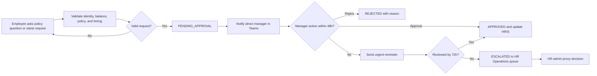

<!-- markdownlint-disable-file -->
---
brd_id: "BRD-HR-TIME-001"
title: "Enterprise Adaptive HR and Time Management Copilot"
status: "draft"
version: "0.1.0"
owners: ["HR Operations Product Owner"]
reviewers: ["HR Director", "Technical Lead", "Privacy and Compliance Lead"]
created_date: "2026-09-25"
last_updated: "2026-09-25"
business_goal_ids: ["BG-001", "BG-002", "BG-003"]
business_goal_smart_status: "deferred"
fr_to_ac_coverage_threshold_pct: 80.0
diagram_format: "mermaid"
lineage:
  supersedes: []
  superseded_by: []
last_brd_id: null
requirement_id_prefixes:
  fr: "FR"
  ac: "AC"
  nfr: "NFR"
  con: "CON"
  br: "BR"
license: "CC-BY 4.0 (Microsoft HVE-Core)"
---

# Enterprise Adaptive HR and Time Management Copilot

> **BRD-HR-TIME-001** | Status: draft | Version: 0.1.0 | Last Updated: 2026-09-25

## Executive Summary

NovaTech Global Solutions needs to reduce the operational cost and delay of time, attendance, leave, and overtime administration. Employees currently depend on portal, mobile, or manual requests, while HR teams repeatedly answer policy questions and chase manager decisions. The result is avoidable HR workload, inconsistent employee guidance, delayed approvals, and increased payroll and compliance risk.

The proposed business capability is an Enterprise Adaptive HR and Time Management Copilot. It combines policy Q&A grounded in SOP-HR-042 with conversational ticket creation and a controlled approval lifecycle. Microsoft Teams notifications and actionable approvals keep managers in their existing work context. Human accountability remains mandatory for manager and HR decisions.

The draft business case targets measurable improvement in average ticket resolution time, policy-query deflection, and manager action within the 48-business-hour SLA. The initial scope is limited to Annual Leave, Sick Leave, Overtime Claims, and Attendance Adjustments. Medical details, compensation data, and peer or cross-tenant information remain protected by design.

This is a workshop-evidence draft, not a legal determination or production policy approval. Real HRIS contracts, tenant security settings, retention requirements, regional policy variations, and outcome baselines require validation before approval.

---

## Business Context

SOP-HR-042 defines a 40-hour work week, PTO accrual, advance-notice rules, overtime multipliers and safety limits, sick-leave certification, role-based access, privacy controls, and immutable audit expectations. SPEC-HRIS-014 defines the ticket schema and lifecycle from `DRAFT` through `PENDING_APPROVAL`, `APPROVED`, `REJECTED`, `ESCALATED`, or `CANCELLED`.

The cost of inaction includes repetitive HR policy work, manager approval delays, employee uncertainty, escalation overhead, and potential errors in payroll-sensitive processes. A conversational experience is valuable only when it is connected to authoritative policy evidence, current balances, organizational hierarchy, approval controls, and auditable state changes.

Primary stakeholders are HR leadership and HR Operations, who own service quality and policy administration; Line Managers, who own approval decisions; employees, who need timely and understandable service; IT and security teams, who own tenant integration and access controls; and Privacy/Compliance, who govern sensitive data handling.

## Stakeholders

| Stakeholder | Power | Interest | Engagement strategy |
|---|---|---|---|
| Chief People Officer / HR Director | High | High | Approve business outcomes, policy ownership, and funding |
| HR Operations Administrator | High | High | Define queue, proxy-action, audit, and exception procedures |
| HR Policy Owner | High | High | Maintain SOP citations, policy versions, and exception rules |
| Line Manager | Medium | High | Validate approval workflow, Teams cards, and SLA reminders |
| Employee / Frontline Worker | Low | High | Validate conversational requests, policy clarity, and privacy |
| IT, Identity, and Security | High | Medium | Approve tenant integration, RBAC, logging, and operations |
| Privacy and Compliance Lead | High | Medium | Review PHI, compensation, retention, and audit controls |

## Design Decisions

* **DD-001:** Treat the agent as a policy-aware workflow assistant, not an autonomous HR decision maker. This preserves human accountability for approvals and exceptions.
* **DD-002:** Use authoritative policy citations in answers and retain the source policy identifier and version for traceability.
* **DD-003:** Use Microsoft Teams actionable cards for manager decisions while preserving portal or API alternatives for operational continuity.

## Business Goals

* **BG-001:** Reduce the average elapsed time from ticket submission to approved or rejected decision by 30% within two quarters of production launch. Baseline and measurement source remain to be confirmed by HR Operations.
* **BG-002:** Deflect at least 40% of routine HR policy questions from HR Operations within two quarters of launch, measured by resolved conversational sessions and HR case tagging.
* **BG-003:** Achieve at least 95% manager action within 48 business hours and ensure 100% of overdue tickets enter the defined escalation path within 72 hours, measured from immutable ticket events.

## Business Rules

* **BR-001:** Standard full-time work is 40 hours across five eight-hour days, with local timezone and core-hours considerations.
* **BR-002:** Full-time permanent employees accrue 1.5 business days of PTO per month, subject to current balance and a maximum three-day borrowing ceiling.
* **BR-003:** Annual leave advance notice depends on duration: 48 hours for one to two days, five business days for three to ten days, and 15 business days plus secondary approval above ten days.
* **BR-004:** Overtime uses 1.5x weekday, 2.0x weekend, and 2.5x public-holiday multipliers, with a 12-hour daily and 16-hour weekly overtime limit.
* **BR-005:** Planned overtime above two hours per shift requires manager pre-approval. Emergency overtime must be logged within 24 hours.
* **BR-006:** Sick leave of three or more consecutive business days requires a signed medical certificate within five business days of return; medical details remain confidential.
* **BR-007:** Managers must approve, reject, or request information within 48 business hours. The system sends an urgent reminder at the threshold and escalates unreviewed tickets to the HR queue after 72 hours.
* **BR-008:** Employees access only their own tickets and permitted balances; managers access direct-report tickets only; HR administrators have tenant-wide operational and audit visibility.
* **BR-009:** Every lifecycle event records UTC timestamp, Entra actor ID, action, client channel, previous state, and new state in an immutable audit record.

## Functional Requirements

* **FR-001:** Provide employees and managers with policy answers grounded in SOP-HR-042 citations and applicable business rules. Supports BG-002.
* **FR-002:** Allow an employee to create, edit, submit, and cancel a ticket for Annual Leave, Sick Leave, Overtime Claim, or Attendance Adjustment, subject to validation. Supports BG-001 and BG-002.
* **FR-003:** Notify the responsible Line Manager through Microsoft Teams and provide an actionable approval, rejection, or request-information path with a documented rejection reason. Supports BG-001 and BG-003.
* **FR-004:** Track ticket age and SLA state, send a 48-hour reminder, and escalate an unreviewed ticket to the HR Operations queue after 72 hours. Supports BG-001 and BG-003.
* **FR-005:** Enforce role-appropriate visibility and prevent disclosure of medical details, medical notes, compensation calculations, peer tickets, or cross-tenant records. Supports BG-003.
* **FR-006:** Append an immutable audit event for every ticket creation, modification, decision, cancellation, escalation, policy validation, and integration outcome. Supports BG-003.

## Non-Functional Requirements

* **NFR-001 Performance:** For a supported policy question or ticket form interaction under nominal load, the user-visible response should complete within 3 seconds at p95, excluding unavailable downstream HRIS calls.
* **NFR-002 Performance:** At least 99% of eligible 48-hour reminders and 72-hour escalations should be dispatched within 5 minutes of the threshold.
* **NFR-003 Availability:** The production service should provide 99.9% monthly availability, excluding approved maintenance, with retry and recovery for transient connector failures.
* **NFR-004 Security:** Entra-authenticated requests must be authorized against employee, direct-report manager, HR-admin, and tenant boundaries before data retrieval or action.
* **NFR-005 Privacy:** PHI, medical notes, and compensation-sensitive values must be minimized, masked from unauthorized roles, excluded from cleartext conversational transcripts, and retained only under approved tenant policy.
* **NFR-006 Auditability:** Every state transition and policy decision must be traceable to actor, timestamp, channel, source policy version, previous state, and new state; audit records must be tamper-evident.
* **NFR-007 Interoperability:** The solution must integrate with the approved HRIS/ERP, time-clock system, Microsoft Graph organizational hierarchy, and Teams notification channel through versioned contracts.

## Constraints

* **CON-001:** The product must honor SOP-HR-042 and tenant-specific policy configuration; it must not silently invent or override policy.
* **CON-002:** Approval and proxy-action decisions remain attributable to a human manager or HR administrator.
* **CON-003:** The first release is limited to the four ticket types named in this BRD.
* **CON-004:** Medical and compensation data must not be exposed to unauthorized roles or team channels.
* **CON-005:** Deployment must support Microsoft 365 identity, Teams, and Azure-hosted enterprise controls.

## Scope Boundaries

### In scope

* Policy Q&A with citations to SOP-HR-042 and configured policy versions.
* Conversational creation and lifecycle management for the four ticket types.
* Balance and business-rule validation using approved source systems.
* Teams manager notifications, actionable decisions, reminders, and HR escalation.
* RBAC enforcement, immutable audit logging, and operational metrics.

### Out of scope

* Autonomous approval or rejection without an authorized human decision.
* Payroll calculation, payroll execution, compensation changes, or tax advice.
* Recruitment, performance management, benefits enrollment, or case management outside the four ticket types.
* Legal interpretation of employment law or replacement of HR policy owners.
* General-purpose medical advice or exposure of medical diagnosis.

## Process Model

## Acceptance Criteria

* **AC-001** covers FR-001: Given an employee asks a question covered by SOP-HR-042, when the agent answers, then the response states the applicable rule and cites the policy identifier and version.
* **AC-002** covers FR-002: Given an authenticated employee has sufficient balance and a compliant date range, when they submit an Annual Leave request, then the system creates a `PENDING_APPROVAL` ticket and shows its identifier.
* **AC-003** covers FR-003: Given a ticket is pending for a manager's direct report, when the manager selects Approve or Reject in Teams, then the ticket records the decision and the employee receives an outcome notification; rejection requires a reason.
* **AC-004** covers FR-004: Given a ticket is unreviewed near 48 business hours, when the threshold is reached, then the manager receives an urgent reminder; given it remains unreviewed after 72 hours, then it appears in the HR Operations escalation queue.
* **AC-005** covers FR-005: Given a sick-leave ticket contains a medical reason or note, when a manager views the ticket, then the manager sees only the permitted certification status and no diagnosis or note content.
* **AC-006** covers FR-006: Given any lifecycle event occurs, when the event is committed, then an immutable audit record contains UTC timestamp, actor, action, channel, previous state, and new state.

## Traceability Matrix

### FR-to-AC Coverage

| Functional requirement | Acceptance criteria | Coverage |
|---|---|---|
| FR-001 | AC-001 | Covered |
| FR-002 | AC-002 | Covered |
| FR-003 | AC-003 | Covered |
| FR-004 | AC-004 | Covered |
| FR-005 | AC-005 | Covered |
| FR-006 | AC-006 | Covered |

Coverage: 100%.

### FR-to-BG Alignment

| Functional requirement | Business goals |
|---|---|
| FR-001 | BG-002 |
| FR-002 | BG-001, BG-002 |
| FR-003 | BG-001, BG-003 |
| FR-004 | BG-001, BG-003 |
| FR-005 | BG-003 |
| FR-006 | BG-003 |

### BR-to-FR Enforcement

| Business rule | Enforcing requirements |
|---|---|
| BR-001 to BR-007 | FR-001, FR-002, FR-004 |
| BR-008 | FR-005 |
| BR-009 | FR-006 |

## Risks and Assumptions

### Key assumptions

| ID | Assumption | Evidence status | Impact if false | Mitigation |
|---|---|---|---|---|
| A-001 | Approved HRIS/ERP APIs expose balances, manager relationships, and employee status in near real time. | Partially supported | High | Validate Workday/SAP/BambooHR contract and define degraded mode |
| A-002 | Microsoft Graph provides authoritative direct-report relationships for manager authorization. | Partially supported | High | Confirm tenant source of truth and reconciliation process |
| A-003 | HR Operations can provide baselines for resolution time and query volume. | Untested | Medium | Instrument pilot and baseline before target approval |
| A-004 | Tenant retention and audit services can meet PHI and compensation restrictions. | Untested | High | Complete privacy and security review before production |

### Risk register

| Risk | Probability | Impact | Mitigation |
|---|---|---|---|
| Policy variations by country or business unit produce incorrect answers. | Medium | High | Version policies by scope and require policy-owner approval |
| Connector outage causes stale balances or missed escalations. | Medium | High | Surface freshness, retry safely, and route exceptions to HR |
| Teams card action is replayed or arrives after a competing decision. | Medium | Medium | Use idempotent decision tokens and state preconditions |
| Sensitive content appears in prompts, logs, or notifications. | Medium | Critical | Redaction, least privilege, data minimization, and audit review |

## Open Questions

| ID | Question or gap | Owner | Status | Target phase |
|---|---|---|---|---|
| Q-001 | What are the production HRIS/ERP systems and supported API contracts? | Technical Lead | Open | Implementation |
| Q-002 | What are the tenant-specific retention periods and approved audit store? | Privacy Lead | Open | Implementation |
| Q-003 | What baseline and target values should be approved for resolution time and deflection? | HR Operations Lead | Open | PRD |
| Q-004 | Which regional policies override SOP-HR-042? | HR Policy Owner | Open | PRD |

## Sign-Off

* Business Sponsor: Pending assignment
* Product Owner: Pending assignment
* Technical Lead: Pending assignment
* Quality Lead: Pending assignment
* Legal/Compliance: Required before production approval

Approval date: Pending

### Handoff Readiness

Draft only. Requirements and acceptance coverage are sufficient to begin PRD elaboration, but the BRD is not approved and has no governed BRD-to-PRD handoff payload.

## Source Evidence

* `.copilot-tracking/research/2026-09-24/hr-time-leave-agent-research.md`
* `.copilot-tracking/research/workshop-input/policies/sop-hr-time-and-leave.md`
* `.copilot-tracking/research/workshop-input/sops/ticketing-process-spec.md`
* `.copilot-tracking/research/workshop-input/leancanvas.md`

## Disclaimer

This draft is based on synthetic workshop evidence and requires review by accountable HR, security, privacy, legal, and technical owners before implementation or production use.
