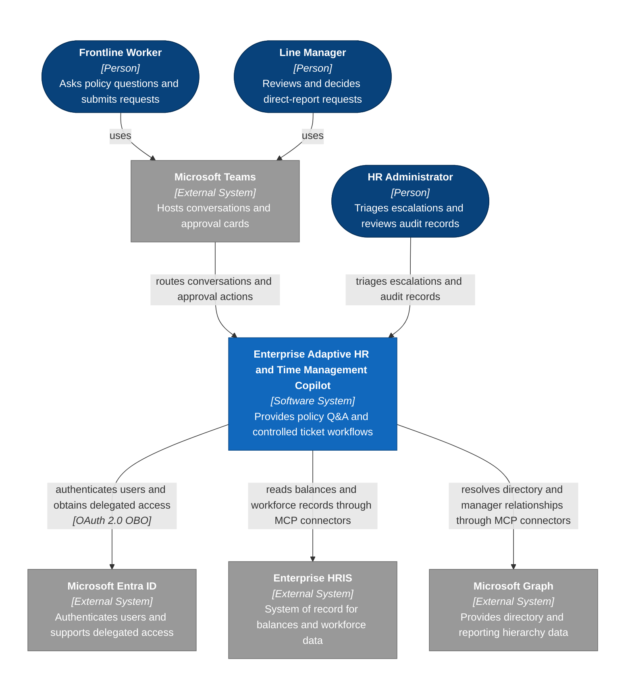
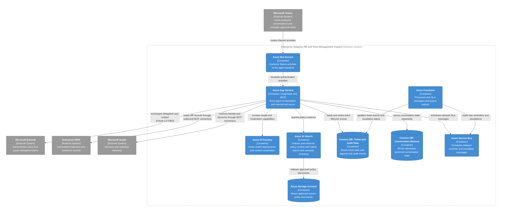

<!-- markdownlint-disable-file -->
---
title: "Enterprise Adaptive HR Copilot Architecture Notes"
description: "Planned architecture, trust boundaries, Well-Architected review, and Marketplace publication boundaries for the HR Copilot"
author: "Architecture Working Draft"
ms.date: 2026-09-28
ms.topic: architecture
keywords:
  - HR Copilot
  - Azure architecture
  - Microsoft Teams
  - MCP
  - Marketplace
---

## Status and Scope

This is a planned-system architecture view based on the caller-supplied blueprint and the draft PRD. It describes intended responsibilities and logical flows, not deployed infrastructure, measured performance, approved security controls, or an implementation that has been verified in code. The diagrams use Mermaid C4-style context, container, and component views. No deployment diagram is included because no infrastructure-as-code or environment placement evidence was supplied.

### Evidence and assumptions

* The user-provided blueprint establishes Azure App Service with LangGraph and an internal MCP server, Azure Bot Service and Teams, Microsoft Entra OBO, Azure AI Foundry, Azure AI Search, Storage Accounts, separate Cosmos DB workloads, HRIS and Graph MCP connectors, Service Bus, and Functions timers.
* The PRD and policy evidence establish worker/manager/HR roles, policy-grounded Q&A, ticket lifecycle, privacy and compensation constraints, RBAC, and 48-hour reminder / 72-hour escalation requirements.
* The diagrams assume the Azure resources are provisioned for and operated as part of this product system. Subscription ownership, SaaS versus customer-managed deployment, data ownership, network boundaries, and production tenancy model remain unresolved.
* The Microsoft 365 Agent Store and Azure Marketplace Managed Application are publication and procurement channels, not runtime components in the request flow.

## System Overview

The planned product accepts employee conversations and manager decisions through Microsoft Teams. Azure Bot Service routes channel activity to an Azure App Service that hosts the LangGraph orchestration state machine and an internal MCP server. The orchestration retrieves policy material from Azure AI Search, obtains model and moderation capabilities from Azure AI Foundry, and uses authenticated MCP tools to validate and update ticket state, retrieve permitted HRIS information, and resolve Microsoft Graph identity and reporting relationships.

Ticket state and audit events are stored separately from conversation memory in Cosmos DB. Azure Storage holds policy source documents for indexing. The App Service schedules delayed SLA messages with Azure Service Bus; Azure Functions consume due messages and perform reminder or escalation work. The 48-hour reminder and 72-hour escalation thresholds must use explicit calendar semantics, while ticket actions remain human-attributed and idempotent.

### Component responsibilities

| Component | Responsibility | Security and reliability boundary |
|---|---|---|
| Microsoft Teams | Employee conversation and manager approval-card surface | Display only role-authorized fields; never include diagnosis, medical notes, or unauthorized compensation data |
| Azure Bot Service | Receive and route Teams activities to the application | Validate channel identity and preserve the authenticated user context; do not trust card payloads as authorization |
| Microsoft Entra ID | Authenticate users and issue delegated tokens via OBO | Use least-privilege scopes and validate issuer, audience, tenant, and actor on every request |
| Azure App Service | Host LangGraph orchestration and internal MCP server | Enforce request, tenant, role, and tool authorization; protect secrets and user-token exchange |
| LangGraph state machine | Route Q&A, request collection, validation, and workflow transitions | Use explicit state transitions; do not let model output autonomously approve or reject a ticket |
| Internal MCP server | Expose a bounded, validated tool surface to orchestration | Apply tool allowlists, argument schemas, identity checks, authorization, idempotency, and audit hooks |
| HRIS MCP connector | Read balances and employee/job/reporting data; submit supported updates | Treat HRIS as an external system of record; handle stale data, throttling, and partial failure explicitly |
| Microsoft Graph MCP connector | Resolve directory identity and direct-report relationships | Enforce direct-report scope server-side; do not rely on client filtering |
| Azure AI Foundry | Provide model deployments and content moderation | Moderation is one defense, not a substitute for data minimization, authorization, output filtering, or safe logging |
| Azure AI Search | Retrieve policy documents using hybrid BM25 and vector search with semantic reranking | Filter by tenant, region, policy version, and effective date before retrieval; return citations and source metadata |
| Azure Storage Account | Store approved source policy documents for indexing | Restrict write access to policy publishers; preserve version/effective-date metadata and protect documents in transit and at rest |
| Cosmos DB, ticket and audit data | Persist ticket lifecycle state and audit events | Separate access paths; enforce append-only audit writes and tamper evidence because a Cosmos DB collection alone is not immutable |
| Cosmos DB, conversation memory | Persist conversation state separately from ticket/audit records | Apply independent retention, encryption, access, and deletion policy; exclude PHI and compensation data from durable memory by default |
| Azure Service Bus | Hold scheduled SLA reminder and escalation messages | Use duplicate detection/idempotency, dead-letter handling, retry policy, and a reconciler for overdue messages |
| Azure Functions | Consume due SLA messages and run reminder/escalation actions | Re-check ticket state and authorization before mutation; make handlers idempotent and observable |
| Enterprise HRIS (Workday/SAP) | Authoritative workforce and balance data | External dependency; availability, delegated-auth support, API contract, and tenant-specific limits require validation |
| Microsoft Graph | Directory and organizational hierarchy dependency | External dependency; use minimal delegated permissions and handle hierarchy drift or missing relationships |

## Data Flow

1. An employee or manager interacts with the Copilot in Teams. Azure Bot Service forwards activity and authenticated user context to the App Service.
2. The App Service validates the token context and performs OBO token exchange with Entra ID for the least-privilege downstream access required by the operation.
3. LangGraph classifies the workflow intent and invokes policy retrieval or ticket tools. The model may propose a response or identify a request flow; deterministic application logic owns validation and state transitions.
4. For policy Q&A, orchestration queries Azure AI Search. Search retrieves policy chunks from indexed Storage content using hybrid BM25 and vector search with semantic reranking, applies tenant and effective-policy filters, and returns citations. Azure AI Foundry generates a response from retrieved evidence and applies configured moderation. Unsupported or conflicting answers route to HR rather than fabricating policy.
5. For ticket requests, the MCP server validates tool arguments and the caller's role, checks balance and policy conditions through the HRIS connector, then writes the ticket to ticket Cosmos DB. The ticket begins in the specified draft or pending state. A Teams actionable card is sent to the authorized direct manager.
6. Manager actions arrive through Teams and are re-authorized against the current ticket state and direct-report relationship. Approve, Reject, and Request Info are recorded as attributed actions. Rejection requires a reason. Stale or replayed actions fail safely.
7. The App Service schedules SLA messages in Service Bus. Functions consume due messages, re-check ticket state, dispatch the 48-hour reminder or 72-hour HR escalation, and append audit events. The HR queue exposes the overdue ticket to authorized HR administrators.
8. Conversation memory is written only to its separate Cosmos DB boundary and must not become a secondary store for medical or compensation data. Ticket/audit events and conversational memory follow separate retention and access policies.

## Architecture Diagrams

The Level 1, Level 2, and Level 3 views describe one planned system boundary. Element names remain consistent across levels. Azure-provisioned services are modeled as system containers under the explicit assumption above; ownership and subscription deployment are not confirmed.

### Legend

```mermaid
---
config:
  flowchart:
    subGraphTitleMargin:
      bottom: 30
---
flowchart LR
    person_legend(["`**Name**
*[Person]*
Description`"])
    sys_legend["`**Name**
*[Software System]*
Description`"]
    ctr_legend("`**Name**
*[Container]*
Description`")
    cmp_legend["`**Name**
*[Component]*
Description`"]
    ext_legend["`**Name**
*[External System]*
Description`"]
    ext_legend_store[("`**Name**
*[External Data Store]*
Description`")]
    infra_legend["`**Name**
*[Infrastructure Node]*
Description`"]

    subgraph deploy_legend["`**Parent Name** *[Deployment Node]*`"]
        subgraph deploy_nested_legend["`**Nested Name**
*[Deployment Node]*`"]
            ctr_legend_i("`**Name**
*[Container Instance]*
Description`")
        end
    end

    subgraph bnd_legend["`**Name** *[Software System]*`"]
        ctr_legend_store[("`**Name**
*[Internal Data Store]*
Description`")]
    end

    person_legend ~~~ sys_legend
    sys_legend ~~~ ctr_legend
    ctr_legend ~~~ cmp_legend
    cmp_legend ~~~ ext_legend
    ext_legend ~~~ ext_legend_store
    ext_legend_store ~~~ infra_legend
    infra_legend ~~~ deploy_legend
    deploy_legend ~~~ bnd_legend

    classDef person fill:#08427b,stroke:#052e56,color:#ffffff
    classDef system fill:#1168bd,stroke:#0b4884,color:#ffffff
    classDef container fill:#438dd5,stroke:#2e6295,color:#ffffff
    classDef component fill:#85bbf0,stroke:#5d82a8,color:#000000
    classDef external fill:#999999,stroke:#6b6b6b,color:#ffffff
    classDef infrastructure fill:#b0c4de,stroke:#7b899b,color:#000000

    class person_legend person
    class sys_legend system
    class ctr_legend,ctr_legend_i,ctr_legend_store container
    class cmp_legend component
    class ext_legend,ext_legend_store external
    class infra_legend infrastructure

    style deploy_legend fill:none,stroke:#2e6295,color:#2e6295
    style deploy_nested_legend fill:none,stroke:#2e6295,color:#2e6295
    style bnd_legend fill:none,stroke:#888888,stroke-dasharray:5 5,color:#888888
```



### Level 1: System Context



### Level 2: Containers



### Level 3: App Service Components

```mermaid
---
config:
  flowchart:
    subGraphTitleMargin:
      bottom: 30
---
flowchart TB
    subgraph layout_top[" "]
        ctr_bot_service("`**Azure Bot Service**
*[Container]*
Routes Teams activities to the backend`")
    end
    subgraph layout_center[" "]
        subgraph ctr_app_service["`**Azure App Service** *[Container]*`"]
            cmp_langgraph["`**LangGraph State Machine**
*[Component]*
Routes Q&A and ticket workflows`")
            cmp_mcp_server["`**Internal MCP Server**
*[Component]*
Exposes authorized tools to the agent`")
            cmp_obo["`**OBO Token Handler**
*[Component]*
Obtains delegated tokens for downstream access`")
            cmp_hris_connector["`**HRIS MCP Connector**
*[Component]*
Validates and exchanges HRIS operations`")
            cmp_graph_connector["`**Microsoft Graph MCP Connector**
*[Component]*
Resolves directory and manager scope`")
        end
    end
    subgraph layout_bottom[" "]
        ctr_ai_foundry("`**Azure AI Foundry**
*[Container]*
Model deployments and moderation`")
        ctr_ai_search("`**Azure AI Search**
*[Container]*
Hybrid policy retrieval with semantic reranking`")
        ctr_ticket_cosmos[("`**Cosmos DB: Ticket and Audit Data**
*[Container]*
Ticket state and audit events`")]
        ctr_memory_cosmos[("`**Cosmos DB: Conversation Memory**
*[Container]*
Separated conversation state`")]
        ctr_service_bus("`**Azure Service Bus**
*[Container]*
Delayed SLA messages`")
        ext_entra["`**Microsoft Entra ID**
*[External System]*
Delegated identity provider`"]
        ext_hris["`**Enterprise HRIS**
*[External System]*
System of record`"]
        ext_graph["`**Microsoft Graph**
*[External System]*
Directory and hierarchy API`"]
    end

    ctr_bot_service -->|"`forwards authenticated activity`"| cmp_langgraph
    cmp_langgraph -->|"`invokes policy models and moderation`"| ctr_ai_foundry
    cmp_langgraph -->|"`retrieves cited policy content`"| ctr_ai_search
    cmp_langgraph -->|"`loads and saves conversation state`"| ctr_memory_cosmos
    cmp_langgraph -->|"`requests workflow tools`"| cmp_mcp_server
    cmp_mcp_server -->|"`persists ticket and audit events`"| ctr_ticket_cosmos
    cmp_mcp_server -->|"`schedules SLA notifications`"| ctr_service_bus
    cmp_mcp_server -->|"`requests delegated access from`"| cmp_obo
    cmp_obo -->|"`exchanges user context for scoped tokens
*[OAuth 2.0 OBO]*`"| ext_entra
    cmp_mcp_server -->|"`dispatches workforce operations to`"| cmp_hris_connector
    cmp_mcp_server -->|"`dispatches directory operations to`"| cmp_graph_connector
    cmp_hris_connector -->|"`reads balances and submits supported requests
*[MCP connector / HRIS REST API]*`"| ext_hris
    cmp_graph_connector -->|"`reads identity and reporting relationships
*[MCP connector / Microsoft Graph API]*`"| ext_graph

    classDef container fill:#438dd5,stroke:#2e6295,color:#ffffff
    classDef component fill:#85bbf0,stroke:#5d82a8,color:#000000
    classDef external fill:#999999,stroke:#6b6b6b,color:#ffffff

    class ctr_bot_service,ctr_ai_foundry,ctr_ai_search,ctr_ticket_cosmos,ctr_memory_cosmos,ctr_service_bus container
    class cmp_langgraph,cmp_mcp_server,cmp_obo,cmp_hris_connector,cmp_graph_connector component
    class ext_entra,ext_hris,ext_graph external

    style ctr_app_service fill:none,stroke:#888888,stroke-dasharray:5 5,color:#888888
    style layout_top fill:none,stroke:none
    style layout_center fill:none,stroke:none
    style layout_bottom fill:none,stroke:none
```

### Legend and Key Relationships

* Relationships use active labels and point from the initiating caller or dependent component to the service it invokes, reads, writes, or relies on.
* `*[technology]*` appears only where the blueprint names the protocol or token flow; other links intentionally omit protocol details.
* The Azure resources inside the product boundary are planned internal containers, subject to the unresolved ownership and deployment assumption.
* Teams carries employee conversations and manager actions; Entra ID authenticates and authorizes the caller context.
* LangGraph invokes the internal MCP server for controlled tool execution. MCP connectors call HRIS and Microsoft Graph as external dependencies.
* Azure AI Search retrieves policy evidence from Storage-backed indexes using hybrid BM25/vector retrieval and semantic reranking; Azure AI Foundry supplies model and moderation capabilities.
* The App Service schedules SLA messages; Functions consume them and update ticket/audit state idempotently.
* Ticket/audit data and conversation memory use separate Cosmos DB boundaries and policies.

## Well-Architected Review

This is a preliminary design review against Security, Reliability, Cost Optimization, and Performance Efficiency. It is not an Azure Well-Architected assessment or production approval.

### Security and RBAC

* Authenticate Teams users through Entra ID and validate tenant, issuer, audience, actor, and delegated scope. OBO tokens must be short-lived, resource-specific, and never sent to the model, stored in conversation memory, or included in logs.
* Authorize every ticket and tool call on the server. Employees can access only their own tickets; managers only direct reports; HR administrators have approved queue and audit privileges. Re-evaluate manager relationships at action time to prevent stale-card authorization.
* Treat Adaptive Card payloads as untrusted. Bind actions to ticket ID, authenticated actor, current ticket state, expiry, and a nonce/idempotency key. Require a rejection reason and reject duplicate or stale transitions.
* Restrict the internal MCP server to explicit tools and typed argument schemas. Keep model-selected tool names and arguments inside a policy-checked boundary; never give the model ambient database, Graph, or HRIS privileges.
* Use service identities or managed identities for service-to-service access and secrets storage. Separate customer tenants, indexes, search filters, Cosmos partitions, encryption scopes, and operational access. Confirm whether customer-managed keys, private endpoints, and network isolation are required.
* Content moderation can detect classes of unsafe content but does not establish PHI confidentiality. Apply deterministic field-level redaction and data minimization before prompts, output filtering before Teams delivery, restricted transcript logging, and leakage tests across the full path.
* Cosmos DB does not by itself make records immutable. Enforce append-only audit write paths, deny update/delete to application identities, separate audit privileges, and choose a tamper-evidence / retention mechanism appropriate to policy (for example, a separately governed immutable archive or ledger). Validate retention and legal-hold requirements with Privacy and Compliance.

### Reliability

* Model workflow transitions explicitly and make all ticket operations idempotent. Use transactional or outbox-style event publication so a committed ticket cannot lose its scheduled SLA message.
* Service Bus messages can be duplicated, delayed, or dead-lettered. Functions must verify current ticket state before sending a reminder or escalating, use retry/backoff, alert on dead-letter volume, and run periodic reconciliation for overdue pending tickets.
* Clarify clock semantics: SOP-HR-042 says 48 business hours for manager action, reminder at the 48-hour threshold, and escalation after 72 hours. Define the timezone, holidays, weekend handling, whether escalation is elapsed or business hours, and how paused or reopened tickets affect timers.
* Degrade safely when HRIS or Graph is unavailable. Show data freshness, do not approve based on stale balances, preserve a recoverable draft, and route unresolved cases to HR.
* Define recovery objectives, regional redundancy, Cosmos consistency/backup configuration, Search and Storage recovery, App Service deployment slots, and Functions/Service Bus retry/replay ownership before production.

### Cost Optimization

* Main variable cost drivers are Foundry token and moderation usage, Search indexing/query/vector capacity, Cosmos DB throughput and storage, Storage retention, and Bot/App Service/Functions/Service Bus runtime.
* Use a small model for routing or extraction where quality is sufficient; call stronger models only for policy explanation or difficult ambiguity. Set bounded context sizes, summarize non-sensitive conversation state, cache policy retrieval by policy version, and avoid repeated retrieval on follow-up turns.
* Size Search and Cosmos from measured query and ticket volume. Start with autoscaling or serverless options only after checking latency and unit economics; isolate high-volume tenants where noisy-neighbor limits require it.
* Add per-tenant budgets and alerts for tokens, search, Cosmos RU/s, and message volume. Meter by completed task and avoid recording sensitive prompts in cost telemetry.
* Compare Azure Marketplace Managed Application delivery costs and support obligations with a vendor-operated SaaS model before choosing the commercial deployment boundary.

### Performance Efficiency and Latency

* The PRD target is p95 under 3 seconds for conversational responses, excluding unavailable external calls. The end-to-end path includes Bot routing, OBO token exchange, LangGraph orchestration, Search retrieval, moderation/model generation, and potentially HRIS calls; measure each span separately.
* Return a grounded policy answer before initiating ticket creation. For ticket validation, parallelize independent identity and policy lookups where safe, but do not submit until current balance and rule validation complete.
* Stream policy responses where host and safety design allow, while clearly indicating that ticket submission is not complete until deterministic validation and persistence succeed.
* Keep Teams card payloads small and precomputed; avoid additional portal round trips for common manager actions. Use regional placement and private networking only after tenant and data-residency requirements are resolved.
* Set timeouts, retry budgets, circuit breakers, and user-visible progress for HRIS and Graph. A model timeout must not leave an ambiguous ticket state; use request IDs and durable workflow status.

## Marketplace Publication Boundaries

| Surface | Primary purpose | What it distributes or deploys | Boundary and required decision |
|---|---|---|---|
| Microsoft 365 Copilot Agent Store | Discovery and installation surface for the Copilot agent experience in the Microsoft 365 environment | For the assumed custom-engine agent built with Agents Toolkit, submit the Microsoft 365 app package through the supported organizational-catalog or Microsoft Commercial Marketplace route; after approval and tenant enablement, the agent can appear in the Agent Store | The Agent Store is not the Azure backend deployment. Publication route depends on agent type. Validate the current package, certification, Responsible AI, tenant-enable, and permission requirements; neither store placement guarantees HRIS connectivity or replaces tenant consent. |
| Azure Marketplace Managed Application | Procurement and managed deployment of an Azure solution | An Azure offer and managed application deployment of the backend resources and configuration into the chosen customer/provider-managed Azure boundary | Governs Azure resource deployment, lifecycle, access, support, and commercial terms. It is distinct from a Teams/Copilot agent catalog package. The exact managed-resource-group, operator-access, subscription, and billing model must be decided before offer authoring. |

The two surfaces may complement each other: the Agent Store can make the Teams/Copilot experience discoverable, while Azure Marketplace can package and govern the Azure backend. They are separate publication, deployment, consent, and support tracks. Do not imply that listing the agent deploys the managed application or that a managed application automatically publishes an agent to Microsoft 365. Validate current Partner Center requirements and Microsoft 365 agent packaging rules before committing offer metadata.

## Open Architecture Decisions

* Confirm vendor SaaS versus customer-subscription deployment and who owns and operates Cosmos schemas, Search indexes, policy Storage, network boundaries, and upgrades.
* Confirm tenant-isolation strategy, identity application model, Entra consent and OBO scopes, and whether the HRIS supports delegated access or requires a separate service identity.
* Confirm whether separate Cosmos DB means distinct accounts, databases, or containers, and define partition keys, transactional boundaries, retention, backup, and audit immutability controls.
* Define how the 48 business-hour manager SLA and 72-hour escalation are calculated across tenant timezones and holidays.
* Confirm the exact Adaptive Card schema/host version, Agent Store submission packaging, Azure Managed Application offer model, and Partner Center responsibilities.
* Establish load profile and validate the p95 latency, availability, cost-per-ticket, RPO/RTO, moderation efficacy, and PHI leakage targets through tests and operational evidence.

## Sources

* User-provided planned architecture blueprint, supplied in the request dated 2026-09-28.
* `.copilot-tracking/prd-sessions/requirements.md`
* `.copilot-tracking/dt/experience-design.md`
* `.copilot-tracking/research/workshop-input/policies/sop-hr-time-and-leave.md`
* `.copilot-tracking/research/workshop-input/sops/ticketing-process-spec.md`
* Azure Managed Applications overview: https://learn.microsoft.com/en-us/azure/azure-resource-manager/managed-applications/overview
* Publish agents for Microsoft 365 Copilot: https://learn.microsoft.com/microsoft-365/copilot/extensibility/publish

The Microsoft 365 publishing reference covers agent-type-specific distribution routes. Confirm the applicable custom-engine package, certification, and tenant enablement requirements before offer submission.
