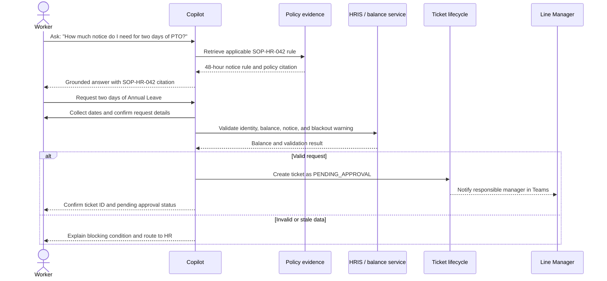
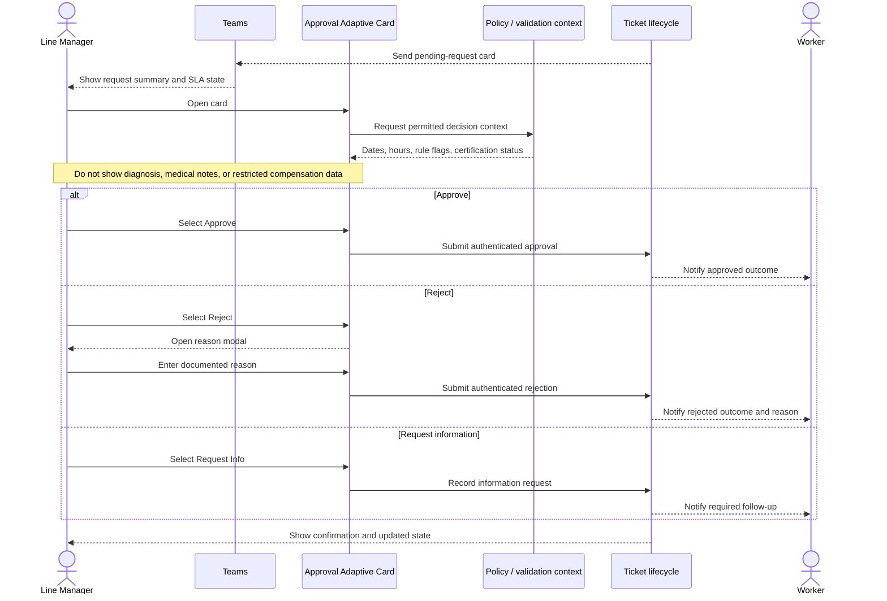
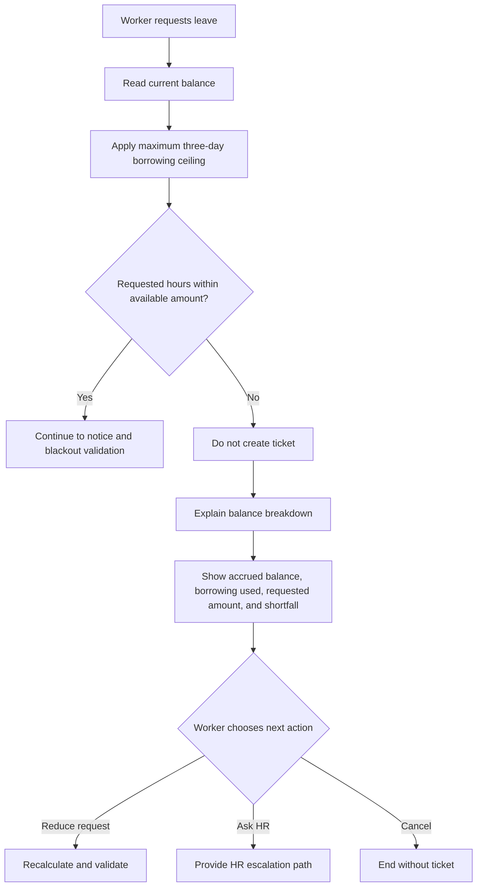

<!-- markdownlint-disable-file -->
# Design and Experience Pack: Enterprise Adaptive HR and Time Management Copilot

## Artifact Context

* Project: enterprise-adaptive-hr-time-management-copilot
* Subject: Conversation journeys, manager approval card, and inclusive experience guidance
* Status: draft
* Created: 2026-09-25
* Sources:
  * `.copilot-tracking/prd-sessions/requirements.md`
  * `.copilot-tracking/research/workshop-input/policies/sop-hr-time-and-leave.md`
  * `.copilot-tracking/research/workshop-input/sops/ticketing-process-spec.md`

## Observed

* The PRD defines Worker, Line Manager, and HR Administrator personas, four supported ticket types, Teams approval actions, and 48-hour reminder plus 72-hour escalation behavior.
* SOP-HR-042 requires grounded policy handling, role-based access, medical privacy, compensation confidentiality, and immutable lifecycle audit records.
* SPEC-HRIS-014 defines `DRAFT`, `PENDING_APPROVAL`, `APPROVED`, `REJECTED`, `ESCALATED`, and `CANCELLED` ticket states.
* Manager approval requires `APPROVE`, `REJECT`, or `REQUEST_INFO`; rejection requires a documented reason.

## Reported

* Frontline workers need fast conversational answers, simple leave submission, and access through mobile or Teams experiences. Source: supplied design brief.
* Line Managers are busy and need high-context Teams approval cards with minimal interaction. Source: supplied design brief.
* HR Administrators need escalation queue triage, permitted exception or proxy actions, and audit-trail visibility. Source: supplied design brief.
* Managers must not receive medical diagnosis, medical notes, or medical justifications. Source: SOP-HR-042.

## Assumed

* The conversational experience can be presented consistently across Microsoft Teams and an approved mobile-responsive surface.
* A balance service can provide a sufficiently fresh leave balance for pre-submission validation.
* Teams supports the required authenticated and idempotent Adaptive Card actions in the target tenant configuration.
* A rejection reason can be collected in a Teams modal or equivalent follow-up interaction without forcing the manager through a separate portal.

## Unresolved

* The exact Teams Adaptive Card schema version and host capabilities supported by the production tenant.
* Whether the 48-hour and 72-hour thresholds use the same business-hour calendar across regions.
* The precise HR Admin fields and controls required for proxy decisions and exception overrides.
* The mobile surface, screen-reader stack, localization set, and real user access-needs coverage remain to be validated.
* The proposed accessibility guidance is not a conformance result. Runtime probes and a qualified human review are required.

## 1. User Personas

### Frontline Worker

| Attribute | Experience definition |
|---|---|
| Primary need | Get a clear policy answer and submit a compliant request without navigating a complex HR portal. |
| Jobs to be done | Ask about PTO or leave rules, understand balance and notice requirements, submit a request, and track status. |
| Preferred entry points | Conversational Copilot in Teams and a mobile-responsive experience. |
| Key interaction principles | Use plain language, ask only for missing fields, show a visible balance breakdown, explain blocking rules, and confirm the ticket ID. |
| Trust needs | Cite the governing policy, distinguish validation from approval, and never expose sensitive medical or compensation details to unauthorized people. |
| Success signal | The worker can move from question to valid `PENDING_APPROVAL` ticket with minimal re-entry. |

### Line Manager

| Attribute | Experience definition |
|---|---|
| Primary need | Decide on a direct-report request quickly using enough context to act responsibly. |
| Jobs to be done | Review permitted details, approve, reject with a reason, request information, and monitor pending work. |
| Preferred entry point | Microsoft Teams actionable card, with an accessible fallback to the approved HR surface. |
| Key interaction principles | Put the decision and SLA state first, keep one primary click per decision, avoid extraneous navigation, and clearly separate restricted details. |
| Trust needs | Show employee, request type, dates, hours, policy flags, and certification status without diagnosis or medical notes. |
| Success signal | The manager completes a valid decision from the card and receives clear confirmation. |

### HR Administrator

| Attribute | Experience definition |
|---|---|
| Primary need | Triage overdue or exceptional requests while preserving privacy, policy authority, and auditability. |
| Jobs to be done | Review the escalation queue, inspect permitted audit events, resolve exceptions, perform an authorized proxy decision, and identify connector or policy failures. |
| Preferred entry point | HR Operations queue with searchable, filterable ticket and audit views. |
| Key interaction principles | Make urgency, SLA age, failure reason, and next action explicit; provide safe recovery paths; preserve actor attribution. |
| Trust needs | Tenant-wide operational visibility must not become unrestricted exposure of medical or compensation data. |
| Success signal | An escalated ticket is resolved or routed with a complete, immutable audit trail. |

## 2. Conversational Journey Maps

### Flow 1: Policy question to two-day annual leave submission



| Stage | Worker action | System response | Experience opportunity | Evidence basis |
|---|---|---|---|---|
| Ask | Ask about two days of PTO | Retrieve an authoritative rule | Answer first, cite source, avoid policy jargon | Reported, PRD FR-001 and SOP-HR-042 |
| Clarify | State desired dates | Ask only for missing request fields | Keep the conversation short and confirm dates in local timezone | Assumed, PRD FR-002 |
| Validate | Submit the request | Check balance, notice, and applicable rules | Show a validation summary before commitment | Observed, SOP-HR-042 section 5.1 |
| Submit | Confirm the request | Create `PENDING_APPROVAL` ticket and notify manager | Return ticket ID, status, and next expected action | Observed, SPEC-HRIS-014 |

### Flow 2: Teams manager approval



**Card experience rules**

* Put request type, employee name, dates, total hours, current state, and time remaining to SLA before secondary content.
* Use certification status for medical leave, never diagnosis, doctor notes, or medical justification.
* Make Approve, Reject, and Request Info distinct named actions, not color-only controls.
* Reject opens a focused reason collection step and cannot complete without a reason.
* After any action, replace active actions with a read-only confirmation state and show the resulting ticket status.
* If the ticket is stale, already decided, unauthorized, or unavailable, disable decision actions and explain the recovery path.

### Flow 3: Leave request exceeds balance and borrowing ceiling



**Friendly error content specification**

* Lead with the outcome: “This request cannot be submitted yet because it exceeds your available leave.”
* Show a breakdown: accrued balance, permitted borrowing remaining, requested amount, and shortfall.
* State the governing rule and cite SOP-HR-042 without blaming the worker.
* Offer recovery actions: reduce dates, choose another eligible leave type, or contact HR.
* Do not create a draft or pending ticket unless the worker explicitly asks to save a draft and the product supports that state.
* Keep the message free of peer balances, aggregate data, salary data, and unnecessary personal details.

## 3. Microsoft Teams Adaptive Card Wireframe Specification

This JSON is an implementation-facing content and action specification. It is not a final rendered visual design. The target Adaptive Card schema version and Teams host capabilities remain unresolved.

```json
{
  "$schema": "http://adaptivecards.io/schemas/adaptive-card.json",
  "type": "AdaptiveCard",
  "version": "1.5",
  "speak": "Pending annual leave request from Jordan Vance for October 12 through October 16, 40 hours. Manager action is due within 48 business hours.",
  "body": [
    {
      "type": "TextBlock",
      "text": "Time and Leave Approval",
      "weight": "Bolder",
      "size": "Medium",
      "wrap": true
    },
    {
      "type": "FactSet",
      "facts": [
        { "title": "Employee", "value": "${employeeDisplayName}" },
        { "title": "Request", "value": "${ticketTypeLabel}" },
        { "title": "Dates", "value": "${startDate} to ${endDate}" },
        { "title": "Total hours", "value": "${totalHours}" },
        { "title": "Status", "value": "Pending approval" },
        { "title": "Decision due", "value": "${slaDueAt}" }
      ]
    },
    {
      "type": "TextBlock",
      "text": "Policy and validation",
      "weight": "Bolder",
      "wrap": true,
      "spacing": "Medium"
    },
    {
      "type": "TextBlock",
      "text": "${sanitizedValidationSummary}",
      "wrap": true,
      "isSubtle": true
    },
    {
      "type": "Container",
      "id": "medical-sanitized-summary",
      "items": [
        {
          "type": "TextBlock",
          "text": "Medical certification status: ${medicalCertificationStatus}",
          "wrap": true
        }
      ],
      "isVisible": "${isMedicalLeave}",
      "style": "emphasis"
    },
    {
      "type": "TextBlock",
      "text": "Medical diagnosis, notes, and justifications are not displayed in this card.",
      "wrap": true,
      "isSubtle": true,
      "isVisible": "${isMedicalLeave}"
    }
  ],
  "actions": [
    {
      "type": "Action.Submit",
      "title": "Approve",
      "data": {
        "action": "APPROVE",
        "ticketId": "${ticketId}",
        "actionToken": "${actionToken}"
      }
    },
    {
      "type": "Action.ShowCard",
      "title": "Reject",
      "card": {
        "type": "AdaptiveCard",
        "version": "1.5",
        "body": [
          {
            "type": "Input.Text",
            "id": "rejectionReason",
            "label": "Reason for rejection",
            "isRequired": true,
            "isMultiline": true,
            "maxLength": 500,
            "placeholder": "Explain why this request cannot be approved."
          }
        ],
        "actions": [
          {
            "type": "Action.Submit",
            "title": "Submit rejection",
            "data": {
              "action": "REJECT",
              "ticketId": "${ticketId}",
              "actionToken": "${actionToken}"
            }
          }
        ]
      }
    },
    {
      "type": "Action.Submit",
      "title": "Request information",
      "data": {
        "action": "REQUEST_INFO",
        "ticketId": "${ticketId}",
        "actionToken": "${actionToken}"
      }
    }
  ]
}
```

### Card field and action contract

| Element | Requirement |
|---|---|
| `ticketId` | Must identify the ticket and be bound to the authenticated action token. |
| `actionToken` | Must be time-bounded, single-use or idempotent, and rejected when the ticket is no longer pending. |
| `sanitizedValidationSummary` | Must contain only manager-authorized context. Never include medical diagnosis, uploaded notes, or unauthorized compensation values. |
| `medicalCertificationStatus` | May communicate certification state only, for example “Certification required” or “Certified Medical Leave Approved by HR.” |
| Approve | Records an authenticated human approval and transitions the ticket to `APPROVED` when state and authorization checks pass. |
| Reject | Requires a reason, records an authenticated human rejection, and transitions the ticket to `REJECTED`. |
| Request Info | Records the information request and notifies the worker without changing the card into an approval. |

## 4. Inclusive Design and Accessibility

This section is design guidance and a verification plan, not a conformance claim. The Accessibility capability owns technical assessment against the applicable WCAG and ARIA requirements.

### Screen reader and announcement cues

* Give every card a meaningful accessible name that includes request type, employee, date range, and current state without sensitive medical detail.
* Keep a logical reading order: title, employee and request facts, policy or validation summary, privacy notice when applicable, then actions.
* Use explicit labels for all facts and inputs. Do not rely on visual grouping or color to convey meaning.
* Announce state changes after Approve, Reject, Request Info, reminder, error, and escalation using an appropriate status or live-region pattern in the host surface.
* On rejection, move focus to the required reason field and announce why the field is required. Return focus to a clear confirmation after successful submission.
* Ensure stale or unauthorized actions have a programmatic name and state, such as “Approve unavailable because this request was already decided.”
* Expose validation errors next to the affected field and in a summary that can be reached without scanning the entire card.

### Keyboard and motor access

* All card actions, reason entry, expansion, and dismissal must be reachable and operable by keyboard alone.
* Preserve a predictable focus order and prevent focus from becoming trapped in the rejection interaction.
* Make the primary actions distinct by text and semantics, not by color, position, or icon alone.
* Avoid requiring precise pointer movement or multiple navigation hops for the common approval path.
* Provide a fallback route when an Adaptive Card host cannot support the required action or input control.

### High-contrast and non-visual states

* Use text, labels, and programmatic state in addition to color for pending, approved, rejected, escalated, error, and privacy states.
* Verify text, action labels, borders, focus indicators, and disabled states in high-contrast or forced-colors modes.
* Keep focus indicators visible against all supported card backgrounds.
* Do not use red or green alone to distinguish rejection and approval.
* Provide non-visual notification content for pending approvals, 48-hour reminders, and 72-hour escalations. A badge or sound may supplement, but must not be the only signal.
* Include a concise notification title, request type, employee, action due, and a link or action to open the decision context.

### Cognitive and language support

* Prefer plain language such as “Available leave” and “Leave requested” over internal state names in user-facing text; expose technical state as secondary detail where needed.
* Explain blocking rules with a balance breakdown and a recovery action rather than a bare error.
* Keep the worker flow progressive: answer the policy question, collect missing details, summarize, then confirm submission.
* Preserve user-entered values when validation fails so the worker does not repeat the entire request.
* Make privacy boundaries visible, especially when a manager sees certification status without medical details.
* Support localization of dates, times, business-hour calendars, and policy citations before global deployment.

### Accessibility verification handoff

* Verify keyboard traversal, focus management, accessible names and roles, status announcements, contrast, forced-colors rendering, 200% zoom, and 320px reflow on the approved implementation surface.
* Use an accessibility-tree assertion or manual assistive-technology pass for announcement and computed-name behavior; static inspection alone is insufficient for those behaviors.
* Test the Teams host and the mobile-responsive fallback separately because host capabilities may differ.
* Record any surface-specific meaning that must remain build-checkable in the consuming project's human-authored Design Intent Record. Do not treat this pack as that record.

## Evidence and Validation Register

| Item | Current status | Evidence or validation needed |
|---|---|---|
| Persona needs | Reported and PRD-supported | Interview or usability evidence with each role |
| Policy-to-leave journey | Reported plus policy and ticket-spec supported | Pilot walkthrough using configured balance and policy data |
| Manager card actions | PRD-required, wireframe assumed | Confirm Adaptive Card host behavior and run action/replay tests |
| Medical sanitization | Policy-required | Privacy review plus positive and negative data-leak tests |
| Accessibility guidance | Assumed design requirement | Runtime probes and qualified human AT review |
| Balance breakdown error | Policy-supported interaction direction | Validate wording, localization, and comprehension with workers |

## Human Review

> [!CAUTION]
> **Disclaimer:** This agent is an assistive coaching tool only. It does not conduct user research, observe stakeholders, or speak for the people whose problems you are designing for, and it does not replace primary research, direct stakeholder contact, design review, or product and strategy decision authority. Personas, problem statements, journey maps, empathy maps, concept tests, and other Design Thinking artifacts produced with this tool are scaffolding for your own research and synthesis — not substitutes for real stakeholder voice or observed behavior. Validate all AI-generated assumptions, personas, themes, and insights against actual stakeholders before treating any Design Thinking artifact as a basis for product, design, or strategy commitments. Outputs from this tool do not constitute validated research findings or design approval.

- [ ] Reviewed and validated by a qualified human reviewer
