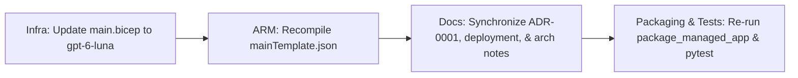

<!-- markdownlint-disable-file -->
---
title: "Core LLM Migration to GPT-6-Luna Implementation Plan"
description: "Implementation plan for migrating the core LLM model from gpt-4o to gpt-6-luna across infrastructure, packaging, tests, and architecture documentation"
author: "RPI Implement"
ms.date: 2026-10-06
ms.topic: reference
keywords:
  - HR Copilot
  - gpt-6-luna
  - model migration
  - Azure OpenAI
  - Bicep
---

# Core LLM Migration to GPT-6-Luna Implementation Plan

## Task Metadata

* Task ID: `gpt-6-luna-migration`
* Task slug: `gpt-6-luna-migration`
* Plan date: 2026-10-06
* Requested artifact: `.copilot-tracking/plans/2026-10-06/gpt-6-luna-migration-plan.md`

## Executive Summary

This plan sequences the migration of the core LLM model of the enterprise HR Copilot solution from `gpt-4o` to `gpt-6-luna` (version `2026-preview`). The migration encompasses updating Azure Bicep infrastructure definitions, recompiling the ARM template, synchronizing architecture and deployment documentation, updating packaging assertions, re-running the Managed Application packager, and running the complete test suite.

* Planning result: Complete.
* Readiness: Ready for immediate execution.
* Confidence: High.

## Phase Checklist

<!-- rpi:phase id=P01 -->
### [x] P01 (P0): Core LLM Model Migration to GPT-6-Luna

Goals:
* Replace `gpt-4o` with `gpt-6-luna` (version `2026-preview`) in infrastructure Bicep templates.
* Recompile ARM deployment template `infra/mainTemplate.json` using `az bicep build`.
* Update ADR-0001, Managed Application deployment documentation, Teams deployment documentation, and architecture notes.
* Update packaging test assertions to verify `gpt-6-luna` deployment.
* Re-run Azure Managed Application packager utility (`packaging/managed_app/package_managed_app.py`) to regenerate `app.zip`.
* Execute the complete test suite (`uv run pytest -v`) with 100% pass rate.

<!-- rpi:task id=P01-T01 -->
#### [x] P01-T01: Update Bicep infrastructure definition and recompile ARM template

Goals:
* Update `infra/main.bicep` Cognitive Services deployment resource to `gpt-6-luna` (name `gpt-6-luna`, version `2026-preview`).
* Recompile `infra/mainTemplate.json` via `az bicep build --file infra/main.bicep --outfile infra/mainTemplate.json`.

Requirements:
* Cognitive Services deployment resource specifies model name `gpt-6-luna` and version `2026-preview`.
* ARM template compiles with 0 errors and zero hardcoded secrets.

<!-- rpi:task id=P01-T02 -->
#### [x] P01-T02: Update architecture and planning documentation

Goals:
* Update `docs/planning/adrs/0001-choose-agentic-hr-architecture.md` (Axis 2: Retrieval and Models, driver assessment).
* Update `docs/deployment/azure-managed-application.md` architecture diagram.
* Update `docs/deployment/azure-teams-deployment.md` architecture diagram and resource inventory table.
* Update `.copilot-tracking/details/architecture-notes.md` service table, data flow, C4 diagrams, and cost optimization notes.

Requirements:
* All architecture and planning documentation consistently cite `gpt-6-luna` as the core synthesis model.

<!-- rpi:task id=P01-T03 -->
#### [x] P01-T03: Update tests, re-run Managed App packager, and execute full test suite

Goals:
* Update `tests/test_packaging.py` to assert `'gpt-6-luna'` in Bicep content.
* Re-run `python packaging/managed_app/package_managed_app.py` to revalidate and regenerate `packaging/managed_app/app.zip`.
* Run full test suite `$env:PYTHONPATH='.'; uv run pytest -v` ensuring all tests pass.

Requirements:
* 100% test pass rate across all test modules.
* Zero hardcoded secrets in any modified or generated artifacts.
