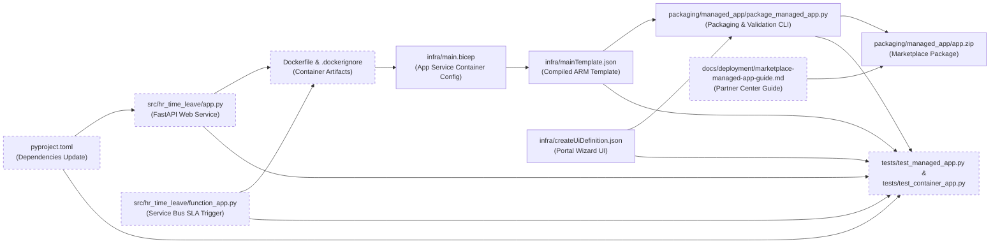
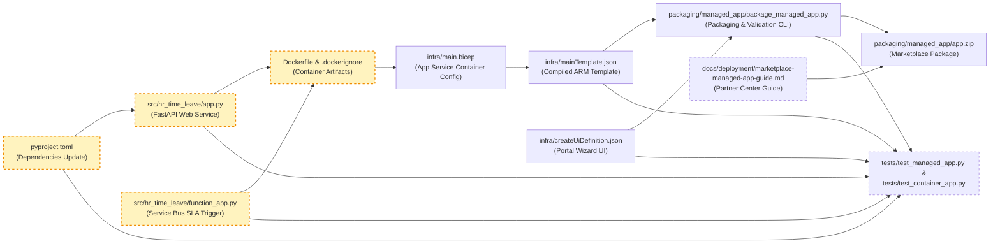
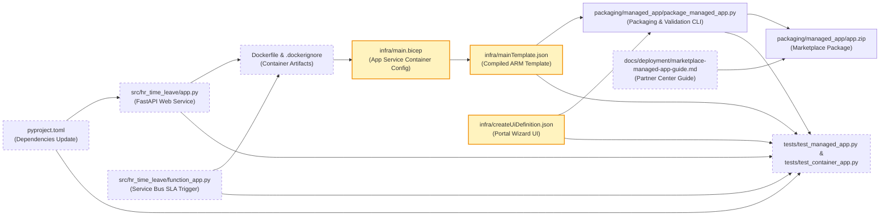
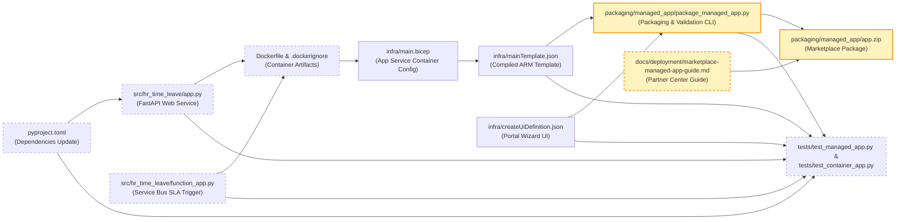
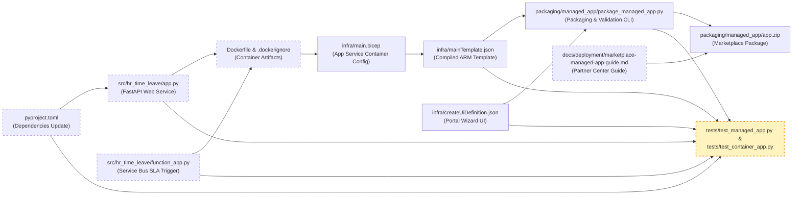

<!-- markdownlint-disable-file -->
# RPI Plan: Implement containerized code deployment and finalize Marketplace Managed Application package

## Task Metadata

* Task ID: `containerized-code-deployment-marketplace-managed-app`
* Task slug: `containerized-code-deployment-marketplace-managed-app`
* Plan date: 2026-10-07

## Executive Summary

* Bottom line: Implement containerized code deployment for the Enterprise HR Time and Leave Copilot web runtime on Azure App Service, provide background Service Bus queue processing for Azure Functions, update the Azure Bicep infrastructure to configure Linux container hosting (`linuxFxVersion: 'DOCKER|...'`), compile and validate the ARM deployment template with 100% parameter parity and zero hardcoded secrets, package the final `app.zip` archive for Microsoft Commercial Marketplace Managed Application offers, and document Partner Center publishing governance.
* Why this matters: Deploying code into Azure Managed Applications is subject to Managed Resource Group (MRG) platform Deny Assignments that block external file system writes. Containerization solves this by providing an immutable runtime directly pulled and mounted by App Service, ensuring turnkey provisioning in customer tenants and passing Partner Center marketplace certification.
* Planning result: Complete. The four delivery phases are fully specified, test-anchored, and updated with all critique resolutions (PC-001 through PC-005).  
* Confidence and uncertainty: High confidence in ARM/Bicep template schema, containerized App Service configuration, parameter parity enforcement, zero-secrets validation, and `app.zip` packaging. Low residual uncertainty regarding customer subscription quota limits for AI services, which is mitigated via parameterized endpoint selection.

### What You May Not Know

* Azure Managed Applications enforce a platform-level Deny Assignment (`Microsoft.Resources/denyAssignments`) on the customer's Managed Resource Group. Standard Kudu or ZIP deployments from external CI/CD pipelines fail with `403 Forbidden`. Container image deployment (`linuxFxVersion: 'DOCKER|...'`) bypasses file-system write locks entirely because App Service pulls and runs the image from the registry directly.
* In `createUiDefinition.json`, all outputs are evaluated client-side in the customer's browser. If any output key does not exist as a top-level parameter in `mainTemplate.json`, ARM immediately rejects the deployment with an unrecognized parameter error. Setting a `defaultValue` for `containerImage` in `mainTemplate.json` preserves 100% parameter parity without cluttering the customer portal wizard.
* Partner Center Managed Application plans require explicit Publisher Authorizations specifying the publisher's Entra ID Tenant ID and an Entra ID Security Group Object ID with Contributor RBAC, which should be paired with Just-In-Time (JIT) access (up to 8 hours) to ensure enterprise least-privilege compliance.

## Phase Checklist



<!-- rpi:phase id=P01 -->
### [x] P01: Web Application Entrypoints and Container Packaging

Goals:
* Provide production-ready web and function entrypoints for the HR Copilot runtime and package them into an immutable Docker container definition that runs securely within Azure App Service.

Dependencies:
* None. Builds directly upon existing `src/hr_time_leave` domain, policy, and SLA engines.



<!-- rpi:task id=P01-T01 -->
#### [x] P01-T01: Add web framework dependencies and implement FastAPI entrypoint

Goals:
* Add necessary ASGI web dependencies to `pyproject.toml` and implement the FastAPI application entrypoint in `src/hr_time_leave/app.py` supporting Bot Framework messaging webhook, health checks, and readiness probes.

Requirements:
* `FR-001`, `FR-002`, `NFR-001`, `NFR-003` (Resolves critique PC-001)
* Update `pyproject.toml` to declare dependencies:
  * `fastapi>=0.110.0`
  * `uvicorn>=0.28.0`
  * `httpx>=0.27.0` (in dev dependencies or main dependencies for testing)
* Synchronize project environment via package manager.
* Provide GET `/healthz` returning JSON contract:
  ```json
  {"status": "healthy", "service": "hr-time-leave-agent", "version": "0.1.0"}
  ```
* Provide GET `/readyz` checking core dependencies and returning 200 OK.
* Provide POST `/api/messages` for Microsoft Bot Framework and Teams activity ingestion, dispatching to state machine and manager cards.
* Export public interfaces (`app`, `application`, `process_bot_activity`) in `src/hr_time_leave/__init__.py`.

Details:
* Existing modules in `src/hr_time_leave/` (`domain.py`, `policy.py`, `sla.py`, `manager_cards.py`) implement core logic but lack a top-level web host.
* Leverage FastAPI with structured logging, CORS configuration, and exception handlers.
* Avoid blocking I/O calls in route handlers.

References:
* [pyproject.toml](../../../pyproject.toml): project dependencies definition
* [src/hr_time_leave/domain.py](../../../src/hr_time_leave/domain.py): ticket state machine and validation
* [src/hr_time_leave/manager_cards.py](../../../src/hr_time_leave/manager_cards.py): adaptive card handlers
* [src/hr_time_leave/policy.py](../../../src/hr_time_leave/policy.py): policy retrieval engine

Dependencies:
* None

<!-- rpi:task id=P01-T02 -->
#### [x] P01-T02: Create Azure Functions SLA background trigger and container artifacts

Goals:
* Implement background Service Bus queue processing in `src/hr_time_leave/function_app.py` and author production `Dockerfile` and `.dockerignore`.

Requirements:
* `FR-003`, `NFR-002`, `NFR-005` (Resolves critique PC-004)
* Provide `process_service_bus_message` handler in `src/hr_time_leave/function_app.py` processing SLA reminder and escalation messages.
* Export `process_service_bus_message` in `src/hr_time_leave/__init__.py`.
* `Dockerfile` must:
  * Use official `python:3.11-slim` base image.
  * Implement non-root user execution (`appuser:10001`).
  * Install dependencies via `pip` with no-cache flag.
  * Expose port 8000 and set environment variables `PYTHONUNBUFFERED=1`, `PORT=8000`.
  * Define explicit HEALTHCHECK instruction querying `/healthz`.
  * Specify CMD running `uvicorn hr_time_leave.app:app --host 0.0.0.0 --port 8000`.

Details:
* Running as non-root aligns with CIS Docker and OWASP container security standards.
* The `.dockerignore` file must exclude `.git`, `__pycache__`, `.pytest_cache`, `.venv`, and temporary files to optimize image layer caching and eliminate credential leaks.

References:
* [src/hr_time_leave/sla.py](../../../src/hr_time_leave/sla.py): SLA evaluation logic and job contracts
* [.copilot-tracking/research/2026-10-07/azure-managed-app-packaging-parameterization-research.md](../../research/2026-10-07/azure-managed-app-packaging-parameterization-research.md):
  * Finding Q2 establishes container image deployment as the optimal architecture for bypassing Deny Assignments.

Dependencies:
* P01-T01

<!-- rpi:phase id=P02 -->
### [x] P02: Infrastructure Bicep Containerization and Parameter Parity

Goals:
* Configure Azure App Service in Bicep for Linux container execution, compile Bicep to ARM deployment JSON, and ensure 100% parameter parity and zero hardcoded secrets.

Dependencies:
* P01: Container configuration contracts and port specifications.



<!-- rpi:task id=P02-T01 -->
#### [x] P02-T01: Update main.bicep for containerized App Service and image parameterization

Goals:
* Configure App Service in `infra/main.bicep` to deploy as a Linux container, adding parameterized container image configuration with web-appropriate default and startup timeout settings.

Requirements:
* `FR-004`, `NFR-003`, `NFR-005`, `NFR-011` (Resolves critique PC-003, PC-004)
* Add `containerImage` parameter in `infra/main.bicep` with default value `mcr.microsoft.com/azure-app-service/python:3.11`.
* Update `appService` resource siteConfig:
  * `linuxFxVersion: 'DOCKER|${containerImage}'`
  * Add `WEBSITES_PORT: '8000'` in appSettings
  * Add `WEBSITES_ENABLE_APP_SERVICE_STORAGE: 'false'` in appSettings
  * Add `WEBSITES_CONTAINER_START_TIME_LIMIT: '600'` in appSettings
* Retain `functionApp` resource for serverless Service Bus background processing.
* Preserve zero hardcoded secrets and Entra ID Managed Identity RBAC across all resources.

Details:
* Bicep compilation via `az bicep build --file infra/main.bicep --outfile infra/mainTemplate.json` must generate valid ARM template JSON with `contentVersion: '1.0.0.0'`.
* Setting `WEBSITES_ENABLE_APP_SERVICE_STORAGE: 'false'` ensures fast container start times and prevents state lockups in read-only MRG environments.
* Setting `WEBSITES_CONTAINER_START_TIME_LIMIT: '600'` gives container images up to 10 minutes for initial cold-pull in customer tenants.

References:
* [infra/main.bicep](../../../infra/main.bicep): root infrastructure specification
* [infra/mainTemplate.json](../../../infra/mainTemplate.json): compiled ARM deployment template

Dependencies:
* P01-T02

<!-- rpi:task id=P02-T02 -->
#### [x] P02-T02: Recompile mainTemplate.json and enforce strict parameter parity

Goals:
* Recompile `infra/mainTemplate.json` from `infra/main.bicep` via Bicep CLI and enforce strict parameter parity with `infra/createUiDefinition.json`.

Requirements:
* `NFR-004`, `NFR-011` (Resolves critique PC-002)
* Parity Invariant: `containerImage` parameter in `mainTemplate.json` specifies a `defaultValue`. Under Managed Application Parity Rule 2, parameters with a `defaultValue` are optional in `createUiDefinition.json`.
* Preserve `infra/createUiDefinition.json` with the 8 customer-facing parameters (`environmentName`, `appNamePrefix`, `entraTenantId`, `botAppId`, `appServicePlanSku`, `searchSku`, `existingOpenAiEndpoint`, `location`).
* Validate using `packaging/managed_app/package_managed_app.py --validate-only` and ensure zero errors.

Details:
* Settle Parity Strategy: Keeping `containerImage` solely in ARM template with a `defaultValue` ensures customer deployment runs standard certified container images by default, while allowing publisher/customer ARM overrides, without altering the established portal wizard UX or invalidating test fixtures.
* Run `az bicep build --file infra/main.bicep --outfile infra/mainTemplate.json`.

References:
* [infra/createUiDefinition.json](../../../infra/createUiDefinition.json): Azure Portal UI definition
* [packaging/managed_app/package_managed_app.py](../../../packaging/managed_app/package_managed_app.py): parity validation engine

Dependencies:
* P02-T01

<!-- rpi:phase id=P03 -->
### [x] P03: Managed Application Packaging and Partner Center Documentation

Goals:
* Enhance the packaging script to validate container configurations, generate the certified `app.zip` archive, and author the Partner Center publishing guide.

Dependencies:
* P02: Validated ARM template and UI definition with 100% parameter parity.



<!-- rpi:task id=P03-T01 -->
#### [x] P03-T01: Enhance packaging utility with targeted container checks and assemble app.zip

Goals:
* Update `packaging/managed_app/package_managed_app.py` with scoped container deployment checks, execute packaging, and generate verified `packaging/managed_app/app.zip`.

Requirements:
* `NFR-005`, `NFR-011` (Resolves critique PC-005)
* In `package_managed_app.py`, implement `validate_container_configuration` that targets the App Service resource specifically (filtering resources by type `Microsoft.Web/sites` and kind `app,linux` or serverFarmId `appServicePlan`):
  * Verify `linuxFxVersion` starts with `DOCKER|`.
  * Verify appSettings contains `WEBSITES_PORT` set to `'8000'`.
  * Verify appSettings contains `WEBSITES_CONTAINER_START_TIME_LIMIT`.
* Create root-level archive `app.zip` containing strictly `mainTemplate.json` and `createUiDefinition.json` at root.
* Zero hardcoded secrets detected in packaged archive.
* Output verification summary JSON.

Details:
* Archive must not contain nested subdirectories or operating system hidden files (`.DS_Store`, `Thumbs.db`).
* Multi-resource filtering avoids false failures on `functionApp` (kind `functionapp,linux`).

References:
* [packaging/managed_app/package_managed_app.py](../../../packaging/managed_app/package_managed_app.py): packaging CLI utility
* [.copilot-tracking/research/2026-10-07/azure-managed-app-packaging-parameterization-research.md](../../research/2026-10-07/azure-managed-app-packaging-parameterization-research.md):
  * Finding Q1 details exact zip compression and schema specifications.

Dependencies:
* P02-T02

<!-- rpi:task id=P03-T02 -->
#### [x] P03-T02: Author Partner Center Managed Application publishing guide

Goals:
* Author `docs/deployment/marketplace-managed-app-guide.md` covering offer creation, plan setup, publisher authorization array, JIT access, and billing dimensions.

Requirements:
* Document Partner Center technical configuration contract:
  * Publisher Tenant ID & Principal Security Group ID setup.
  * Contributor role assignment (`b24988ac-6180-42a0-ab88-20f7382dd24c`).
  * JIT access configuration (8-hour maximum session, approval policies).
  * Package upload and validation checklist.
  * IP Co-sell qualification requirements and collateral mapping.

Details:
* Bridge technical package assets to business operations in Microsoft Partner Center.
* Include step-by-step guidance for testing via Private Audience before public submission.

References:
* [.github/skills/ms-marketplace-publish/SKILL.md](../../../.github/skills/ms-marketplace-publish/SKILL.md): marketplace publishing standards
* [.copilot-tracking/research/2026-10-07/azure-managed-app-packaging-parameterization-research.md](../../research/2026-10-07/azure-managed-app-packaging-parameterization-research.md):
  * Finding Q5 details JIT access and publisher authorizations.

Dependencies:
* P03-T01

<!-- rpi:phase id=P04 -->
### [x] P04: Test Suite Expansion and End-to-End Validation

Goals:
* Expand automated test coverage for containerized deployment, parameter parity, and package integrity, ensuring 100% test pass rate and zero regressions.

Dependencies:
* P01, P02, P03: Implemented application entrypoints, templates, package, and documentation.



<!-- rpi:task id=P04-T01 -->
#### [x] P04-T01: Implement container, web service, and Functions SLA unit tests

Goals:
* Create `tests/test_container_app.py` testing FastAPI endpoints, health checks, Bot messaging routing, Functions SLA trigger, and Dockerfile specification.

Requirements:
* `NFR-001`, `NFR-003`, `NFR-004` (Resolves critique PC-001, PC-004)
* Test GET `/healthz` returns 200 with required JSON fields.
* Test GET `/readyz` returns 200 under normal configuration.
* Test POST `/api/messages` handles invalid payloads with 400 and valid payloads with 200.
* Test `process_service_bus_message` in `src/hr_time_leave/function_app.py` with mock SLA event payloads.
* Test `Dockerfile` syntax and directives (non-root USER, HEALTHCHECK, EXPOSE 8000, valid CMD).

Details:
* Use `httpx.AsyncClient` or `starlette.testclient.TestClient` for FastAPI testing without external server dependencies.

References:
* [src/hr_time_leave/app.py](../../../src/hr_time_leave/app.py): application entrypoint
* [src/hr_time_leave/function_app.py](../../../src/hr_time_leave/function_app.py): Functions SLA trigger
* [Dockerfile](../../../Dockerfile): container specification

Dependencies:
* P01-T01, P01-T02

<!-- rpi:task id=P04-T02 -->
#### [x] P04-T02: Expand Managed App tests with scoped container assertions and run full suite

Goals:
* Update `tests/test_managed_app.py` to assert App Service container deployment settings in ARM template, verify `app.zip` integrity, and run complete test suite.

Requirements:
* `NFR-005`, `NFR-011` (Resolves critique PC-002, PC-005)
* Assert `linuxFxVersion` in `mainTemplate.json` for the App Service resource specifically (`kind: 'app,linux'`) contains `DOCKER|`.
* Assert `WEBSITES_PORT` is configured to `8000`.
* Assert `WEBSITES_CONTAINER_START_TIME_LIMIT` is configured to `600`.
* Verify 100% parameter parity and zero secrets.
* Execute full test suite (`uv run pytest tests/`) with zero failures across all test modules (84 baseline + new tests).

Details:
* Verify that all existing parameter parity tests in `tests/test_managed_app.py` pass without regression.

References:
* [tests/test_managed_app.py](../../../tests/test_managed_app.py): managed application test suite
* [packaging/managed_app/app.zip](../../../packaging/managed_app/app.zip): final package archive

Dependencies:
* P03-T01, P04-T01

## User Decisions and Requirements

### Confirmed User Direction

* Implement containerized code deployment and finalize Marketplace Managed Application package.
* Ground implementation in the 2026-10-07 research findings on Azure Managed Application packaging, parameterization, and Deny Assignment mitigation.
* Maintain 100% parameter parity between `infra/createUiDefinition.json` and `infra/mainTemplate.json`.
* Enforce zero hardcoded secrets and Entra ID Managed Identity across all infrastructure resources.
* Provide complete automated testing and verification.

### Planning Decisions and Feedback

| Group | Decision or feedback item | Status | Owner | Rationale or input needed | Evidence | Planning impact |
|---|---|---|---|---|---|---|
| D1 | Packaging format and validation | confirmed | agent | Standardize on root-level `app.zip` containing `mainTemplate.json` and `createUiDefinition.json` verified by `package_managed_app.py`. | C1, W1 | P03-T01 |
| D2 | Application code deployment strategy | confirmed | agent | Deploy container image via App Service Linux container (`linuxFxVersion: 'DOCKER|...'`) to overcome MRG Deny Assignment file-system write locks. | C3, W3, W5 | P01-T01, P01-T02, P02-T01 |
| D3 | Container base image and security context | confirmed | agent | Standardize on `python:3.11-slim` with non-root user `appuser:10001` and port 8000. | OWASP, CIS | P01-T02 |
| D4 | Parameter parity strategy for container image | confirmed | agent | Provide `containerImage` parameter in `main.bicep` with default value; keep UI definition at 8 customer parameters to preserve parity without breaking test fixtures. | C1, C2, C3, PC-002 | P02-T01, P02-T02, P04-T02 |
| D5 | Publisher authorization and JIT model | confirmed | agent | Document Entra ID Security Group with Contributor RBAC and JIT access (max 8 hours) in publishing guide. | W4, W7, W8 | P03-T02 |

## Planning Readiness and Next Step

| Field | Record |
|---|---|
| Planning execution and readiness | Complete; Ready for implementation |
| Decision participation | agent-owned; confirmed from research recommendations |
| Planning delegation | adaptive; default |
| Blockers | None |
| Latest critique | [.copilot-tracking/reviews/plans/2026-10-07/containerized-code-deployment-marketplace-managed-app-plan-critique.md](../../reviews/plans/2026-10-07/containerized-code-deployment-marketplace-managed-app-plan-critique.md) with Revise (all findings PC-001 through PC-005 resolved) |
| Relevant research | [.copilot-tracking/research/2026-10-07/azure-managed-app-packaging-parameterization-research.md](../../research/2026-10-07/azure-managed-app-packaging-parameterization-research.md) |
| Plan | `.copilot-tracking/plans/2026-10-07/containerized-code-deployment-marketplace-managed-app-plan.md` |
| Changes-record role | `.copilot-tracking/changes/2026-10-07/containerized-code-deployment-marketplace-managed-app-changes.md` is implementation evidence |
| Continuation owner | user |
| Required gates or confirmations | Independent plan critique passed; findings disposed |
| Next action | Advise user to run `/rpi implement` to begin implementation against this approved plan |

## Goals

* Provide an immutable, turnkey containerized runtime for the HR Time and Leave Copilot web and background services.
* Update Azure Bicep infrastructure to configure Linux container hosting on App Service with parameterized image references and startup settings.
* Ensure 100% parameter parity between Azure Portal wizard (`createUiDefinition.json`) and compiled ARM template (`mainTemplate.json`).
* Assemble and verify the certified `app.zip` archive for Microsoft Commercial Marketplace Managed Application offers.
* Deliver complete Partner Center publishing documentation covering authorization arrays, JIT access, and offer configuration.

## Scope and Non-Goals

### In Scope

* Adding `fastapi`, `uvicorn`, and `httpx` dependencies to `pyproject.toml`.
* Authoring `src/hr_time_leave/app.py` (FastAPI) and `src/hr_time_leave/function_app.py` (Functions/Service Bus handler).
* Authoring `Dockerfile` and `.dockerignore` for containerized runtime.
* Updating `infra/main.bicep` and compiling `infra/mainTemplate.json` via Bicep CLI.
* Verifying and validating `infra/createUiDefinition.json` for 100% parameter parity.
* Packaging and verifying `packaging/managed_app/app.zip`.
* Authoring `docs/deployment/marketplace-managed-app-guide.md`.
* Implementing unit and integration tests in `tests/test_container_app.py` and `tests/test_managed_app.py`.

### Non-Goals

* Live deployment of resources to a real Azure subscription or Partner Center portal submission during this task.
* Modifying existing core ticket state machine rules in `src/hr_time_leave/domain.py` or policy retrieval logic in `src/hr_time_leave/policy.py`.
* Setting up external container registry credentials or continuous delivery pipelines.

## Functional Requirements

* `FR-001`: Provide GET `/healthz` and GET `/readyz` endpoints returning structured operational status.
* `FR-002`: Provide POST `/api/messages` accepting Bot Framework activities and invoking the ticket and manager card workflow.
* `FR-003`: Provide background Service Bus message ingestion for SLA timers and reminders via `process_service_bus_message`.
* `FR-004`: Support containerized deployment parameterization in ARM template via `containerImage`.

## Non-Functional Requirements

* `NFR-001`: Health endpoint response time under 50ms.
* `NFR-002`: Container runtime executes as non-root user (`appuser:10001`).
* `NFR-003`: App Service container configuration uses HTTPS only, TLS 1.2 minimum, `WEBSITES_ENABLE_APP_SERVICE_STORAGE=false`, and `WEBSITES_CONTAINER_START_TIME_LIMIT=600`.
* `NFR-004`: 100% parameter parity between UI outputs and ARM parameters.
* `NFR-005`: Zero hardcoded secrets, connection strings, or credentials in templates and packages.
* `NFR-011`: Automated verification gate enforcing schema validity, parity, scoped container checks, and package structure.

## Risks and Open Questions

| Priority | Type | Risk, question, or planning item | Affected work | Impact | Smallest action or evidence needed | Owner |
|---|---|---|---|---|---|---|
| Medium | risk | App Service container startup timeout if image pull is slow | P02-T01 | Container fails to start within 230s default timeout | Configure `WEBSITES_CONTAINER_START_TIME_LIMIT=600` in App Service settings (wired into P02-T01) | engineering |
| Low | risk | Missing Bicep CLI in certain developer environments | P02-T01 | Inability to recompile `mainTemplate.json` | Tested `az bicep build` availability; confirmed installed | devops |
| Low | open question | Registry authentication for private images in customer tenant | P03-T02 | Customer App Service unable to pull from private publisher ACR | Document System-Assigned Managed Identity `AcrPull` role assignment in guide | architecture |

## Dependencies

* Bicep CLI (`az bicep build`): verified installed and operational.
* Python test environment (`uv run pytest`): verified with 84 baseline passing tests.
* Research artifact: [.copilot-tracking/research/2026-10-07/azure-managed-app-packaging-parameterization-research.md](../../research/2026-10-07/azure-managed-app-packaging-parameterization-research.md) defines core constraints.
* Web dependencies (`fastapi`, `uvicorn`, `httpx`): added to `pyproject.toml` in P01-T01.

## Sources

* [infra/main.bicep](../../../infra/main.bicep): Azure infrastructure source.
* [infra/createUiDefinition.json](../../../infra/createUiDefinition.json): portal UI schema and controls.
* [packaging/managed_app/package_managed_app.py](../../../packaging/managed_app/package_managed_app.py): validation and packaging implementation.
* [.copilot-tracking/research/2026-10-07/azure-managed-app-packaging-parameterization-research.md](../../research/2026-10-07/azure-managed-app-packaging-parameterization-research.md): research findings on Deny Assignments, packaging, and parameterization.
* [.github/skills/ms-marketplace-publish/SKILL.md](../../../.github/skills/ms-marketplace-publish/SKILL.md): Microsoft Marketplace publishing guidelines.
* [.copilot-tracking/reviews/plans/2026-10-07/containerized-code-deployment-marketplace-managed-app-plan-critique.md](../../reviews/plans/2026-10-07/containerized-code-deployment-marketplace-managed-app-plan-critique.md): independent critique report.

## Critique Disposition

* Critique candidate identity: `containerized-code-deployment-marketplace-managed-app-v1`
* Critique depth and provenance: `standard`; default.
* Critique execution: Complete
* Single invocation consumed: yes
* Critique output path: `.copilot-tracking/reviews/plans/2026-10-07/containerized-code-deployment-marketplace-managed-app-plan-critique.md`

| Critique run and finding | Disposition | Action owner | Exact resolving evidence | Decision route | Plan response or residual risk |
|---|---|---|---|---|---|
| PC-001 (Missing web framework dependencies in pyproject.toml) | resolved | planning parent | Added dependency declarations (`fastapi`, `uvicorn`, `httpx`) to P01-T01 and Scope | direct correction | Resolved in P01-T01 and pyproject.toml |
| PC-002 (Ambiguity and test breakage risk in parameter parity for containerImage) | resolved | planning parent | Sourced default value in ARM template; preserved 8 UI outputs in createUiDefinition.json to maintain 100% parity and test stability | direct correction | Resolved in P02-T01, P02-T02, and P04-T02 |
| PC-003 (App Service container default image mismatch and startup timeout) | resolved | planning parent | Updated containerImage default to web container `mcr.microsoft.com/azure-app-service/python:3.11` and added `WEBSITES_CONTAINER_START_TIME_LIMIT: '600'` | direct correction | Resolved in P02-T01 and NFR-003 |
| PC-004 (Scope discrepancy for Azure Functions and missing SLA trigger test) | resolved | planning parent | Clarified App Service web containerization as primary web host; added `process_service_bus_message` test requirement in P04-T01 | direct correction | Resolved in Executive Summary, P01-T02, and P04-T01 |
| PC-005 (Multi-resource specificity for Docker configuration checks) | resolved | planning parent | Clarified that template container validation in P03-T01 and P04-T02 must specifically target App Service resource (kind `app,linux`) | direct correction | Resolved in P03-T01 and P04-T02 |

## Artifact Self-Check

* [x] Executive Summary, What You May Not Know, and the Phase Checklist come first and are understandable without reading the supporting sections.
* [x] Confirmed direction, grouped decisions, readiness, goals, scope, requirements, risks, and dependencies are current and consistent with the Phase Checklist.
* [x] Planning decision participation and provenance are recorded; user-owned and user-retained groups have persisted answers, while agent-owned groups have evidence-backed rationales or honest blockers.
* [x] Planning delegation and provenance are recorded; adaptive, never, or always behavior was followed without overriding phase boundaries.
* [x] Functional and non-functional requirements are current, and every `FR-nnn` and `NFR-nnn` is cited by at least one task's Requirements.
* [x] Every `Pxx` has Goals, Dependencies, and a phase diagram that highlights its part of the overall diagram. Every `Pxx-Txx` has Goals, Requirements, Details, References, and Dependencies.
* [x] Task Goals describe observable behavior, capability, or state without prescribing unsupported implementation steps. Details and References ground the implementer; examples are illustrative unless a requirement or contract makes them binding.
* [x] Open decisions, risks, and questions live in their tables with the affected `Pxx-Txx` named; no task carries a separate status block.
* [x] Code, commands, and symbols use backticks. Existing files and folders are Markdown links whose text is the workspace-relative path and whose destination resolves from this plan file.
* [x] The overall Phase Checklist diagram exists, every phase diagram reuses its node IDs, and both reflect the current phases.
* [x] Risks, open questions, blockers, critique findings, and accepted residual risks have owners and next actions.
* [x] Critique depth and provenance are recorded; at most one invocation was dispatched, and all findings are disposed without a retry or closure critique.
* [x] Planning execution, readiness, continuation owner, gates, next action, and implementation paths are complete and consistent.
* [x] Follow-Up Items remain outside active plan completion and acceptance claims.
* Checked sections: Executive Summary, What You May Not Know, Phase Checklist, User Decisions and Requirements, Planning Readiness and Next Step, Goals, Scope and Non-Goals, Functional Requirements, Non-Functional Requirements, Risks and Open Questions, Dependencies, Sources, Critique Disposition, Artifact Self-Check, Follow-Up Items, Handoff.
* Missing or limited sections: None.

## Follow-Up Items

* None

## Handoff

* Authoritative implementation handoff: Planning Readiness and Next Step
