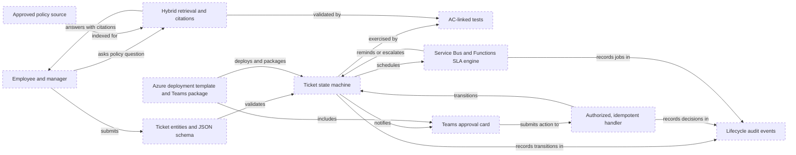
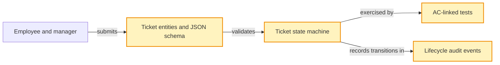
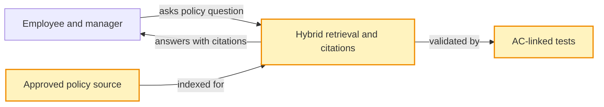
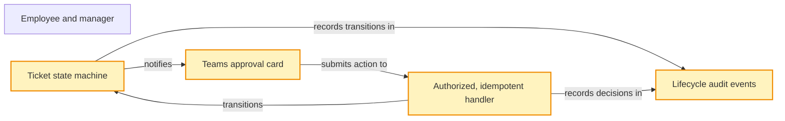
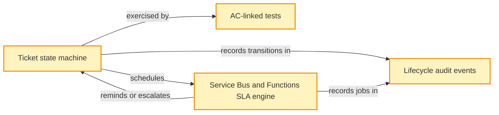
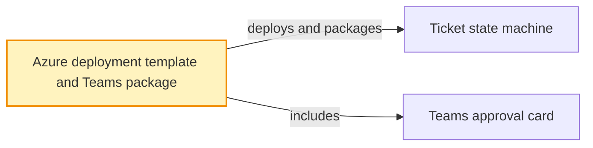

<!-- markdownlint-disable-file -->
---
title: "HR Time and Leave Agent Implementation Plan"
description: "Phased implementation plan for the HR time and leave Copilot agent"
author: "RPI Plan"
ms.date: 2026-09-29
ms.topic: reference
keywords:
  - HR Copilot
  - implementation plan
  - phased delivery
---

## Task Metadata

* Task ID: `hr-time-leave-agent-implementation`
* Task slug: `hr-time-leave-agent-implementation`
* Plan date: 2026-09-29
* Requested artifact: `.copilot-tracking/plans/implementation-plan.md`

## Executive Summary

This plan sequences the requested HR Copilot work into five phases: ticket state and validation, cited policy retrieval, manager approval, SLA processing, and deployment/package preparation. It uses the supplied PRD acceptance criteria as test anchors and the ADR as the proposed architecture baseline.

* Planning result: Partial. The requested phases are defined, but the plan is not ready for unrestricted production implementation.
* Readiness: Core state, retrieval, and approval work can proceed against approved test fixtures. Production SLA configuration and deployment remain gated on policy, architecture, and platform decisions.
* Confidence: High for the requested phase order and stated criteria; limited for production rules and architecture approval because the evidence pack does not establish them.

### What You May Not Know

* The traceability matrix and ADR both say the HR policy and ticket specification are synthetic, the PRD is a draft, and the ADR is still proposed. The user-requested phase sequence is treated as confirmed direction; those source artifacts are not treated as approved production authority.
* The 48-business-hour reminder and 72-hour escalation in the PRD conflict with the ticket specification's 48-hour escalation. Do not enable a production timer until the HR policy owner resolves the conflict and calendar semantics.
* Cosmos DB alone does not make audit records immutable. The audit integrity and retention mechanism remains an implementation/release gate.
* The Azure deployment target and Teams package route are not approved in the cited ADR. Phase 5 prepares deployment and manifest artifacts only after those decisions are confirmed.

## Phase Checklist

<!-- rpi:phase id=P01 -->
### [ ] P01 (P0): Foundation and Core State Machine

Goals:
* Establish validated ticket data and explicit, testable lifecycle transitions so later approval and timer work cannot mutate malformed or invalid state.

Dependencies:
* Use the supplied PRD criteria and ticket specification as test fixtures only until the HR policy owner approves production rules.

<!-- rpi:task id=P01-T01 -->
#### [x] P01-T01: Define ticket contracts and transition behavior

Goals:
* Represent ticket types and lifecycle states in validated domain data, with a deterministic transition boundary.

Requirements:
* PRD `FR-002`; `NFR-004`, `NFR-005`, `NFR-006`, `NFR-008`, `NFR-009`, `NFR-010`, and `NFR-013`; ADR C2 and C3.
* Preserve the requested lifecycle contract: `DRAFT` to `PENDING_APPROVAL`, then a valid decision to `APPROVED` or `REJECTED`, or an authorized SLA process to `ESCALATED`.
* Add unit tests mapped to `AC-004`, `AC-005`, and `AC-010`: a valid annual-leave request creates a pending ticket; a request beyond accrued balance plus the three-day ceiling remains unsubmitted; and rejection requires a reason.
* Reject invalid transitions and malformed ticket payloads without changing the persisted ticket.
* Keep medical details and restricted compensation out of manager-facing projections and general-purpose telemetry. Do not assert that the selected store is immutable without a separately approved integrity control.

Details:
* Use schema validation at the ticket boundary and keep business validation separate from model-generated text. The exact schema and transition API are implementation contracts to be established in code.
* The user authorized creating a Python application package in this repository for this task; keep it limited to ticket domain behavior and its tests.
* Cover all four PRD ticket categories in the domain model, but do not invent missing overtime or attendance rules. Add only rule validations supported by authoritative approved policy.
* Record lifecycle audit fields required by `NFR-013`; the production append-only or tamper-evidence mechanism remains unresolved and must be closed before production.

References:
* [`.copilot-tracking/prd-sessions/requirements.md`](../prd-sessions/requirements.md): `FR-002`, `NFR-004` through `NFR-010`, `NFR-013`, `AC-004`, `AC-005`, and `AC-010`.
* [`.copilot-tracking/details/traceability-matrix.md`](../details/traceability-matrix.md): `BR-07`, `BR-09`, and gaps in ticket transition, privacy, and audit coverage.
* [`docs/planning/adrs/0001-choose-agentic-hr-architecture.md`](../../docs/planning/adrs/0001-choose-agentic-hr-architecture.md): proposed LangGraph/MCP boundary and C2-C4 constraints.

Dependencies:
* None.

<!-- rpi:phase id=P02 -->
### [x] P02 (P0): Grounded Policy Retrieval

Goals:
* Answer supported HR policy questions from versioned approved sources with relevant section citations, and safely decline or route unsupported or conflicting questions.

Dependencies:
* P01 establishes the initial domain boundary and test-fixture conventions; policy indexing can proceed with synthetic fixtures until authoritative tenant policy is approved.

<!-- rpi:task id=P02-T01 -->
#### [x] P02-T01: Index policy sections and return grounded citations

Goals:
* Retrieve the applicable policy clauses for a user question and return a citation or an explicit unsupported/conflict response.

Requirements:
* PRD `FR-001`; `NFR-001`, `NFR-010`, `NFR-011`, and `NFR-012`; acceptance criteria `AC-001`, `AC-002`, and `AC-003`.
* Implement policy chunking and hybrid BM25/vector retrieval with section-level citations that preserve source identity and version.
* Demonstrate the specified annual-leave notice answer and citation (`AC-001`), no invented answer outside the corpus (`AC-002`), and conflict handling (`AC-003`) using approved test fixtures.

Details:
* Follow the proposed Azure AI Search hybrid retrieval and reranking baseline in the ADR, subject to architecture approval. Treat Foundry moderation as a supporting control, not as a substitute for access control, data minimization, or authoritative policy selection.
* Keep policy version, effective-date and tenant applicability explicit in retrieval metadata; measure response latency against the PRD target under a defined test workload.
* Do not publish synthetic SOP-HR-042 content as real customer policy.

References:
* [`.copilot-tracking/prd-sessions/requirements.md`](../prd-sessions/requirements.md): `FR-001`, `NFR-001`, `NFR-010` through `NFR-012`, and `AC-001` through `AC-003`.
* [`.copilot-tracking/details/traceability-matrix.md`](../details/traceability-matrix.md): `BR-01`, policy effective-date/version gaps, and unsupported-claim status.
* [`docs/planning/adrs/0001-choose-agentic-hr-architecture.md`](../../docs/planning/adrs/0001-choose-agentic-hr-architecture.md): proposed Foundry, Storage, hybrid Search, and citation topology.

Dependencies:
* P01 provides the shared request boundary; production answers additionally depend on an HR-approved, versioned policy source.

<!-- rpi:phase id=P03 -->
### [x] P03 (P1): Teams Approval and Manager Handler

Goals:
* Let an authorized direct manager review only permitted ticket details in Teams and make a human-attributed, safe, idempotent decision.

Dependencies:
* P01 supplies ticket state and audit contracts. Confirm the target Teams host and card action contract before production enablement.

<!-- rpi:task id=P03-T01 -->
#### [x] P03-T01: Build the manager card and protected action handler

Goals:
* Present a sanitized approval card and apply an approval or rejection only when the authenticated manager remains authorized for the current pending ticket.

Requirements:
* PRD `FR-003`; `NFR-004` through `NFR-010`, `NFR-013`, and `NFR-015`; acceptance criteria `AC-008`, `AC-009`, and `AC-010`.
* Verify direct-report authorization server-side, enforce current-state and idempotency checks, require a rejection reason, and audit the actor and transition.
* Ensure manager/card projections exclude medical diagnosis, notes, and unauthorized compensation data.

Details:
* Treat card actions and all card-supplied identifiers as untrusted input. Re-authenticate and re-authorize each action, check that the ticket is pending, and make retries safe. Do not embed access tokens in the card.
* Resolve the PRD's `Request Information` action semantics before enabling it. The specification does not define its ticket-state effect, response path, or audit contract; do not invent a new state.
* The experience design's card schema is a wireframe, not a verified production-host contract. Validate action payloads, rejection reason capture, accessibility, and host support in the target tenant.

Guidance:
* Reuse the [`src/hr_time_leave/domain.py`](../../src/hr_time_leave/domain.py) contracts, especially `Ticket`, `Ticket.manager_view()`, `transition_ticket()`, `TicketStatus`, and `LifecycleAction`; the manager projection enforces certification-only disclosure for `SICK_LEAVE` (`CERTIFIED_MEDICAL_LEAVE_STATUS`) while allowlisting other ticket types, and the transition API records actor, action, channel, UTC time, and state.

References:
* [`.copilot-tracking/prd-sessions/requirements.md`](../prd-sessions/requirements.md): `FR-003`, role/privacy requirements, and `AC-008` through `AC-010`.
* [`.copilot-tracking/details/traceability-matrix.md`](../details/traceability-matrix.md): `BR-06`, `BR-07`, `BR-09`, and Teams authorization/privacy gaps.
* [`docs/planning/adrs/0001-choose-agentic-hr-architecture.md`](../../docs/planning/adrs/0001-choose-agentic-hr-architecture.md): proposed Entra, Teams, MCP, and ticket-store boundaries.

Dependencies:
* P01 transition and audit contracts; P05 package/host validation before release.

<!-- rpi:phase id=P04 -->
### [x] P04 (P1): Asynchronous SLA Timer Engine

Goals:
* Deliver auditable reminders and escalation transitions without allowing duplicate or stale jobs to alter a ticket.

Dependencies:
* P01 ticket transitions and audit contract. Production timer configuration is blocked on HR policy resolution of the conflicting escalation threshold and calendar semantics.

<!-- rpi:task id=P04-T01 -->
#### [x] P04-T01: Schedule and process reminder and escalation jobs

Goals:
* Process the approved manager reminder and HR escalation thresholds using durable asynchronous work and authoritative ticket-state checks.

Requirements:
* PRD `FR-004`; `NFR-002`, `NFR-004`, `NFR-011`, `NFR-012`, `NFR-013`, and `NFR-014`; acceptance criteria `AC-011`, `AC-012`, and `AC-013`.
* Implement the requested 48-hour reminder and 72-hour escalation as configurable thresholds, not embedded constants, and prove duplicate jobs cannot create duplicate lifecycle transitions.
* Meet the PRD's dispatch target of 99% of jobs within five minutes of the calculated threshold under a defined test load.

Details:
* Use the ADR's proposed Service Bus and Functions path with durable scheduling, retry/dead-letter handling, job reconciliation, and state re-check before each action.
* Add simulated-clock tests for reminder, escalation, already-decided tickets, duplicate deliveries, retry, and recovery. Keep escalation disabled in production until an authorized HR policy owner resolves the conflict between PRD/SOP and the ticket specification.
* Record UTC job and transition events. Keep PII and free-text reasons out of metric dimensions and general logs; use the telemetry vocabulary and redaction rules in the linked references.

Guidance:
* Reuse the [`src/hr_time_leave/domain.py`](../../src/hr_time_leave/domain.py) transition contracts (`transition_ticket()`, `TicketStatus.ESCALATED`, and `LifecycleAction.ESCALATE`) and manager card/action handler contracts in [`src/hr_time_leave/manager_cards.py`](../../src/hr_time_leave/manager_cards.py) when evaluating whether pending tickets remain unreviewed or have already been decided.

References:
* [`.copilot-tracking/prd-sessions/requirements.md`](../prd-sessions/requirements.md): `FR-004`, `NFR-002`, `NFR-004`, `NFR-011` through `NFR-014`, and `AC-011` through `AC-013`.
* [`.copilot-tracking/details/traceability-matrix.md`](../details/traceability-matrix.md): contradiction `C-01` and gaps in timer, queue, retry, and escalation evidence.
* [`docs/planning/adrs/0001-choose-agentic-hr-architecture.md`](../../docs/planning/adrs/0001-choose-agentic-hr-architecture.md): proposed Service Bus/Functions topology and deferred SLA constraint.
* [`.github/skills/shared/telemetry-foundations/SKILL.md`](../../.github/skills/shared/telemetry-foundations/SKILL.md): span, metric, and log vocabulary.
* [`.github/skills/shared/telemetry-foundations/references/pii-denylist.md`](../../.github/skills/shared/telemetry-foundations/references/pii-denylist.md): default-deny PII telemetry fields and redaction strategies.

Dependencies:
* P01; HR policy owner approval of threshold, time basis, business calendar, timezone, holidays, and pause/reopen semantics before production activation.

<!-- rpi:phase id=P05 -->
### [x] P05 (P2): Packaging and Marketplace Readiness

Goals:
* Prepare a repeatable Azure deployment template and Teams app package while keeping unapproved infrastructure, permissions, and publication claims out of production.

Dependencies:
* P01 through P04 provide the deployable behavior. Architecture/design authority must adopt or revise the proposed ADR; platform and publisher owners must confirm deployment and distribution choices.

<!-- rpi:task id=P05-T01 -->
#### [x] P05-T01: Prepare deployment and Teams package artifacts

Goals:
* Make the proposed service and Teams experience installable in a controlled test environment with a documented configuration and permission boundary.

Requirements:
* PRD `NFR-003`, `NFR-005`, `NFR-011`, `NFR-012`, `NFR-014`, and `NFR-015`; ADR C5 and the ADR decision outcome.
* Produce an Azure deployment template and Teams app manifest/package with environment-specific configuration, least-privilege permission documentation, health/operational settings, and no embedded secrets.
* Validate package/deployment in a non-production tenant and environment; do not claim marketplace certification or public-store eligibility from a successful local package check.

Details:
* Follow the proposed App Service, Foundry, Azure AI Search, Storage, separate Cosmos DB stores, Service Bus, and Functions topology only after architecture approval. Keep model/provider, region, tenant/data ownership, audit integrity, IaC format, and customer-managed versus SaaS deployment decisions explicit until owners resolve them.
* Verify the current Teams manifest schema, supported custom-engine route, required assets, consent model, and target host capabilities against current official specifications before packaging. The traceability matrix and prior store plan mark these details unverified.
* Include clean-environment deployment, permissions/consent, removal/rollback, and operational smoke checks. The PRD's 99.9% availability target requires an agreed operational design and evidence; a template alone does not prove it.

Guidance:
* Leverage the [`src/hr_time_leave/sla.py`](../../src/hr_time_leave/sla.py) contracts and configuration (`SLAConfiguration`, `BusinessCalendar`, `SLA_CHANNEL`, and queue parameters) alongside [`src/hr_time_leave/manager_cards.py`](../../src/hr_time_leave/manager_cards.py) and [`src/hr_time_leave/domain.py`](../../src/hr_time_leave/domain.py) when configuring Azure Service Bus, Azure Functions scheduled triggers, Teams card manifest settings, and operational environment settings.

References:
* [`.copilot-tracking/prd-sessions/requirements.md`](../prd-sessions/requirements.md): `NFR-003`, `NFR-005`, `NFR-011`, `NFR-012`, `NFR-014`, and `NFR-015`.
* [`.copilot-tracking/details/traceability-matrix.md`](../details/traceability-matrix.md): marketplace readiness gaps and contradictions `C-02`, `C-03`, `C-04`, `C-07`, `C-08`, and `C-09`.
* [`docs/planning/adrs/0001-choose-agentic-hr-architecture.md`](../../docs/planning/adrs/0001-choose-agentic-hr-architecture.md): proposed Azure topology and deployment/operations consequences.

Dependencies:
* P01 through P04; architecture/design authority adoption; platform owner selection of deployment model and IaC format; publisher confirmation of package route and current schema.

## User Decisions and Requirements

### Confirmed User Direction

* Create a lightweight five-phase implementation plan at `.copilot-tracking/plans/implementation-plan.md`.
* Preserve the requested phase order and priorities: P0 foundation/state machine, P0 grounded RAG, P1 Teams manager approvals, P1 asynchronous SLA timers, and P2 packaging/readiness.
* Include the specified acceptance-criteria anchors: `AC-004`, `AC-005`, `AC-010`, `AC-001`, `AC-002`, `AC-008`, `AC-009`, `AC-011`, and `AC-012`.
* Include ticket schema validation, cited hybrid policy retrieval, direct-report authorization, idempotency, a 48-hour reminder, a 72-hour escalation, an Azure deployment template, and Teams manifest packaging.
* For previous implementation invocations, authorized work covered `P01-T01` (Foundation and Core State Machine), `P02-T01` (Grounded Policy Retrieval), `P03-T01` (Teams manager approval card and protected action handler), and `P04-T01` (Asynchronous SLA Timer Engine).
* For phase `P05` / task `P05-T01`, the user authorized:
  1. Azure deployment architecture in `infra/main.bicep` and `infra/main.bicepparam`, with Teams app packaging in `packaging/teams/` (`manifest.json` schema v1.16, icons, `package.py`).
  2. Implementation of Azure Managed Application packaging and marketplace readiness following confirmed user decision **D-01** (Azure Managed Application): resolving D-01 and D-02 in `.copilot-tracking/details/marketplace-plan.md`, creating `infra/createUiDefinition.json` (MultiVm schema 0.1.2-preview), creating `packaging/managed_app/package_managed_app.py` and `packaging/managed_app/app.zip`, creating `docs/deployment/azure-managed-application.md`, and adding unit tests in `tests/test_managed_app.py` bringing the test suite to 84 tests.
* The user authorized a new Python application package in this repository for `P01-T01`, its extension in `src/hr_time_leave/policy.py` for `P02-T01`, `src/hr_time_leave/manager_cards.py` for `P03-T01`, and `src/hr_time_leave/sla.py` for `P04-T01`.

### Planning Decisions and Feedback

| Group | Decision or feedback item | Status | Owner | Rationale or input needed | Evidence | Planning impact |
|---|---|---|---|---|---|---|
| D1 | Resolve escalation timing and calendar semantics | Unresolved production gate | HR policy owner | Confirm 48-hour reminder and escalation timing, elapsed versus business hours, timezone/calendar/holidays, timer start, and pause/reopen behavior; reconcile authoritative policy and spec. | PRD `FR-004`, `AC-011`/`AC-012`; traceability matrix `C-01`; ADR C6 | P04 tests may use explicit fixtures, but production timer configuration and activation are blocked. |
| D2 | Adopt the architecture baseline | Proposed | Architecture/design authority | ADR lists the App Service/LangGraph/MCP, Foundry/Search, and Cosmos topology as proposed, not approved. | ADR-0001 decision outcome; traceability matrix production readiness | P05 deployment template must be based on an adopted design. |
| D3 | Define `Request Information` behavior | Unresolved | Product owner and HR policy owner | Specify state effect, employee response path, deadlines, and audit event before enabling this card action. | PRD `FR-003`; traceability matrix `BR-07` action-coverage gap | P03 implemented APPROVE and REJECT decision actions; enablement of Request Information remains blocked pending definition. |
| D4 | Select deployment and packaging contracts (D-01 / D-02) | **Resolved: Azure Managed Application** | Product Owner & Platform Architecture | Decided Azure Managed Application in customer subscription MRG with time-bound JIT access (D-01); commercial model is monthly deployment fee + per-seat subscription / BYOL (D-02). | Marketplace Plan D-01/D-02; user directive | P05 created ARM template, `createUiDefinition.json`, Teams manifest, and `app.zip`. |
| D5 | Identify the implementation target and language/runtime for `P01-T01` | Resolved by user | User | User authorized creating a new Python application package in this repository; the proposed LangGraph architecture supports this selection. | User response: “Authorize a new Python application package in this repository.” | Bounded Python package with its own tests in this repository. |

## Planning Readiness and Next Step

| Field | Record |
|---|---|
| Planning execution and readiness | Complete for declared scope `P05-T01` and phase `P05`. Tasks `P01-T01`, `P02-T01`, `P03-T01`, `P04-T01`, and `P05-T01` (and phases `P02`, `P03`, `P04`, and `P05`) are complete as bounded implementations with test validation (84 unit tests across 6 test modules, Bicep compilation, Managed App package `app.zip`, and zero hardcoded secrets). Container phase P01 marker remains unchecked because full plan was not declared in a single run. Production SLA timer activation and commercial marketplace listing remain gated. |
| Decision participation | `user-owned`; standalone plan request. User specified phases and acceptance anchors; unresolved policy/architecture authority remains with designated owners. |
| Planning delegation | `adaptive`, default. No phase delegation used because the requested five-phase outline is compact and tightly coupled. |
| Blockers | No current blocker for bounded P01-T01, P02-T01, P03-T01, P04-T01, and P05-T01 implementation. Other phase gates remain HR resolution of the SLA conflict in production, formal ADR adoption, source policy approval, `Request Information` semantics, and commercial marketplace listing. |
| Latest critique | Not run. The plan is not implementation-ready for production because decision-critical source and architecture gates remain open. |
| Relevant research | No additional research activated; the supplied PRD, ADR, and matrix identify the planning-critical gaps. |
| Plan | `.copilot-tracking/plans/implementation-plan.md` |
| Changes-record role | `.copilot-tracking/changes/2026-09-29/hr-time-leave-agent-implementation-changes.md` records P01-T01, P02-T01, P03-T01, P04-T01, and completed P05-T01 implementation and validation evidence. |
| Continuation owner | User, standalone planning invocation. |
| Required gates or confirmations | HR policy and calendar confirmation, ADR adoption, approved tenant policy, and commercial marketplace publication review. |
| Next action | Stop at caller-bounded P05-T01 scope in phase P05. Review readiness confirmed for phase P05 deployment and packaging artifacts. |

## Goals

* Establish validated, deterministic ticket state and decision behavior.
* Ground time-and-leave policy answers in versioned approved sources with section citations.
* Provide privacy-preserving, authorized Teams manager actions.
* Process reminders and escalations idempotently under an HR-approved SLA policy.
* Prepare controlled Azure deployment and Teams packaging without overstating approval or publication readiness.

## Scope and Non-Goals

### In Scope

* The five user-requested phases and acceptance criteria listed under Confirmed User Direction.
* Test-first validation of supplied acceptance criteria with synthetic fixtures where necessary.
* Operational and release gates that the source artifacts identify as blockers.

### Non-Goals

* Treating synthetic SOP/spec material, the draft PRD, or proposed ADR as approved production policy or architecture.
* Choosing an IaC format, production hosting ownership, public/private Agent Store route, or current manifest schema without the accountable owner and authoritative evidence.
* Claiming immutable audit storage, marketplace certification, or achieved performance/availability targets based on a design or template.
* Expanding the supplied acceptance criteria to invent missing overtime, leave, HR proxy, or `Request Information` semantics.

## Functional Requirements

* `FR-001`: Answer supported policy questions from the applicable approved version and cite evidence; identify unsupported or conflicting policy and route to HR.
* `FR-002`: Collect and validate the four in-scope ticket types and create pending tickets only when applicable rules pass.
* `FR-003`: Provide permitted Teams manager actions with authenticated, authorized, idempotent, human-attributed decisions.
* `FR-004`: Send the configured reminder and escalation, expose queue status, and preserve lifecycle transitions.

## Non-Functional Requirements

* `NFR-001`: Policy and ticket responses at p95 within 3 seconds under nominal load, excluding unavailable external systems.
* `NFR-002`: At least 99% of reminder/escalation jobs dispatched within five minutes of the calculated threshold.
* `NFR-003`: 99.9% monthly service availability, excluding approved maintenance.
* `NFR-004`: Safe retries and visible status for transient dependencies without duplicate tickets or decisions.
* `NFR-005` and `NFR-006`: Entra authentication, tenant/role isolation, employee ownership, and direct-report authorization.
* `NFR-007`: Time-bounded, idempotent approval actions; reject stale or completed transitions.
* `NFR-008` through `NFR-010`: Protect medical and compensation data and minimize collection and exposure.
* `NFR-011`: Version and configure policy sources, calendars, thresholds, and connector mappings.
* `NFR-012`: Actionable operational alerts for connector, citation, authorization, reminder, and escalation failures.
* `NFR-013`: Record lifecycle actor, action, channel, UTC timestamp, and state change in an immutable or tamper-evident audit path.
* `NFR-014`: Measure resolution time, policy deflection, manager SLA compliance, job dispatch/escalation, connector freshness, and authorization denials.
* `NFR-015`: Interoperate through versioned contracts with approved HRIS/ERP, time clock, Graph hierarchy, Teams, and notification services.

## Risks and Open Questions

| Priority | Type | Risk, question, or planning item | Affected work | Impact | Smallest action or evidence needed | Owner |
|---|---|---|---|---|---|---|
| High | Blocker | Conflicting 48-hour and 72-hour escalation meanings | P04-T01 | Incorrect automated escalation could violate policy and misroute HR work. | Authoritative HR decision covering thresholds and calendar semantics; reconcile SOP, spec, PRD, and ADR. | HR policy owner |
| High | Blocker | Synthetic policy and draft requirements may not match tenant policy | P01-T01, P02-T01, P04-T01 | Production validation and answers could be wrong for workforce or jurisdiction. | Approve versioned policy sources and rules by tenant/workforce/jurisdiction. | HR and legal policy owners |
| High | Risk | Medical or compensation content may enter ticket reasons, prompts, cards, memory, audit, or telemetry | P01-T01, P02-T01, P03-T01 | Sensitive-data disclosure or retention outside the approved purpose. | Field-level classification/projection and negative leakage tests across all paths. | Privacy/data owner |
| High | Blocker | Audit tamper-evidence and retention design is not selected | P01-T01, P03-T01, P04-T01 | Lifecycle evidence cannot yet support the PRD's audit claim. | Select and verify append-only/tamper-evidence, privileged-access separation, retention, and recovery controls. | Security/privacy and platform owners |
| Medium | Blocker | Overtime/attendance rule coverage and related acceptance tests are incomplete | P01-T01 | Generic ticket model may be mistaken for validated rules for every request type. | HR-approved rule table and test criteria for overtime, attendance, and remaining leave rules. | HR policy owner and product owner |
| Medium | Open question | `Request Information` action is not defined end to end | P03-T01 | Card action may produce ambiguous ticket state or user expectations. | Specify state behavior, response path, deadline, and audit record. | Product owner and HR policy owner |
| Medium | Blocker | Architecture, deployment ownership, and Teams distribution route remain unapproved | P05-T01 | Deployment artifacts could encode the wrong service boundary or package. | Adopt/revise ADR and confirm target tenant, offer, package route, and IaC standard. | Architecture/design authority and platform owner |
| Medium | Risk | Reliability/latency/metric targets lack measured workload, baselines, and alert ownership | P02-T01, P04-T01, P05-T01 | A passing functional test would not establish service readiness. | Define test load, SLIs/denominators, alert thresholds, and operational owners; measure before production. | Service owner |

## Dependencies

* HR-approved tenant policy and data classification: required before production policy indexing or ticket-rule activation.
* HR-approved SLA and business calendar: required before configuring or enabling production reminder/escalation actions.
* Adopted architecture and deployment/data-ownership decisions: required before treating the proposed Azure topology as binding.
* Identity, HRIS/ERP, Graph hierarchy, time-clock, notification, and HR queue contracts: required before end-to-end integration.
* Target Teams host and current manifest/package requirements: required before release packaging or publication.

## Sources

* [`.copilot-tracking/prd-sessions/requirements.md`](../prd-sessions/requirements.md): draft functional/non-functional requirements and `AC-001` through `AC-013`.
* [`docs/planning/adrs/0001-choose-agentic-hr-architecture.md`](../../docs/planning/adrs/0001-choose-agentic-hr-architecture.md): proposed Azure architecture, alternatives, and deferred constraints.
* [`.copilot-tracking/details/traceability-matrix.md`](../details/traceability-matrix.md): requirements coverage, contradiction `C-01`, unsupported claims, and release blockers.

## Critique Disposition

* Critique candidate identity: `hr-time-leave-agent-implementation`, requested five-phase plan.
* Critique depth and provenance: `standard`; default.
* Critique execution: Not run.
* Single invocation consumed: No.
* Rationale: The plan is explicitly partial and not production-ready while HR, architecture, audit, and publication decisions remain unresolved. Do not dispatch critique until the candidate is implementation-ready.

| Critique run and finding | Disposition | Action owner | Exact resolving evidence | Decision route | Plan response or residual risk |
|---|---|---|---|---|---|
| None | Not applicable | Planning parent | Source gaps are recorded under Planning Decisions and Feedback and Risks and Open Questions. | No critique dispatched | Revisit the critique gate only after readiness blockers are resolved. |

## Artifact Self-Check

* Included the requested five phases, priorities, and acceptance-criteria anchors.
* Linked the PRD, ADR, and traceability matrix with paths relative to this plan.
* Recorded that the cited PRD is a draft, the ADR is proposed, and the policy evidence is synthetic.
* Reused stable diagram nodes across the overall and phase diagrams.
* Recorded the SLA contradiction, unapproved architecture, audit control gap, and other implementation gates with owners.
* No human review or approval is marked complete.
* Missing or limited sections: no independent critique because the plan is not production-ready; bounded implementation and automated test passes completed across P01-T01, P02-T01, P03-T01, P04-T01, and P05-T01 (84 tests, Bicep compilation, Managed App package `app.zip`, zero hardcoded secrets).

## Follow-Up Items

* Extend acceptance coverage for overtime eligibility/calculation and remaining attendance, leave, certification, and HR-admin workflows before production. The traceability matrix identifies these gaps; HR policy and product owners should define authoritative rules and tests.
* Define and test the `Request Information` workflow before enabling that card action.
* Resolve audit tamper-evidence, retention, and operational metric ownership before making production audit or service-level claims.

## Handoff

* Implementation handoff is blocked for production timer activation and commercial deployment commitment pending the gates in Planning Readiness and Next Step.
* P01-T01, P02-T01, P03-T01, P04-T01, and P05-T01 were implemented against approved test fixtures, Bicep schemas, and Teams packaging specifications with no production data or policy claims; subsequent commercial release work remains separately authorized and gated.
* Record implementation evidence in `.copilot-tracking/changes/2026-09-29/hr-time-leave-agent-implementation-changes.md`; do not treat this prototype as production approval.
