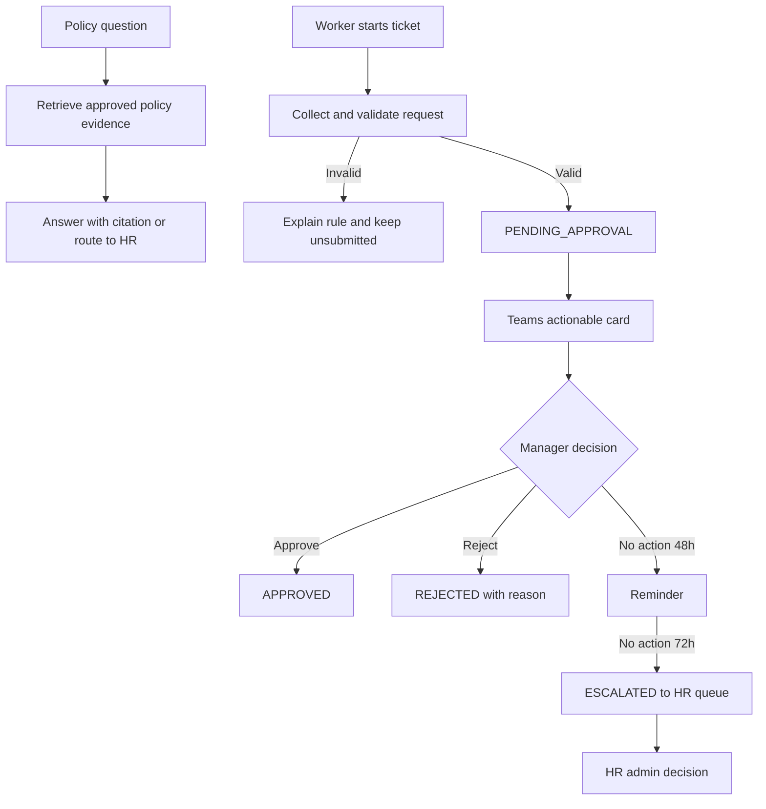

<!-- markdownlint-disable-file -->
---
prd_id: "PRD-HR-TIME-001"
title: "Enterprise Adaptive HR and Time Management Copilot"
status: "draft"
version: "0.1.0"
owners: ["HR Operations Product Owner"]
reviewers: ["HR Director", "Technical Lead", "Privacy and Compliance Lead"]
created_date: "2026-09-25"
last_updated: "2026-09-25"
product_goal_ids: ["GOAL-001", "GOAL-002", "GOAL-003"]
product_goal_smart_status: "deferred"
fr_to_ac_coverage_threshold_pct: 80.0
fr_to_goal_coverage_threshold_pct: 100.0
diagram_format: "mermaid"
lineage:
  supersedes: []
  superseded_by: []
source_brd_id: "BRD-HR-TIME-001"
requirement_id_prefixes:
  fr: "FR"
  ac: "AC"
  nfr: "NFR"
  con: "CON"
  goal: "GOAL"
license: "CC-BY 4.0 (Microsoft HVE-Core)"
---

# Enterprise Adaptive HR and Time Management Copilot

> **PRD-HR-TIME-001** | Status: draft | Version: 0.1.0 | Last Updated: 2026-09-25

## Executive Summary

The Enterprise Adaptive HR and Time Management Copilot gives employees a conversational way to understand workforce policy and submit common time and leave requests. It gives Line Managers a Teams-native path to review and decide requests, while giving HR Administrators controlled visibility into escalations, exceptions, and audit history.

The first release covers policy Q&A grounded in SOP-HR-042, four ticket types, Teams actionable approvals, and SLA tracking. The agent must validate current balances and business rules through approved systems, preserve human decision accountability, and prevent unauthorized disclosure of medical or compensation data.

The primary success measures are average ticket resolution time, routine policy-query deflection, and manager action within the 48-business-hour SLA. Baselines must be captured during pilot instrumentation before targets are finalized. The release is suitable for architecture and implementation planning after HRIS, tenant, retention, and regional-policy dependencies are confirmed.

## Product Context

The product addresses repetitive policy questions and slow, fragmented ticket workflows. SOP-HR-042 is the authoritative policy source for working hours, PTO, overtime, sick leave, approval SLAs, RBAC, privacy, and auditability. SPEC-HRIS-014 defines the ticket lifecycle and record shape.

The product is not a general medical assistant, payroll engine, or autonomous HR decision maker. It is a policy-grounded workflow assistant that keeps employees informed, helps managers act within SLA, and routes unresolved work to HR Operations.

## Users and Personas

### Worker / Employee

* Jobs-to-be-done: Understand whether a request is allowed, determine balance and notice requirements, submit a request without navigating multiple systems, and track the outcome.
* Pain points: Repetitive portal forms, uncertain policy interpretation, delayed manager decisions, and concern that sensitive medical details may be exposed.
* Success outcome: A request is validated, submitted, traceable, and resolved with a clear explanation.

### Line Manager

* Jobs-to-be-done: Review direct-report requests, make an approval decision in context, request information when needed, and avoid missed SLAs.
* Pain points: Approval work is easy to miss, requests lack consistent context, and managers must not see restricted medical or compensation details.
* Success outcome: A decision can be made from a Teams actionable card with the right information and a recorded rationale.

### HR Administrator

* Jobs-to-be-done: Triage escalations, perform permitted proxy decisions, answer exceptions, inspect audit history, and maintain policy configuration.
* Pain points: Repetitive questions, manual chasing, inconsistent records, and limited visibility into queue health.
* Success outcome: Overdue work is visible, auditable, and actionable without broadening access to sensitive content.

## Design Decisions

* **DD-001:** Use citations to identify the policy source and version for every grounded policy answer.
* **DD-002:** Keep employee, manager, and HR administrator capabilities separated by tenant-aware RBAC and direct-report checks.
* **DD-003:** Treat approval and rejection as human-attributed actions. The agent may validate, notify, remind, and route, but may not impersonate a decision maker.
* **DD-004:** Redact or omit medical diagnosis, medical notes, and unauthorized monetary calculations from manager views, team channels, and cleartext model transcripts.

## Product Goals

* **GOAL-001:** Reduce average time from ticket submission to decision by 30% within two quarters of launch, measured from lifecycle audit events.
* **GOAL-002:** Deflect at least 40% of routine policy questions from HR Operations within two quarters of launch, measured by resolved sessions and HR case tagging.
* **GOAL-003:** Achieve at least 95% manager action within 48 business hours and route 100% of overdue tickets to HR after 72 hours.

## Functional Requirements

### FR-001: Citation-grounded policy Q&A

* Priority: MUST
* Actor: Worker, Line Manager, or HR Administrator
* Trigger: User asks a question about time, attendance, leave, overtime, or related policy
* Requirement: The system shall answer supported questions using the applicable version of SOP-HR-042 and configured tenant policy, identify the relevant rule, and provide a citation. If evidence is insufficient or policies conflict, it shall state the limitation and route the user to HR.
* Product goals: GOAL-002
* Acceptance criteria: AC-001, AC-002, AC-003

### FR-002: Conversational ticket creation

* Priority: MUST
* Actor: Worker
* Trigger: Worker requests Annual Leave, Sick Leave, Overtime, or Attendance Adjustment
* Requirement: The system shall collect required fields, validate identity, dates, balance, notice, overtime limits, certification conditions, and submission windows, then create a ticket in `PENDING_APPROVAL` when valid. Invalid requests shall remain unsubmitted and explain the blocking rule.
* Product goals: GOAL-001, GOAL-002
* Acceptance criteria: AC-004, AC-005, AC-006, AC-007

### FR-003: Teams manager decision

* Priority: MUST
* Actor: Line Manager
* Trigger: A valid ticket enters `PENDING_APPROVAL`
* Requirement: The system shall send the direct manager a Microsoft Teams actionable card containing only permitted request information and provide one-click Approve, Reject, or Request Information actions. Reject requires an explicit reason. Actions must be authenticated, authorized, idempotent, and reflected in the ticket and employee notification.
* Product goals: GOAL-001, GOAL-003
* Acceptance criteria: AC-008, AC-009, AC-010

### FR-004: SLA tracking and escalation

* Priority: MUST
* Actor: System, Line Manager, HR Administrator
* Trigger: A ticket remains pending after creation
* Requirement: The system shall calculate the manager SLA using the configured business-hour calendar, send an urgent reminder at 48 business hours, and auto-escalate an unreviewed ticket to the HR Operations queue after 72 hours. The system shall expose queue status and preserve the lifecycle transition.
* Product goals: GOAL-001, GOAL-003
* Acceptance criteria: AC-011, AC-012, AC-013

## Non-Functional Requirements

### Performance and Capacity

* **NFR-001:** Policy answers and ticket interaction responses shall complete at p95 within 3 seconds under nominal load, excluding time waiting for unavailable external systems.
* **NFR-002:** At least 99% of reminder and escalation jobs shall dispatch within 5 minutes of their calculated threshold.

### Reliability and Resilience

* **NFR-003:** The production service shall provide 99.9% monthly availability excluding approved maintenance.
* **NFR-004:** Transient HRIS, Teams, or notification failures shall be retried safely, expose a user-visible status, and not create duplicate tickets or decisions.

### Security

* **NFR-005:** Every request shall be authenticated with Microsoft Entra ID and authorized for tenant, role, employee ownership, or direct-report scope before data access or mutation.
* **NFR-006:** Manager access shall be limited to direct reports from the approved organizational hierarchy. Employees shall not access peer tickets, balances, or aggregate metrics.
* **NFR-007:** Approval actions shall use authenticated, time-bounded, idempotent action tokens and reject stale or already-completed state transitions.

### Privacy

* **NFR-008:** Diagnostic details, medical reasons, and uploaded medical notes are PHI-sensitive. Managers and team channels shall receive only the permitted certification status, such as “Certified Medical Leave Approved by HR.”
* **NFR-009:** Compensation-sensitive overtime calculations shall be withheld from unauthorized roles and excluded from cleartext model prompts, transcripts, notifications, and logs.
* **NFR-010:** Data collection shall be minimized to the fields needed for validation, routing, decision, audit, and approved retention.

### Maintainability and Operability

* **NFR-011:** Policy sources, business calendars, SLA thresholds, and connector mappings shall be versioned and configurable without changing conversational behavior code.
* **NFR-012:** Connector failures, policy citation failures, authorization denials, reminder failures, and escalation failures shall produce actionable operational alerts.

### Observability and Auditability

* **NFR-013:** Every lifecycle event shall record UTC timestamp, Entra actor ID, action, client channel, previous state, and new state in an immutable or tamper-evident audit store.
* **NFR-014:** Operations shall expose metrics for average resolution time, query deflection, manager SLA compliance, reminder dispatch, escalation rate, connector freshness, and authorization denials.

### Compatibility and Interoperability

* **NFR-015:** The product shall interoperate with the approved HRIS/ERP, time-clock engine, Microsoft Graph hierarchy, Teams actionable messages, and notification services through versioned contracts.

## RAI Guardrails

* Medical diagnosis, doctor notes, and medical justifications are never shown to Line Managers or posted to team channels. Only the minimum approved status is shown.
* Compensation calculations and salary-derived values are visible only to authorized roles and are never emitted in cleartext LLM transcripts.
* The agent must distinguish policy-backed answers from uncertainty, must cite policy evidence, and must route conflicts or unsupported cases to HR rather than fabricate an answer.
* Human managers or HR administrators remain accountable for approval, rejection, and proxy decisions. The agent cannot self-approve, self-reject, or impersonate a user.
* Audit events must capture the actor and action without copying sensitive medical or compensation content into general-purpose logs.

## Constraints

* **CON-001:** Initial ticket scope is Annual Leave, Sick Leave, Overtime, and Attendance Adjustments.
* **CON-002:** SOP-HR-042 and approved tenant policy versions are authoritative for policy answers and validation.
* **CON-003:** Approval SLA is 48 business hours, with urgent reminder at the threshold and HR escalation after 72 hours.
* **CON-004:** The solution must support Microsoft 365 identity and Teams while protecting tenant boundaries.
* **CON-005:** Real HRIS APIs, org hierarchy, retention schedules, regional policies, and audit-store choices require confirmation before production release.

## Process Model

## Acceptance Criteria

### FR-001

* **AC-001:** Given a user asks which notice period applies to one to two annual-leave days, when the agent answers, then it states the 48-hour rule and cites SOP-HR-042 version 3.2.
* **AC-002:** Given a user asks a question outside the approved policy corpus, when the agent cannot establish an authoritative answer, then it states that the answer is unsupported and provides an HR escalation path without inventing policy.
* **AC-003:** Given two configured policy sources conflict, when the user asks an affected question, then the agent identifies the conflict and withholds a definitive answer until the policy owner resolves it.

### FR-002

* **AC-004:** Given an authenticated employee has sufficient annual-leave balance and a compliant notice period, when the employee submits dates and hours conversationally, then the system creates a `PENDING_APPROVAL` ticket with the required fields and returns the ticket ID.
* **AC-005:** Given an employee requests more leave than accrued balance plus the three-day borrowing ceiling, when the employee submits the request, then the system refuses submission and explains the balance rule.
* **AC-006:** Given an employee requests sick leave for three or more consecutive business days, when the request is submitted, then the system marks certification as required and does not expose the medical reason to the manager.
* **AC-007:** Given an employee submits an Attendance Adjustment more than 48 hours after the shift, when the request is submitted, then the system prevents normal submission and explains the submission-window rule.

### FR-003

* **AC-008:** Given a ticket is pending for one of the manager's direct reports, when the manager opens the Teams actionable card, then the card shows the permitted request summary and available decision actions.
* **AC-009:** Given a manager selects Approve on a current pending ticket, when the action is authenticated, then the ticket transitions to `APPROVED`, the employee is notified, and an audit event records the manager action.
* **AC-010:** Given a manager selects Reject, when no rejection reason is supplied, then the system refuses the decision and requests a reason; when a reason is supplied, then the ticket transitions to `REJECTED` and the reason is recorded.

### FR-004

* **AC-011:** Given a ticket remains pending under the configured business-hour calendar, when 48 business hours elapse, then the responsible manager receives an urgent Teams or Copilot reminder and the reminder event is auditable.
* **AC-012:** Given a ticket remains unreviewed after the 72-hour escalation threshold, when the escalation job runs, then the ticket transitions to `ESCALATED` and appears in the HR Operations queue.
* **AC-013:** Given a ticket has already been decided or escalated, when a duplicate reminder or escalation job runs, then the system does not create a second decision or duplicate lifecycle transition.

## Traceability Matrix

### FR-to-AC Coverage

| Functional requirement | Acceptance criteria | Coverage |
|---|---|---|
| FR-001 | AC-001, AC-002, AC-003 | Covered |
| FR-002 | AC-004, AC-005, AC-006, AC-007 | Covered |
| FR-003 | AC-008, AC-009, AC-010 | Covered |
| FR-004 | AC-011, AC-012, AC-013 | Covered |

Coverage: 100%.

### FR-to-Goal Alignment

| Functional requirement | Product goals |
|---|---|
| FR-001 | GOAL-002 |
| FR-002 | GOAL-001, GOAL-002 |
| FR-003 | GOAL-001, GOAL-003 |
| FR-004 | GOAL-001, GOAL-003 |

Coverage: 100%.

## MVP and Release Framing

The MVP includes FR-001 through FR-004, NFR-001 through NFR-015, the RAI guardrails, and the four ticket types. It requires one approved HRIS/ERP connector, Microsoft Entra authentication, Microsoft Graph hierarchy lookup, Teams actionable cards, an immutable audit store, and policy-source versioning.

Future releases may add regional policy packs, additional leave categories, richer HR admin reporting, and more connectors. Payroll execution, autonomous decisions, and general HR case management remain outside the release boundary.

## Success Metrics

| Metric | Definition | Baseline | Target | Window and source |
|---|---|---|---|---|
| Average ticket resolution time | Mean elapsed time from `PENDING_APPROVAL` to decision | To be measured | 30% reduction | 30-day rolling audit-event dashboard; GOAL-001 |
| Policy-query deflection rate | Routine policy sessions resolved without HR case creation | To be measured | At least 40% | Monthly conversation and HR case data; GOAL-002 |
| Manager SLA compliance | Tickets with manager action within 48 business hours | To be measured | At least 95% | Immutable lifecycle events; GOAL-003 |
| 72-hour escalation completeness | Eligible overdue tickets entering HR queue after threshold | To be measured | 100% | Escalation and queue events; GOAL-003 |

## Risks and Assumptions

### Key assumptions

* HRIS/ERP APIs provide current balances, employee status, and manager relationships. If false, the product must show data freshness and route requests to HR.
* Microsoft Graph or an approved HRIS hierarchy is authoritative for direct-report authorization.
* HR Operations will provide baseline metrics and policy-owner review.
* Tenant retention, encryption, redaction, and audit controls can satisfy PHI and compensation restrictions.

### Risk register

| Risk | Probability | Impact | Mitigation |
|---|---|---|---|
| Regional policy differences make a globally uniform answer unsafe. | Medium | High | Scope policies by tenant, region, and effective version |
| External-system outage produces stale validation. | Medium | High | Freshness indicators, retries, safe failure, HR queue |
| Sensitive details leak through prompts or cards. | Medium | Critical | Field-level minimization, redaction tests, least privilege, audit review |
| Duplicate or stale Teams actions change a completed ticket. | Medium | Medium | Idempotent actions and state preconditions |

## Glossary

| Term | Definition |
|---|---|
| SOP-HR-042 | Workforce Time, Attendance and Leave Management policy used as the primary workshop policy source |
| HRIS | Human Resources Information System containing workforce records and balances |
| PHI | Protected health information, including diagnosis, medical notes, and medical justifications |
| SLA | Service-level agreement for manager action and escalation timing |
| Actionable Card | Microsoft Teams message containing authenticated actions |

## Sign-Off

Approval status: Draft. Product, technical, quality, privacy, and legal approval are pending.

## Source Evidence

* `.copilot-tracking/research/2026-09-24/hr-time-leave-agent-research.md`
* `.copilot-tracking/research/workshop-input/policies/sop-hr-time-and-leave.md`
* `.copilot-tracking/research/workshop-input/sops/ticketing-process-spec.md`
* `.copilot-tracking/research/workshop-input/leancanvas.md`

## Disclaimer

This PRD is based on synthetic workshop evidence. It requires validation against live tenant policy, regional employment requirements, HRIS contracts, Microsoft 365 security configuration, and approved privacy and retention controls before production use.
