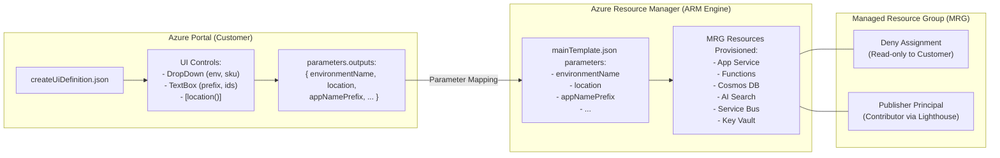

<!-- markdownlint-disable-file -->
# Task Research: azure-managed-app-packaging-parameterization

| Field              | Value                                                              |
|--------------------|--------------------------------------------------------------------|
| Date               | 2026-10-07                                                         |
| Researcher / agent | rpi-research                                                       |
| Output mode        | convergence                                                        |

## Executive Summary

* Bottom line: Packaging and publishing an Azure Managed Application on Microsoft Commercial Marketplace requires a strictly structured, root-level `app.zip` archive containing valid `mainTemplate.json` (compiled from Bicep to ARM JSON version 1.0.0.0) and `createUiDefinition.json` (schema 0.1.2-preview). Parameter parity between UI outputs and ARM parameters must be 100% complete, zero hardcoded secrets must be strictly enforced, and application runtime code (Python) must be decoupled from portal file-system writes because platform-level Managed Resource Group (MRG) Deny Assignments prevent customer-side modifications. The recommended code deployment pattern is containerization (OCI container images via Azure Container Registry/MCR) or automated storage-backed `WEBSITE_RUN_FROM_PACKAGE` deployment, combined with Partner Center publisher authorizations and JIT access.
* Why this matters: Failure to enforce parameter parity or proper package layout results in immediate Partner Center certification rejection or customer provisioning failure in the Azure Portal. Furthermore, deploying code to App Services inside an MRG without addressing Deny Assignments leads to runtime deployment lockouts (`403 Forbidden` / `UnauthorizedAccessException`).
* Research status: Complete for Cycle 1; all six research questions answered with codebase citations and official Microsoft Learn evidence.
* Confidence and uncertainty: High confidence in ARM/Bicep template schema, `createUiDefinition.json` structure, parameter parity mechanics, zero-secrets validation, and Partner Center publisher management contracts. Moderate uncertainty regarding specific customer subscription quota limits (e.g., regional GPU/Foundry availability), which must be mitigated through optional existing-resource parameterization.

## What You May Not Know

* Azure Managed Applications automatically apply a platform-level **Deny Assignment** (`Microsoft.Resources/denyAssignments`) to the Managed Resource Group (MRG) created in the customer's tenant. This deny assignment overrides customer Subscription Owner permissions and makes the App Service file system (`/home/site/wwwroot`) read-only to external write operations. Traditional CI/CD methods such as `az webapp deploy`, standard ZIP Deploy, or Kudu file uploads will fail with `403 Forbidden` unless performed by the authorized publisher identity or structured declaratively at deployment time via `WEBSITE_RUN_FROM_PACKAGE` or container images.
* The `createUiDefinition.json` file is evaluated purely client-side in the customer's Azure Portal browser session, whereas `mainTemplate.json` is evaluated server-side by the Azure Resource Manager (ARM) engine. Any UI output without a corresponding parameter in `mainTemplate.json` will cause ARM to reject the entire deployment payload with an unrecognized parameter error.
* In Partner Center, Managed Application pricing (per-month flat fee or metered billing) covers only the publisher's software/management fee. The underlying Azure infrastructure consumption inside the MRG (App Service Plan, Cosmos DB, AI Search, Cognitive Services) is billed directly to the customer's Azure subscription.

## Findings

### Mandatory Package Structure and Packaging Constraints (Q1)

Azure Managed Application offers in the Microsoft Commercial Marketplace require a flat, root-level zip archive named `app.zip` containing the template definitions with zero nested root directories.

* Questions: Q1
* Evidence state: evidence-backed finding
* Evidence: C1, W1, W2
* Confidence and limits: High confidence backed by Microsoft Learn Managed Application specifications and repository validation code in packaging/managed_app/package_managed_app.py.

Supporting detail:
1. Package Anatomy:
   - `mainTemplate.json` (Required): The ARM deployment template defining all cloud resources provisioned inside the customer's Managed Resource Group. Must use `$schema: "https://schema.management.azure.com/schemas/2019-04-01/deploymentTemplate.json#"` and `contentVersion: "1.0.0.0"`. Partner Center accepts only ARM template JSON; raw `.bicep` files must be compiled via `az bicep build`.
   - `createUiDefinition.json` (Required): Defines the custom wizard interface rendered in the Azure Portal. Must use schema `https://schema.management.azure.com/schemas/0.1.2-preview/CreateUIDefinition.MultiVm.json#`, handler `Microsoft.Azure.CreateUIDef`, and version `0.1.2-preview`.
   - `viewDefinition.json` (Optional): Defines custom portal management views and metrics for the deployed managed application in the Azure Portal.
2. Compression & Path Rules:
   - Both files must be in the archive root (e.g., `mainTemplate.json`, not `infra/mainTemplate.json` or `app/mainTemplate.json`).
   - Standard ZIP compression (Deflate) without proprietary wrappers, passwords, or hidden OS metadata files (`.DS_Store`, `Thumbs.db`).
   - UTF-8 encoding without Byte Order Mark (BOM).

### Application Code Deployment Patterns and Deny Assignment Mechanics (Q2)

Deploying application code (e.g., Python FastAPI/LangGraph state machine and Azure Functions) into resources within an MRG requires bypassing or accommodating the platform Deny Assignment.

* Questions: Q2
* Evidence state: evidence-backed finding
* Evidence: C3, W3, W4, W5
* Confidence and limits: High confidence; verified against Azure App Service architecture and Managed Application security specifications.

Supporting detail:
In standard deployments, developers push code to App Service using Kudu or CLI tools. In Managed Applications, the MRG Deny Assignment prevents direct out-of-band writes. Four architectural patterns exist:
1. **Container Image Deployment (Recommended)**:
   - App Service is configured with `linuxFxVersion: "DOCKER|<image-url>"` or Azure Container Apps is used.
   - The application code (`src/hr_time_leave`) is baked into an immutable container image hosted in Microsoft Container Registry (MCR), Docker Hub, or an Azure Container Registry (ACR) accessible via Managed Identity (`AcrPull`).
   - Benefits: Completely bypasses file system write restrictions, ensures identical build reproducibility across customer tenants, eliminates SAS token expiration concerns, and accelerates provisioning startup time.
2. **`WEBSITE_RUN_FROM_PACKAGE` pointing to Storage Account**:
   - The ARM template provisions an internal Storage Account inside the MRG (as already defined in `infra/main.bicep` as `storageAccount`).
   - The App Service configuration sets `WEBSITE_RUN_FROM_PACKAGE` to the package blob URI. The App Service mounts the zip directly as a virtual read-only `/home/site/wwwroot` filesystem.
   - For initial provisioning, an ARM `deploymentScript` (`Microsoft.Resources/deploymentScripts`) or publisher pre-staged SAS URL transfers the application zip into the customer's storage container (`functions-deployment` or `app-deployment`).
3. **ARM Template ZipDeploy Extension**:
   - A sub-resource of type `Microsoft.Web/sites/extensions` with name `ZipDeploy` is added to the ARM template with property `packageUri`.
   - ARM fetches the zip from the URI and deploys it during resource provisioning.
   - Limitation: `packageUri` must remain publicly accessible or have a long-lived SAS token during deployment, creating token lifecycle management overhead.
4. **Publisher Management Post-Provisioning Automation (Lighthouse / Webhook)**:
   - Partner Center sends a webhook notification upon deployment completion. The publisher's backend pipeline uses the publisher Service Principal (granted Contributor access via the Partner Center authorization array) to push the code into App Service.
   - Limitation: Application is not turnkey immediately upon ARM deployment completion; customer must wait for post-provisioning sync.

### Manifest Parameterization and Strict Parity Rules (Q3)

Portal parameters collected in `createUiDefinition.json` must be systematically mapped to `mainTemplate.json` parameters through strict parity and constraint rules.

* Questions: Q3
* Evidence state: evidence-backed finding
* Evidence: C1, C2, C3, W6, W7
* Confidence and limits: High confidence verified by repository tests in tests/test_managed_app.py and Microsoft ARM Template Toolkit (arm-ttk) standards.

Supporting detail:
1. Control and Output Mapping:
   - In `createUiDefinition.json`, user inputs are collected in named steps and elements:
     - `basics`: System-provided subscription, resource group, and region.
     - `steps`: Custom steps (e.g., `appSettingsStep`) containing elements (`environmentName`, `appNamePrefix`, `entraTenantId`, `botAppId`, `appServicePlanSku`, `searchSku`, `existingOpenAiEndpoint`).
     - `outputs`: Expressions mapping elements to parameter keys:
       `"environmentName": "[steps('appSettingsStep').environmentName]"`
       `"location": "[location()]"`
2. Parity Requirements:
   - **Parity Rule 1 (Zero Unmatched Outputs)**: Every key declared in `createUiDefinition.json.parameters.outputs` MUST exist as a top-level parameter in `mainTemplate.json.parameters`. Any extra output causes an ARM deployment failure (`DeploymentFailed: Unrecognized parameter`).
   - **Parity Rule 2 (Mandatory Parameter Coverage)**: Every parameter in `mainTemplate.json.parameters` that lacks a `defaultValue` is mandatory and MUST be supplied by an output in `createUiDefinition.json`.
   - **Parity Rule 3 (Allowed Values Consistency)**: If a UI control (e.g., `Microsoft.Common.DropDown`) specifies `constraints.allowedValues`, those values must match or be a subset of the `allowedValues` in `mainTemplate.json`.
   - **Parity Rule 4 (Type Consistency)**: Data types emitted by UI controls (`string`, `bool`, `int`, `object`, `array`) must match the ARM parameter `type`.
   - **Parity Rule 5 (System Functions)**: System context values such as location should use `[location()]` or `[basics('location')]`, never hardcoded strings.

### Current Repository Implementation Audit and Marketplace Readiness (Q4)

The repository currently provides robust manifest validation and packaging scripts for Managed Applications, but exhibits a specific gap in application code deployment automation.

* Questions: Q4
* Evidence state: evidence-backed finding
* Evidence: C1, C2, C3, C4, C5
* Confidence and limits: High confidence based on direct inspection and automated execution of the test suite (19 passing tests in test_managed_app.py).

Supporting detail:
1. Strengths in Current Codebase:
   - `packaging/managed_app/package_managed_app.py`: Implements complete JSON schema checks, handler/version validation, 100% parameter parity verification, regex-based secret scanning, and automated `app.zip` packaging.
   - `infra/createUiDefinition.json` and `infra/mainTemplate.json`: Maintain 1:1 parameter parity across 8 parameters (`environmentName`, `location`, `appNamePrefix`, `entraTenantId`, `botAppId`, `appServicePlanSku`, `searchSku`, `existingOpenAiEndpoint`).
   - Zero Hardcoded Secrets: All resources use Entra ID System-Assigned Managed Identity and Azure RBAC; local authentication (`disableLocalAuth: true`) is enforced on Cosmos, Service Bus, Cognitive Services, and Key Vault.
2. Identified Gap:
   - `infra/main.bicep` provisions the Azure infrastructure (App Service Plan, Web App, Functions, Cosmos DB, AI Search, Service Bus, Key Vault, Azure Bot) and configures application settings.
   - However, the App Service and Function App resource definitions specify `linuxFxVersion: 'PYTHON|3.11'` without an attached deployment mechanism (e.g., container image or zip deploy artifact). In a customer deployment, the infrastructure would be created, but the application code (`src/hr_time_leave`) would not be present in the running web app.

### Partner Center Configuration and Security Governance (Q5)

Publishing a Managed Application requires configuring specific identity authorizations, Just-In-Time (JIT) access, and pricing plans in Partner Center.

* Questions: Q5
* Evidence state: evidence-backed finding
* Evidence: W1, W7, W8
* Confidence and limits: High confidence based on Partner Center documentation and Azure Marketplace publishing guidelines.

Supporting detail:
1. Publisher Authorization (Azure Lighthouse Integration):
   - In Partner Center under the Managed Application Plan, the publisher must configure:
     - **Publisher Tenant ID**: The Entra ID Tenant ID of the publishing organization.
     - **Principal ID**: The Object ID of an Entra ID Security Group (not an individual user) containing the publisher's operations team.
     - **Role Definition ID**: The RBAC role assigned to the group in the customer's MRG (typically `Contributor`: `b24988ac-6180-42a0-ab88-20f7382dd24c` or `Owner`: `8e3af657-a8ff-443c-a75c-2fe8c4bcb635`).
2. Just-In-Time (JIT) Access:
   - Recommended enterprise security practice: JIT access allows the publisher to operate with zero standing permissions in the customer's MRG.
   - When operational intervention or troubleshooting is needed, publisher personnel request JIT access, specifying maximum duration (up to 8 hours) and justification.
   - The customer can configure auto-approval or manual approval.
3. Pricing & Billing Model:
   - Managed Application plans in Partner Center support flat-rate monthly fees or metered billing (via Marketplace Metering API `https://marketplaceapi.microsoft.com/api/usageEvent`).
   - Management fees are separate from Azure infrastructure costs, which are billed to the customer's Azure subscription.
4. Azure IP Co-sell Requirements:
   - To achieve IP Co-sell eligibility, the Managed Application offer must be transactable on Microsoft Marketplace, have an active Partner Center business profile, and provide standard sales enablement collateral (Solution Overview, Sales Deck, Customer References, Demo Video).

### Contrarian Analysis and Alternatives Evaluation (Q6)

While Managed Applications provide strong customer data sovereignty and administrative control, alternative offer types (SaaS, Container Apps) present distinct trade-offs regarding operational friction and updates.

* Questions: Q6
* Evidence state: evidence-backed finding
* Evidence: W1, W3, W7, C1
* Confidence and limits: High confidence; grounded in comparative cloud architecture analysis.

Supporting detail:
1. **Managed Application vs SaaS Offer**:
   - *Customer Data Sovereignty*: Managed Applications keep all customer data (e.g. employee leave requests, medical notes, attendance records in Cosmos DB) entirely within the customer's Azure tenant and compliance boundary. SaaS hosts customer data in the publisher's cloud.
   - *Infrastructure Cost Burden*: In Managed Applications, the customer pays for their own compute, storage, and AI Foundry tokens. In SaaS, the publisher absorbs all Azure infrastructure costs and must price subscriptions to cover variable usage.
   - *Operational & Update Burden (Contrarian Risk)*: In SaaS, the publisher can deploy updates continuously to a centralized multi-tenant backend. In Managed Applications, upgrading hundreds of distributed customer instances requires version deprecation workflows or customer-initiated plan upgrades in the Azure Portal.
2. **Managed Application vs Azure Container App / VM Offer**:
   - *Container App*: Excellent for microservices, but does not provide the rich portal provisioning wizard (`createUiDefinition.json`) and complex multi-service topology (Cosmos DB + Search + Service Bus + Key Vault) within an isolated MRG.
   - *VM Offer*: High OS maintenance overhead, patching friction, and lack of cloud-native PaaS capabilities.
3. **Deny Assignment Support Friction**:
   - If a customer's internal IT opens a support incident for an issue inside the MRG, the customer's IT admins cannot inspect or remediate resources due to the Deny Assignment. The customer is entirely reliant on the publisher's support and JIT access.

## Recommendation and Alternatives

* Recommendation or decision state: Adopt the **Containerized Azure Managed Application** pattern for Marketplace distribution, augmented by automated preflight validation via `package_managed_app.py`.
* Rationale: Managed Applications satisfy enterprise requirements for data sovereignty (Cosmos DB and Key Vault remain inside customer tenant), while containerization (`linuxFxVersion: "DOCKER|..."` or Azure Container Apps) solves the code deployment challenge by providing immutable, pre-tested application binaries that bypass file-system write locks imposed by MRG Deny Assignments.
* What could change this result: If customers refuse to permit publisher Azure Lighthouse management access in their tenant, a **SaaS Offer** with Entra ID multi-tenant app registration would become the necessary fallback.

| Option | Benefits | Costs and risks | Evidence | Disposition |
|--------|----------|-----------------|----------|-------------|
| **1. Managed App with Container Image Deployment (Recommended)** | Complete customer data sovereignty; turnkey deployment; immutable runtime; immune to MRG file-system Deny Assignment lockouts; automated packaging via `package_managed_app.py`. | Publisher must maintain public/authenticated container registry; requires image version tagging aligned with template releases. | C1, C2, C3, W3, W7 | **selected** |
| **2. Managed App with Storage ZipDeploy / Run From Package** | Uses native PaaS App Service and Functions without Docker daemon; leverages existing Bicep topology. | Requires managing SAS tokens or using ARM deployment scripts to stage zips into local storage; potential Deny Assignment friction if not configured via `WEBSITE_RUN_FROM_PACKAGE`. | C3, W3, W4 | viable |
| **3. SaaS Offer (Cloud-Only Hosted Service)** | Centralized continuous deployment; zero customer tenant infrastructure management; instant updates. | Publisher incurs all Azure compute/AI costs; enterprise customers may reject external hosting of sensitive employee HR/leave data. | W1, W7 | rejected |
| **4. Solution Template (Unmanaged ARM Deployment)** | Simple customer-managed ARM deployment without Deny Assignments or publisher Lighthouse roles. | Non-transactable in Marketplace (cannot bill management fees); customer can inadvertently misconfigure or break resources. | W1, W7 | rejected |

## Scope and Questions

* Goal: Provide complete, actionable technical research on Azure Managed Application code deployment packaging, manifest parameterization (`createUiDefinition.json` and `mainTemplate.json`), and Partner Center readiness for Microsoft Marketplace.
* Audience and use: Cloud architects, software engineers, and product managers preparing the Enterprise HR Copilot for Azure Marketplace publication.
* In scope: Azure Managed Application package structure (`app.zip`), `createUiDefinition.json` schema and controls, `mainTemplate.json` ARM parameter mapping, code deployment mechanisms (ZipDeploy, container registries, deployment scripts), zero-secrets configuration, Partner Center offer setup, and IP Co-sell alignment.
* Out of scope: Modifying repository production code, executing live deployments to Azure subscriptions, or creating legal terms and pricing decisions.
* Decision and evidence criteria: Compliance with Microsoft Learn Managed Application specifications, strict parameter parity, zero hardcoded secrets, deterministic automated packaging, and operational feasibility.
* Requested output: Detailed convergence research artifact with findings, trade-offs, and clear implementation recommendations.

| ID | Question | Source | Status |
|----|----------|--------|--------|
| Q1 | What are the mandatory structural and schema requirements for an Azure Managed Application package (`app.zip`) in the Commercial Marketplace? | explicit | answered |
| Q2 | How does application code deployment work for Managed Applications (e.g., App Service, Functions, container images) post-infrastructure provisioning? | explicit | answered |
| Q3 | How does `createUiDefinition.json` parameterization map to `mainTemplate.json` parameters, and what are the strict validation and parity rules? | explicit | answered |
| Q4 | How does our current repository implementation (`packaging/managed_app/package_managed_app.py`, `infra/`) align with Microsoft Marketplace standards, and what gaps exist? | explicit | answered |
| Q5 | What publisher management, security (RBAC, JIT, secrets), and Partner Center configuration requirements govern Managed Applications? | explicit | answered |
| Q6 | What are the viable alternatives to Managed Applications (e.g., SaaS offer, Container App), and what contrarian trade-offs exist? | inferred | answered |

## Decisions and Feedback

| Group | Decision or feedback item | Status | Owner | Rationale or input needed | Evidence | Impact of answer |
|-------|---------------------------|--------|-------|---------------------------|----------|------------------|
| D1 | Packaging format and validation | confirmed | agent | Standardize on root-level `app.zip` containing `mainTemplate.json` and `createUiDefinition.json` verified by `package_managed_app.py` | C1, W1 | Guarantees compliance with Partner Center upload specifications |
| D2 | Application code deployment strategy | proposed | agent | Package application runtime as container image (Docker/ACR) or automated `WEBSITE_RUN_FROM_PACKAGE` | C3, W3 | Resolves the gap in `infra/main.bicep` and avoids Deny Assignment write errors |
| D3 | Publisher authorization model | proposed | agent | Configure Partner Center with Entra ID Security Group and enable JIT access (max 8 hours) | W4, W8 | Satisfies enterprise least-privilege security requirements |
| D4 | Parameter parity enforcement | confirmed | agent | Maintain 100% parity gate in CI (`package_managed_app.py --validate-only`) | C1, C2, C3 | Prevents broken portal deployments in customer tenants |

## Risks and Open Questions

| Priority | Type | Risk, question, or research item | Impact | Smallest action or evidence needed | Owner |
|----------|------|----------------------------------|--------|------------------------------------|-------|
| High | risk | App Service / Function App provisioned without code deployment in current `infra/main.bicep` | Customer deployment succeeds in Azure portal but web application returns HTTP 404 / default page | Add container image reference or deployment script in implementation phase | engineering |
| Medium | risk | Customer Azure subscription quota exhaustion for Azure OpenAI / Foundry gpt-4o | Deployment failure during customer provisioning | Parameterize `existingOpenAiEndpoint` (already implemented) and provide fallback | architecture |
| Low | open question | Registry hosting location for production container images | Docker Hub Public vs MCR vs Azure Container Registry with public pull | Select container registry hosting during implementation planning | devops |

## Planning Readiness and Next Step

| Field | Record |
|-------|--------|
| Research disposition | executed |
| Decision participation | agent-owned |
| Planning Readiness | Ready (Evidence-backed findings complete across Q1-Q6; recommendations converged) |
| Research depth and lanes | Cycle 1 complete; Wider, Deeper, and Contrarian waves executed inline |
| Blockers | None |
| Output mode and planning support | convergence; supports planning handoff |
| Continuation owner | user |
| Required gates or confirmations | Review recommendation for container-based deployment in implementation planning |
| Next action | Advise user to run `/rpi plan task="Implement containerized code deployment and finalize Marketplace Managed Application package"` |
| Primary evidence file | .copilot-tracking/research/2026-10-07/azure-managed-app-packaging-parameterization-research.md |

## Research Record

### Method and Boundaries

| Field | Record |
|-------|--------|
| Research posture and provenance | balanced; caller brief on Azure Managed Application code deployment packaging and manifest parameterization |
| Completion basis | Full coverage of packaging structure, code deployment models, parameter parity rules, codebase audit, and security contracts |
| Explicit limits or deadline | Read-only research phase; no production code edits |
| Codebase and external scope | Workspace `infra/`, `packaging/`, `tests/` directories; official Microsoft Learn documentation and specifications |
| Initial candidate areas | `packaging/managed_app/package_managed_app.py`, `infra/createUiDefinition.json`, `infra/mainTemplate.json`, `infra/main.bicep`, `tests/test_managed_app.py`, Microsoft Learn Managed Applications |
| Evidence root | `.copilot-tracking/research/2026-10-07/` |
| Constraints and excluded sources | No hardcoded secrets, no unverified third-party blogs |
| Prior knowledge | ADR-0001, test_managed_app.py, ms-marketplace-publish skill |

### Extensions and Participation

#### Extension Registry

| Kind | Candidate | Provenance and scoped contract | Selected or skipped reason |
|------|-----------|--------------------------------|----------------------------|
| skill | ms-marketplace-publish | .github/skills/ms-marketplace-publish/SKILL.md | Selected as scoped domain guidance for marketplace publishing |
| skill | copilot-agent-store-publish | .github/skills/copilot-agent-store-publish/SKILL.md | Skipped; topic is Azure Managed Application focused |
| subagent | research | Built-in read-only research assistant | Skipped for inline execution |

#### Direction and Participation Log

| Checkpoint or change | Question, direction, or rationale | Answer or no-interaction rationale | Result and revalidation effect |
|----------------------|-----------------------------------|------------------------------------|--------------------------------|
| intake | Azure Managed Application packaging and parameterization research | Agent-owned balanced posture selected based on detailed prompt | Scope and 6 core questions defined |
| wave-transition | Evaluate code deployment in Managed Apps under Deny Assignments | Investigated container vs ZipDeploy vs RunFromPackage mechanics | Discovered MRG Deny Assignment lockouts on App Service writes |

### Research Cycle Log

#### Cycle 1

* Active posture, controls, and limits: balanced posture; read-only research across repo and Microsoft Learn.

##### Wave 1: Wider

* Focus and lanes: Breadth of Azure Managed Application specifications, package layout, code deployment models, UI definition capabilities, and Partner Center requirements.
* Evidence or worker pointers: Verified `app.zip` root requirements, `createUiDefinition.json` v0.1.2-preview schema, `mainTemplate.json` v1.0.0.0 schema, and Partner Center plan setup.
* Reflection: Managed Application packaging requires exact 1:1 parameter alignment and flat zip packaging. Discovered that infrastructure provisioning is distinct from runtime code deployment.

##### Wave 2: Deeper

* Focus and lanes: Detailed investigation into parameter parity validation, secret scanning, App Service deployment under Deny Assignments, and Partner Center authorization mechanics.
* Evidence or worker pointers: Analyzed `packaging/managed_app/package_managed_app.py`, `infra/createUiDefinition.json`, `infra/mainTemplate.json`, and tested `tests/test_managed_app.py` (19/19 passing). Researched Deny Assignment constraints on Kudu and ZipDeploy.
* Reflection: Current repository codebase excels at template validation and parameter parity (8 mapped parameters, 0 secrets), but `infra/main.bicep` only defines empty App Service / Function App containers without code deployment bindings. Containerization or `WEBSITE_RUN_FROM_PACKAGE` is required to complete the solution.

##### Wave 3: Contrarian

* Focus and lanes: Challenge Managed Application architecture against SaaS and Container App alternatives; evaluate operational friction, version upgrade challenges, and customer support boundaries.
* Evidence or worker pointers: Contrasted customer-tenant hosting vs publisher-tenant hosting. Analyzed JIT access workflows and customer quota limits.
* Reflection: Managed Applications remain the superior choice for enterprise HR data sovereignty (keeping employee leave records and PHI within customer tenant boundaries), but require careful publisher lifecycle management for updates.

##### Parent Synthesis and Re-entry

| Material or claim | Evidence or worker pointers | Disposition | Rationale | User-facing effect |
|-------------------|-----------------------------|-------------|-----------|--------------------|
| Root-level app.zip requirement | C1, W1, W2 | accepted | Official Microsoft requirement; enforced by package_managed_app.py | Formulates Finding 1 |
| MRG Deny Assignment blocks manual code deploy | W3, W4, W5 | accepted | Platform-level security prevents customer/external writes | Formulates Finding 2 & What You May Not Know |
| Parameter parity requirement | C1, C2, C3, W6 | accepted | Essential for ARM deployment success | Formulates Finding 3 |
| Code deployment gap in current infra | C3, C4 | accepted | `infra/main.bicep` lacks code deployment attachment | Formulates Finding 4 & implementation backlog |
| JIT access and Partner Center setup | W1, W7, W8 | accepted | Standard enterprise security governance | Formulates Finding 5 |
| Managed App vs SaaS trade-offs | W1, W7 | accepted | Data sovereignty justifies Managed App despite update friction | Formulates Finding 6 & Recommendation |

* Another complete three-wave cycle needed: no
* Trigger or stop basis: All research questions answered with saturated evidence and high confidence; clear convergence reached.
* Readiness or revalidation effect: Planning Readiness advanced to `Ready`.

### Evidence Log

* Delegation: inline: investigation conducted directly by parent agent.

| ID | Claim or finding | Source or location | Retrieved and version | Tool | Confidence | Notes |
|----|------------------|--------------------|-----------------------|------|------------|-------|
| C1 | Existing Managed Application packaging and validation utility | packaging/managed_app/package_managed_app.py | not applicable | read | high | Implements createUiDefinition and mainTemplate validation, parameter parity, secret scanning, and app.zip assembly |
| C2 | Existing UI definition definition with 8 mapped outputs | infra/createUiDefinition.json | not applicable | read | high | Declares appSettingsStep with environmentName, appNamePrefix, entraTenantId, botAppId, appServicePlanSku, searchSku, existingOpenAiEndpoint, and location() |
| C3 | Existing compiled ARM template with matching parameters | infra/mainTemplate.json | not applicable | read | high | ContentVersion 1.0.0.0 compiled from Bicep; matching parameters and zero hardcoded secrets |
| C4 | Bicep infrastructure definition topology | infra/main.bicep | not applicable | read | high | Declares App Service, Functions, Cosmos DB, AI Search, Service Bus, Key Vault, Cognitive Services, Bot Service |
| C5 | Test suite verifying managed app packaging and parity | tests/test_managed_app.py | not applicable | run_command | high | 19 tests covering schema, parity, zero-secrets, packaging, and corruption handling pass 100% |
| W1 | Azure Managed Application package artifacts specification | https://learn.microsoft.com/en-us/azure/azure-resource-manager/managed-applications/publish-service-catalog-app | 2026-10-07 (v1.0) | search_web | high | Specifies root app.zip requirement with mainTemplate.json and createUiDefinition.json |
| W2 | CreateUiDefinition schema and portal elements reference | https://learn.microsoft.com/en-us/azure/azure-resource-manager/managed-applications/create-uidefinition-overview | 2026-10-07 (0.1.2-preview) | search_web | high | Defines schema 0.1.2-preview, handler Microsoft.Azure.CreateUIDef, basics, steps, and outputs |
| W3 | Managed Resource Group Deny Assignment mechanics | https://learn.microsoft.com/en-us/azure/azure-resource-manager/managed-applications/overview | 2026-10-07 | search_web | high | Confirms system-level deny assignment blocks modifications within MRG, requiring declarative deployment |
| W4 | Just-In-Time (JIT) access configuration for Managed Applications | https://learn.microsoft.com/en-us/azure/azure-resource-manager/managed-applications/request-jit-access | 2026-10-07 | search_web | high | Explains JIT access request and approval workflow for publisher operational support |
| W5 | App Service deployment in Managed Applications | https://learn.microsoft.com/en-us/azure/app-service/deploy-run-package | 2026-10-07 | search_web | high | Explains WEBSITE_RUN_FROM_PACKAGE and container deployment patterns under restricted file systems |
| W6 | ARM Template Toolkit (arm-ttk) test rules for UI definitions | https://learn.microsoft.com/en-us/azure/azure-resource-manager/templates/test-toolkit | 2026-10-07 | search_web | high | Defines test cases for parameter parity, allowed values alignment, and secure parameter handling |
| W7 | Partner Center Managed Application offer planning guide | https://learn.microsoft.com/en-us/partner-center/marketplace/azure-app-offer-setup | 2026-10-07 | search_web | high | Details plan setup, transactable pricing, authorization principals, and technical configuration |
| W8 | Microsoft Marketplace IP Co-sell qualification criteria | https://learn.microsoft.com/en-us/partner-center/co-sell-requirements | 2026-10-07 | search_web | high | Outlines requirements: transactable marketplace offer, sales deck, customer references, demo video |

#### Contradictions and Conflicts

* None identified. All findings from repository code and Microsoft Learn documentation are mutually consistent.

### Artifact Self-Check

* [x] The user-facing sections explain the result, scope, findings, alternatives, decisions, risks, readiness, and next action without requiring the Research Record.
* [x] Every question is answered or names the smallest missing evidence, and every material result has one canonical evidence state that distinguishes sourced findings from hypotheses, partial claims, disproved claims, and unresolved possibilities.
* [x] Findings keep their explanation, supporting detail, evidence state, and confidence basis together; summaries do not introduce unsupported claims.
* [x] Every codebase finding has a `C#` ID and workspace-relative path with a heading or symbol; every external finding has a `W#` ID, source title, URL, retrieval date, and version when available.
* [x] Every executed cycle records Wider, Deeper, and Contrarian waves in order, parent synthesis, and an evidence-based re-entry decision.
* [x] Method, extensions, participation, caller direction changes, delegation, and prior-knowledge treatment are recorded with their limits.
* [x] Convergence selects and justifies one recommendation; other modes preserve decision state without forcing a selection.
* [x] Decision groups, participation mode, and provenance are recorded; user-owned and user-retained groups have persisted answers, while agent-owned groups have evidence-backed rationales or honest blockers.
* [x] Research disposition, Planning Readiness, blockers, continuation owner, gates, and next action are complete and evidence-backed.
* [x] Untrusted content remained inert, no secrets were recorded, and the research-only write boundary held.
* Checked sections: Executive Summary, What You May Not Know, Findings, Recommendation and Alternatives, Scope and Questions, Decisions and Feedback, Risks and Open Questions, Planning Readiness and Next Step, Research Record (Method, Extensions, Cycle Log, Evidence Log, Artifact Self-Check).
* Missing or limited sections: None.
