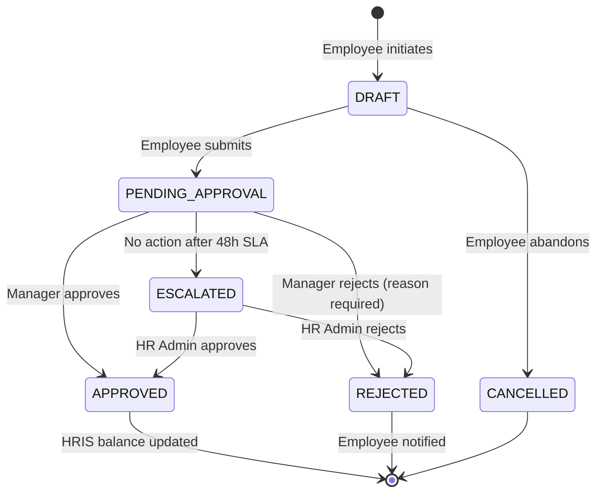

# Specification: HR & Time Management Ticketing & Approval Process
**Document ID:** SPEC-HRIS-014  
**Classification:** Internal Synthetic Evidence  
**Scope:** Data contracts, lifecycle states, and notification webhooks for AI Copilot Agent integration

---

## 1. Ticket Lifecycle State Machine



---

## 2. Synthetic Data Entities & JSON Schema

### 2.1 Ticket Record Schema
```json
{
  "$schema": "https://json-schema.org/draft/2020-12/schema",
  "title": "HRTicket",
  "type": "object",
  "properties": {
    "ticketId": { "type": "string", "pattern": "^TKT-[0-9]{4}-[0-9]{4}$" },
    "employeeId": { "type": "string", "pattern": "^EMP-[0-9]{4}$" },
    "employeeName": { "type": "string" },
    "employeeEmail": { "type": "string", "format": "email" },
    "department": { "type": "string" },
    "managerId": { "type": "string", "pattern": "^EMP-[0-9]{4}$" },
    "managerEmail": { "type": "string", "format": "email" },
    "ticketType": { 
      "type": "string", 
      "enum": ["ANNUAL_LEAVE", "SICK_LEAVE", "OVERTIME_CLAIM", "ATTENDANCE_ADJUSTMENT"] 
    },
    "startDate": { "type": "string", "format": "date-time" },
    "endDate": { "type": "string", "format": "date-time" },
    "totalHours": { "type": "number", "minimum": 0.5, "maximum": 80 },
    "reason": { "type": "string", "maxLength": 500 },
    "status": { 
      "type": "string", 
      "enum": ["DRAFT", "PENDING_APPROVAL", "APPROVED", "REJECTED", "ESCALATED", "CANCELLED"] 
    },
    "rejectionReason": { "type": ["string", "null"] },
    "createdAt": { "type": "string", "format": "date-time" },
    "updatedAt": { "type": "string", "format": "date-time" }
  },
  "required": ["ticketId", "employeeId", "ticketType", "startDate", "endDate", "totalHours", "status"]
}
```

### 2.2 Sample Seed Dataset (Synthetic Records)
```json
[
  {
    "ticketId": "TKT-2026-1001",
    "employeeId": "EMP-4102",
    "employeeName": "Jordan Vance",
    "employeeEmail": "jordan.vance@novatech.internal",
    "department": "Supply Chain Operations",
    "managerId": "EMP-3011",
    "managerEmail": "marcus.brooks@novatech.internal",
    "ticketType": "ANNUAL_LEAVE",
    "startDate": "2026-10-12T09:00:00Z",
    "endDate": "2026-10-16T18:00:00Z",
    "totalHours": 40,
    "reason": "Annual family travel",
    "status": "PENDING_APPROVAL",
    "rejectionReason": null,
    "createdAt": "2026-09-24T06:15:00Z",
    "updatedAt": "2026-09-24T06:15:00Z"
  },
  {
    "ticketId": "TKT-2026-1002",
    "employeeId": "EMP-4889",
    "employeeName": "Elena Rostova",
    "employeeEmail": "elena.rostova@novatech.internal",
    "department": "Cloud Infrastructure",
    "managerId": "EMP-2005",
    "managerEmail": "tariq.mansoor@novatech.internal",
    "ticketType": "OVERTIME_CLAIM",
    "startDate": "2026-09-23T18:00:00Z",
    "endDate": "2026-09-23T22:00:00Z",
    "totalHours": 4,
    "reason": "Emergency database migration and rollback incident #INC-9921",
    "status": "APPROVED",
    "rejectionReason": null,
    "createdAt": "2026-09-23T23:10:00Z",
    "updatedAt": "2026-09-24T08:30:00Z"
  },
  {
    "ticketId": "TKT-2026-1003",
    "employeeId": "EMP-5120",
    "employeeName": "Carlos Mendoza",
    "employeeEmail": "carlos.mendoza@novatech.internal",
    "department": "Customer Support",
    "managerId": "EMP-3011",
    "managerEmail": "marcus.brooks@novatech.internal",
    "ticketType": "ATTENDANCE_ADJUSTMENT",
    "startDate": "2026-09-20T09:00:00Z",
    "endDate": "2026-09-20T18:00:00Z",
    "totalHours": 8,
    "reason": "Badge reader failure at building entrance B",
    "status": "ESCALATED",
    "rejectionReason": null,
    "createdAt": "2026-09-21T09:00:00Z",
    "updatedAt": "2026-09-23T10:00:00Z"
  }
]
```
