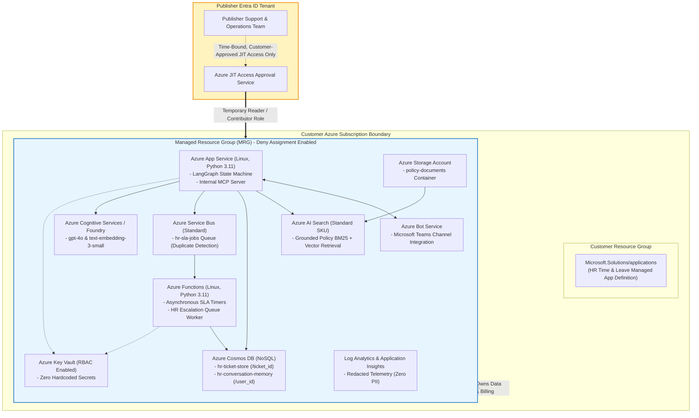
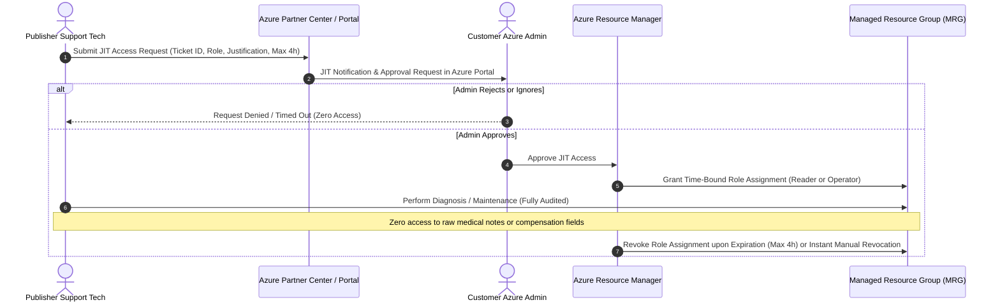

# Azure Managed Application Deployment & Marketplace Readiness Guide

This guide details the deployment architecture, customer subscription boundary, Managed Resource Group (MRG), publisher Just-In-Time (JIT) access governance, packaging, and Microsoft Partner Center submission workflow for the **Enterprise HR Time and Leave Copilot**.

---

## 1. Architecture Overview & Customer Subscription Boundary

Following confirmed architecture decision **D-01**, the solution is packaged and distributed as an **Azure Managed Application**. All cloud infrastructure components deploy directly into the customer's Azure subscription inside a dedicated **Managed Resource Group (MRG)**.



---

## 2. Customer Data Sovereignty & Managed Resource Group (MRG)

### 2.1 Rationale for Decision D-01

Enterprise HR operations involve highly sensitive, regulated records, including employee annual leave balances, certified medical leaves, doctor notes, and compensation adjustment histories. Selecting an Azure Managed Application over a shared multi-tenant SaaS architecture provides four fundamental advantages:

1. **Complete Data Sovereignty & Residency:** All employee tickets, conversation memory, and policy documents remain strictly within the customer's chosen Azure subscription and geographic region (e.g., East US, West Europe). No customer HR data is stored in vendor-owned infrastructure.
2. **Dedicated Cloud Infrastructure:** Dedicated Cosmos DB databases, Azure AI Search indexes, Key Vault, and Service Bus namespaces prevent noisy-neighbor performance degradation and eliminate cross-tenant data leakage risks.
3. **Deny Assignment Protection:** Azure automatically places a system Deny Assignment on the MRG. This prevents customer administrators from inadvertently modifying, deleting, or misconfiguring critical backend dependencies while allowing the managed application to operate reliably.
4. **Transparent Resource Auditing:** Every network request, data write, and operational event in the MRG is audited directly in the customer's Azure Activity Log and Log Analytics workspace.

---

## 3. Publisher Just-In-Time (JIT) Access Governance

To protect sensitive employee records and comply with enterprise security baselines, the publisher operates under a strict **Zero Standing Access** policy.

### 3.1 JIT Access Architecture



### 3.2 JIT Operational Safeguards

- **Time-Bound Validity:** JIT elevations are granted for a maximum window of 4 to 8 hours and terminate automatically.
- **Least-Privilege Roles:** Technicians request role-specific elevation (`Reader` for initial triage; custom `Managed Application Support Operator` for non-destructive maintenance). Full Subscription Owner rights are prohibited.
- **Customer Revocation:** Customer administrators can view all active JIT sessions in the Azure Portal and terminate any session immediately.
- **PII-Denylist Enforcement:** In accordance with repository telemetry guardrails, application telemetry emitted to Application Insights redacts employee names, medical reasons, doctor details, and salary figures. Technicians viewing monitoring logs never see unprotected employee health data.

---

## 4. Commercial Pricing Model (Decision D-02)

The solution is offered as a transactable **"Get It Now"** offer in the Microsoft Commercial Marketplace:

| Component | Billing Mechanism | Description |
|---|---|---|
| **Base Deployment Fee** | Monthly Marketplace Subscription | Covers continuous application updates, security patches, and SLA support operations. |
| **Per-Seat Software Subscription** | Monthly / Annual Tiered Plans | Scaled by active employee count (e.g., Tier 1: 100–500 seats; Tier 2: 501–2,500 seats; Tier 3: 2,500+ enterprise seats). |
| **Bring-Your-Own-License (BYOL)** | Enterprise License Key | Enterprise customers with existing volume agreements deploy under the BYOL plan, waiving Marketplace per-seat billing. |
| **Azure Consumption (Pass-Through)** | Customer Azure Subscription | The customer directly covers underlying compute, storage, search, OpenAI tokens, and Service Bus usage in their Azure invoice. Eliminates publisher margin volatility. |

---

## 5. Managed Application Package Structure

An Azure Managed Application package is a compressed `.zip` archive containing two mandatory root files:

```text
packaging/managed_app/app.zip
├── mainTemplate.json        # Compiled ARM deployment template
└── createUiDefinition.json  # Azure Portal multi-step wizard UI definition
```

### 5.1 Artifact Parity & Output Mapping

`infra/createUiDefinition.json` maps 1:1 to `infra/mainTemplate.json` parameters:

| Portal UI Element | Type | Template Parameter | Default / Options |
|---|---|---|---|
| Basics Blade | Azure Built-in | `location` | Deployment location selected by user |
| App Settings > `environmentName` | `Microsoft.Common.DropDown` | `environmentName` | `dev`, `test`, `prod` |
| App Settings > `appNamePrefix` | `Microsoft.Common.TextBox` | `appNamePrefix` | `hr-time-leave` (3-16 chars) |
| App Settings > `entraTenantId` | `Microsoft.Common.TextBox` | `entraTenantId` | Customer Entra ID Tenant GUID |
| App Settings > `botAppId` | `Microsoft.Common.TextBox` | `botAppId` | Teams Bot Registration Client ID |
| App Settings > `appServicePlanSku` | `Microsoft.Common.DropDown` | `appServicePlanSku` | `B1`, `P1v3`, `P2v3` |
| App Settings > `searchSku` | `Microsoft.Common.DropDown` | `searchSku` | `basic`, `standard` |
| App Settings > `existingOpenAiEndpoint` | `Microsoft.Common.TextBox` | `existingOpenAiEndpoint` | Optional endpoint URI |

---

## 6. Packaging & Validation Utility

The packaging script [`packaging/managed_app/package_managed_app.py`](../../packaging/managed_app/package_managed_app.py) automates preflight verification and archive assembly:

```bash
# Validate templates and assemble app.zip
.venv\Scripts\python.exe packaging/managed_app/package_managed_app.py

# Validate templates without writing zip
.venv\Scripts\python.exe packaging/managed_app/package_managed_app.py --validate-only
```

### Preflight Checks Enforced:
1. **Schema Validation:** Verifies ARM template schema and `CreateUIDefinition.MultiVm.json#` specification.
2. **Parameter Parity:** Guarantees every output in `createUiDefinition.json` exists in `mainTemplate.json`, and all non-default template parameters are supplied by the UI.
3. **Zero Hardcoded Secrets:** Regex scanner ensures zero API keys, storage keys, Service Bus connection strings, client secrets, or private tokens exist in any template or UI file.
4. **Archive Integrity:** Verifies the resulting `app.zip` contains both required files at the root level and re-scans archive contents for credentials.

---

## 7. Partner Center Commercial Marketplace Submission

Follow these steps to publish the Managed Application in Microsoft Partner Center:

### Step 1: Offer Creation
1. Sign in to [Microsoft Partner Center](https://partner.microsoft.com/dashboard/commercial-marketplace/overview).
2. Select **Commercial Marketplace** > **Overview** > **New Offer** > **Azure Application**.
3. Enter an **Offer ID** (e.g., `hr-time-leave-copilot`) and **Offer alias**.
4. Check **Managed application** as the offer setup plan type.

### Step 2: Listing & Marketing Configuration
1. Complete Offer Listing details:
   - Summary, description, search keywords (`HR`, `Time and Leave`, `Copilot`, `Teams`).
   - Support contact details and privacy policy URL.
   - Marketing logos (48x48, 216x216, and hero 1090x500 banner).
2. Accept the Microsoft Commercial Marketplace Publisher Agreement.

### Step 3: Plan Configuration & Pricing
1. Create a new Plan (e.g., `standard-plan`):
   - Type: **Managed Application**.
   - Pricing: Transactable monthly fee (or BYOL plan for volume customers).
   - Availability: Select target geographic enterprise markets.
2. Configure **Technical Configuration**:
   - Version: `1.0.0`.
   - Package file: Upload [`packaging/managed_app/app.zip`](../../packaging/managed_app/app.zip).

### Step 4: Authorizations & JIT Access Configuration
1. Under **Plan Authorizations**, configure publisher access:
   - **Azure Active Directory Tenant ID:** The publisher's Entra ID tenant GUID.
   - **Principal ID:** Entra ID Group object ID for authorized support engineers.
   - **Role Definition:** Select `Reader` or custom support role.
2. Check **Enable Just-In-Time (JIT) Access**:
   - Maximum JIT access duration: `4 hours` or `8 hours`.
   - Require customer approval: **Yes**.

### Step 5: Sandbox Testing & Certification
1. In the **Preview Audience** tab, enter test subscription IDs.
2. Click **Review and publish** to deploy the preview offer.
3. Test deployment in the sandbox subscription via Azure Portal:
   - Verify all blades and controls in `createUiDefinition.json`.
   - Confirm successful resource creation in the MRG.
   - Verify Deny Assignment on the MRG.
   - Test JIT access elevation and customer approval.
4. Once preview verification passes, click **Go live** for final Microsoft certification and marketplace indexing.
