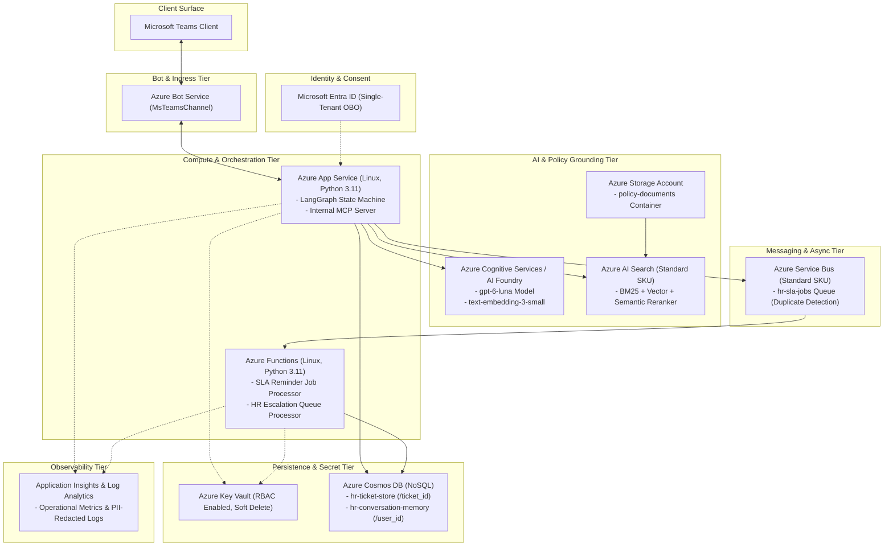

# Azure Deployment & Teams Package Configuration Guide

This document defines the deployment architecture, least-privilege permissions, zero-secrets security posture, environment configuration, and Teams packaging utility for the **Enterprise HR Time and Leave Copilot**.

---

## 1. Architecture Overview

The solution implements the architecture baseline defined in [`ADR-0001: Choose the Agentic HR Architecture`](../planning/adrs/0001-choose-agentic-hr-architecture.md). It decouples policy question-answering from deterministic ticket state mutations and asynchronous SLA timers.



---

## 2. Infrastructure as Code (Bicep)

The infrastructure is defined entirely in Bicep with zero hardcoded credentials:

* [`infra/main.bicep`](../../infra/main.bicep): Root Bicep template creating the entire resource topology.
* [`infra/main.bicepparam`](../../infra/main.bicepparam): Environment parameter file for test/non-production deployment.

### 2.1 Provisioned Azure Resources

| Resource | Bicep Resource Type | Purpose | Configuration / SKU |
|---|---|---|---|
| **App Service Plan** | `Microsoft.Web/serverfarms` | Linux hosting plan for App Service and Functions | `B1` (dev/test) or `P1v3` (prod) |
| **App Service** | `Microsoft.Web/sites` | Hosts LangGraph state machine, MCP tools, and Teams bot API | Linux Python 3.11, HTTPS-only, Managed Identity |
| **Function App** | `Microsoft.Web/sites` | Event-driven processing of SLA reminders and escalations | Linux Python 3.11, Managed Identity |
| **Cosmos DB** | `Microsoft.DocumentDB/databaseAccounts` | Structured ticket store and isolated conversation memory | NoSQL Serverless/Provisioned, Session consistency |
| **AI Search** | `Microsoft.Search/searchServices` | Hybrid lexical/vector policy search with semantic reranker | `standard` SKU, semantic search enabled |
| **Service Bus** | `Microsoft.ServiceBus/namespaces` | Delayed reminder messages and escalation jobs | `Standard` SKU, queue `hr-sla-jobs` |
| **Key Vault** | `Microsoft.KeyVault/vaults` | Secret store with Azure RBAC and purge protection | Standard SKU, soft-delete 90 days |
| **Cognitive Services** | `Microsoft.CognitiveServices/accounts` | Policy question synthesis and vector embeddings | `AIServices`, S0 SKU, models `gpt-6-luna` and `text-embedding-3-small` |
| **Storage Account** | `Microsoft.Storage/storageAccounts` | Storage for policy source documents and Function App state | `Standard_LRS`, TLS 1.2, public blob disabled |
| **Bot Service** | `Microsoft.BotService/botServices` | Teams channel integration and messaging endpoint | Single-tenant Azure Bot, `MsTeamsChannel` |
| **Log Analytics & App Insights** | `Microsoft.OperationalInsights/workspaces`, `Microsoft.Insights/components` | Central telemetry, latency, error budgets, and metrics | 90-day retention, local auth disabled |

---

## 3. Least-Privilege RBAC Matrix

All cross-service authentication relies strictly on **Microsoft Entra ID System-Assigned Managed Identities**. Local key-based authentication (`disableLocalAuth: true`) is enforced wherever supported.

| Identity Principal | Target Resource | Role Name | Role Definition ID | Scope & Principle of Least Privilege Rationale |
|---|---|---|---|---|
| **App Service MI** | Key Vault | **Key Vault Secrets User** | `4633458b-17de-408a-b874-0445c86b69e6` | Allows reading runtime secrets; denies secret write, delete, purge, or administrative control. |
| **App Service MI** | Service Bus | **Azure Service Bus Data Sender** | `69a216fc-b8fb-44d8-bc22-1f3c2cd27a39` | Grants permission to enqueue scheduled SLA reminder and escalation messages; denies message receive/listen or queue configuration. |
| **App Service MI** | AI Search | **Search Index Data Contributor** | `8ebe5a00-799e-43f5-93ac-243d3dce84a7` | Allows querying and indexing policy document chunks; denies search service management. |
| **App Service MI** | Cognitive Services | **Cognitive Services OpenAI User** | `5e0bd9bd-7b93-4f28-af87-19fc36ad61bd` | Authorizes generating completions and vector embeddings; denies cognitive account modification. |
| **App Service MI** | Storage Account | **Storage Blob Data Reader** | `2a2b9908-6ea1-4ae2-8e65-a410df84e7d1` | Grants read access to `policy-documents` container; denies writes, deletes, or account changes. |
| **App Service MI** | Cosmos DB Account | **Cosmos DB Built-in Data Contributor** | `00000000-0000-0000-0000-000000000002` | Permits CRUD on documents in `hr-ticket-store` and `hr-conversation-memory`; denies database/container provisioning. |
| **Function App MI** | Key Vault | **Key Vault Secrets User** | `4633458b-17de-408a-b874-0445c86b69e6` | Permits reading configuration secrets; denies administrative access. |
| **Function App MI** | Service Bus | **Azure Service Bus Data Receiver** | `4f6d3b9b-027b-4f4c-9142-0e5a2a2247e0` | Authorizes receiving and completing scheduled SLA messages; denies message sending or namespace changes. |
| **Function App MI** | Storage Account | **Storage Blob Data Owner** | `b7e6dc6d-f1e8-4753-8033-0f276bb0955b` | Grants lease management and deployment state operations for the Azure Functions runtime. |
| **Function App MI** | Cosmos DB Account | **Cosmos DB Built-in Data Contributor** | `00000000-0000-0000-0000-000000000002` | Allows reading ticket state before dispatching reminders or executing escalation transitions. |

---

## 4. Zero Hardcoded Secrets & Secret Architecture

1. **No Credentials in Code or Templates:**
   * Neither `infra/main.bicep` nor `infra/main.bicepparam` contains passwords, client secrets, API keys, or storage keys.
   * `packaging/teams/manifest.json` contains zero access tokens or secrets.
2. **Managed Identity Exclusivity:**
   * Services connect to Azure Cosmos DB, Azure AI Search, Azure Service Bus, and Azure OpenAI using DefaultAzureCredential with system-assigned identities.
3. **Key Vault Reference Syntax for External Connectors:**
   * When integrating external non-Azure systems (e.g. third-party HRIS or webhook keys), secrets are stored in Key Vault and referenced in App Service settings via:
     `@Microsoft.KeyVault(VaultName=${keyVault.name};SecretName=HRIS-API-KEY)`
4. **Local Auth Disabled:**
   * `disableLocalAuth: true` is configured on Azure Service Bus, Cognitive Services, Application Insights, and Azure Bot Service. Shared Access Policy keys are neither generated nor used.

---

## 5. Environment Configuration Reference

### 5.1 App Service Environment Settings

| Setting Name | Source / Example Value | Description |
|---|---|---|
| `APPLICATIONINSIGHTS_CONNECTION_STRING` | App Insights connection string | Telemetry, request tracing, and SLA metrics |
| `AZURE_TENANT_ID` | Microsoft Entra Tenant ID | Enforces single-tenant isolation for requests |
| `COSMOS_DB_ENDPOINT` | `https://<account>.documents.azure.com:443/` | Target endpoint for Cosmos DB data plane |
| `COSMOS_TICKET_DATABASE` | `hr-ticket-store` | Database storing tickets and attributable audit logs |
| `COSMOS_MEMORY_DATABASE` | `hr-conversation-memory` | Database storing user conversation session checkpoints |
| `AI_SEARCH_ENDPOINT` | `https://<search>.search.windows.net` | Azure AI Search endpoint for policy retrieval |
| `SERVICE_BUS_NAMESPACE` | `<namespace>.servicebus.windows.net` | Service Bus FQDN for scheduling SLA timer jobs |
| `SERVICE_BUS_QUEUE` | `hr-sla-jobs` | Queue name for scheduled manager reminder / escalation jobs |
| `KEY_VAULT_URI` | `https://<vault>.vault.azure.net/` | Key Vault URI for secure runtime configuration |
| `OPENAI_ENDPOINT` | `https://<ai>.cognitiveservices.azure.com/` | Endpoint for model completions and vector embeddings |
| `BOT_APP_ID` | GUID string | Registered Bot Framework application ID |

### 5.2 Cosmos DB Containers & Privacy Minimization

| Container | Partition Key | Sensitive Exclusions in Indexing Policy |
|---|---|---|
| `tickets` in `hr-ticket-store` | `/ticket_id` | Excludes `/medical_notes/*`, `/medical_reason/*`, and `/overtime_calculation_details/*` from the indexing path to prevent sensitive PHI/compensation exposure in secondary indexes per PRD `NFR-008` and `NFR-009`. |
| `sessions` in `hr-conversation-memory` | `/user_id` | Isolated session store with default TTL of 30 days (`2592000` seconds). |

---

## 6. Microsoft Teams App Packaging & Consent Model

### 6.1 Package Contents

The Teams distribution package `hr-time-leave-teams.zip` contains exactly three assets at root level:

1. **`manifest.json`**: Teams app manifest conforming to Microsoft Teams schema v1.16 (`https://developer.microsoft.com/en-us/json-schemas/teams/v1.16/MicrosoftTeams.schema.json`).
2. **`color.png`**: 192x192 PNG color icon for the Teams App Store and catalog cards.
3. **`outline.png`**: 32x32 transparent PNG icon for Teams navigation bars and message cards.

### 6.2 Permissions & Consent

* **Declared Permissions**:
  * `identity`: Permits the app to identify the signed-in Teams user via Microsoft Entra ID.
  * `messageTeamMembers`: Permits proactive notification for SLA reminders and approval outcome alerts.
* **Consent Model**:
  * Single-tenant enterprise rollout via Microsoft 365 Admin Center (`teams.admin.microsoft.com`).
  * Non-production sideloading permitted only for developer testing in sandbox tenants.

### 6.3 Packaging Utility (`packaging/teams/package.py`)

Run the packaging tool directly to validate manifest compliance, check icon dimensions, scan for hardcoded secrets, and build the distribution zip:

```bash
# Validate existing files and create zip
.venv\Scripts\python.exe packaging/teams/package.py

# Generate standard icons (192x192 and 32x32) if needed
.venv\Scripts\python.exe packaging/teams/package.py --generate-icons

# Validate without building zip
.venv\Scripts\python.exe packaging/teams/package.py --validate-only
```

---

## 7. Step-by-Step Deployment Instructions

### 7.1 Prerequisites

1. Azure CLI (`az`) installed and authenticated (`az login`).
2. Target subscription selected (`az account set --subscription <SUBSCRIPTION_ID>`).
3. Resource group created in target region (e.g., `eastus2`):
   ```bash
   az group create --name rg-hr-time-leave-test --location eastus2
   ```

### 7.2 Deploy Infrastructure via Bicep

```bash
# 1. Validate Bicep template
az bicep build --file infra/main.bicep

# 2. What-if deployment analysis
az deployment group what-if \
  --resource-group rg-hr-time-leave-test \
  --template-file infra/main.bicep \
  --parameters infra/main.bicepparam

# 3. Execute deployment
az deployment group create \
  --name deploy-hr-copilot-test \
  --resource-group rg-hr-time-leave-test \
  --template-file infra/main.bicep \
  --parameters infra/main.bicepparam
```

### 7.3 Teams App Sideloading (Test Environment)

1. Run `.venv\Scripts\python.exe packaging/teams/package.py` to generate `packaging/teams/hr-time-leave-teams.zip`.
2. Open Microsoft Teams (desktop or web) in the test tenant.
3. Navigate to **Apps** > **Manage your apps** > **Upload an app** > **Upload a custom app**.
4. Select `hr-time-leave-teams.zip`.
5. Verify the bot conversation starters ("Check Balance", "Request Leave", "Policy Question") render and respond without errors.
