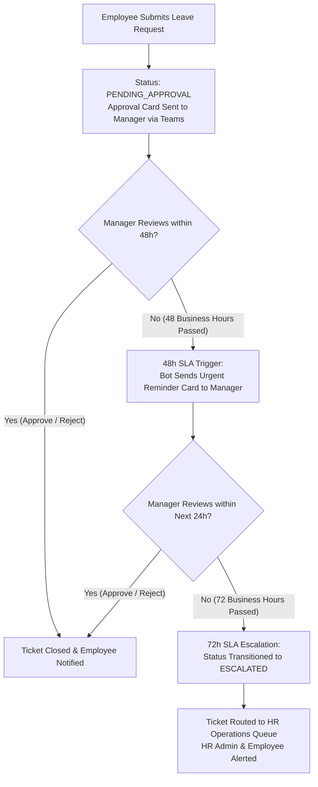

# Customer Setup & Deployment Guide
## Enterprise HR Time and Leave Copilot for Microsoft Teams

Welcome to the **Enterprise HR Time and Leave Copilot**. This guide provides enterprise IT administrators and Microsoft 365 engineers with step-by-step instructions to deploy, configure, and roll out the solution directly from the **Microsoft Azure Marketplace**.

---

## 1. Solution Architecture & Data Sovereignty

The Enterprise HR Time and Leave Copilot is packaged and distributed as an **Azure Managed Application**.

* **Dedicated Infrastructure**: All compute, vector search, databases, AI models, and storage resources are provisioned directly within **your** Azure subscription in an isolated **Managed Resource Group (MRG)**.
* **Complete Data Sovereignty**: All employee records, leave requests, medical notes, and HR policy documents remain strictly inside your corporate tenant boundary and chosen Azure region. No customer data is transmitted to or stored in external multi-tenant vendor servers.
* **Deny Assignment Protection**: Azure automatically applies a system-level Deny Assignment to the MRG. This prevents accidental deletion or configuration drift of backend services while allowing full operational monitoring and cost visibility.
* **Zero Standing Access**: The publisher operates under a zero-trust model. If technical assistance is required, the publisher support team must request **Just-In-Time (JIT) Access**, requiring explicit approval from your Azure administrators.

---

## 2. Prerequisites Checklist

Before launching the deployment wizard from the Azure Marketplace, ensure your organization has:

| Prerequisite | Requirement | Notes |
|---|---|---|
| **Azure Subscription** | Contributor or Owner role | Used to purchase, provision, and bill the underlying Azure cloud resources. |
| **Microsoft Entra ID Tenant** | Single-tenant M365 organization | Where employees, managers, and Teams users reside. |
| **Microsoft Teams** | Microsoft Teams enabled for users | Target client interface for the Copilot. |
| **Azure OpenAI Quota** | `gpt-6-luna` (or existing Foundry endpoint) | If auto-provisioning, ensure your subscription has quota for `gpt-6-luna` and `text-embedding-3-small` in your selected region. Alternatively, provide an existing endpoint. |
| **Teams Bot App Registration** | Application (Client) ID (GUID) | Required to connect the Azure Bot Service to Microsoft Teams (see Step 3.1 below). |

---

## 3. Step-by-Step Deployment Instructions

### Step 3.1: Register the Teams Bot in Microsoft Entra ID (1 Minute)

Azure Bot Service requires an Application (Client) ID to authenticate within your Microsoft Teams environment.

1. Sign in to the **[Azure Portal](https://portal.azure.com)**.
2. Search for and select **Microsoft Entra ID**.
3. In the left navigation, select **App registrations** > Click **+ New registration**.
4. Configure the application:
   * **Name**: Enter a recognizable name (e.g., `HR Copilot Teams Bot`).
   * **Supported account types**: Select **Accounts in this organizational directory only (Single tenant)**.
   * **Redirect URI**: Leave blank.
5. Click **Register**.
6. On the **Overview** blade of the newly registered application, copy the **Application (client) ID** (a GUID such as `a1b2c3d4-e5f6-7890-abcd-ef1234567890`). You will paste this during the Marketplace wizard.
7. Under **Manage**, select **Certificates & secrets** > click **+ New client secret**:
   * **Description**: Enter `Teams Bot Runtime Secret`.
   * **Expires**: Choose your organization's preferred lifetime (e.g., 180 days or 24 months).
   * Click **Add**, then immediately copy the secret **Value** (not Secret ID). You will save this to the App Service configuration after deployment.

---

### Step 3.2: Deploy via Azure Marketplace

1. Navigate to the **[Azure Marketplace](https://portal.azure.com/#blade/Microsoft_Azure_Marketplace/MarketplaceOffersBlade)** or search for **Enterprise HR Time and Leave Copilot**.
2. Select the offer and click **Create** (or **Get It Now**).
3. The multi-step deployment wizard will open.

#### Blade 1: Basics
* **Subscription**: Select the Azure subscription where resources will be hosted and billed.
* **Resource Group**: Select an existing Resource Group or click **Create new** (e.g., `rg-hr-copilot-prod`).
* **Region**: Select your desired data residency location (e.g., `East US`, `Japan East`, `West Europe`, `Southeast Asia`).
* **Application Name**: Name of the Managed Application instance (e.g., `hr-time-leave-copilot`).
* **Managed Resource Group**: Azure automatically assigns a dedicated MRG name (e.g., `mrg-hr-time-leave-copilot-<timestamp>`).

#### Blade 2: Application Settings
Configure the parameters for your environment:

| Parameter | Recommended Value | Description |
|---|---|---|
| **Environment** (`environmentName`) | `prod` (or `test` / `dev`) | Environment tier. |
| **Application Name Prefix** (`appNamePrefix`) | `hr-time-leave` | Prefix (3–16 characters) used for resource naming. |
| **Entra Tenant ID** (`entraTenantId`) | *Leave blank* (or enter GUID) | If left blank, automatically inherits your current deployment subscription tenant. |
| **Teams Bot App ID** (`botAppId`) | Paste the GUID from Step 3.1 | Application (client) ID for your Teams Bot. |
| **App Service Plan SKU** (`appServicePlanSku`) | `P1v3` (prod) or `B1` (test) | Compute sizing for web backend and functions. |
| **Azure AI Search SKU** (`searchSku`) | `standard` | Hybrid lexical/vector policy search tier. |
| **Existing Azure OpenAI Endpoint** (`existingOpenAiEndpoint`) | *Leave blank* | If blank, a dedicated Azure Cognitive Services OpenAI account (`gpt-6-luna`) is provisioned. If using an existing Foundry resource, paste its HTTPS endpoint URI. |

#### Blade 3: Review + Create
1. The wizard validates parameter schemas and Azure policy compliance.
2. Review the Terms of Use and check **I agree to the terms and conditions above**.
3. Click **Create**.
4. Resource deployment typically completes in **5 to 8 minutes**.

---

## 4. Post-Deployment Verification & Teams Rollout

### 4.1 Verify Backend Health
Once the deployment status indicates **Succeeded**:
1. Open the created Managed Application resource.
2. In the **Overview** blade, locate the **Outputs** section to view:
   * `appServiceEndpoint`: The primary web endpoint (e.g., `https://hr-time-leave-prod-app-xyz.azurewebsites.net`).
   * `openAiEndpoint`: The active policy reasoning endpoint.
3. Open a browser and test the liveness and readiness health probes:
   * **Liveness Probe**: `https://<app-name>.azurewebsites.net/healthz`
     * Expected response: `{"status":"healthy","service":"hr-time-leave-agent","version":"0.1.0"}`
   * **Readiness Probe**: `https://<app-name>.azurewebsites.net/readyz`
     * Expected response: `{"status":"ready","service":"hr-time-leave-agent","version":"0.1.0","checks":{"domain":"ok","policy":"ok","sla":"ok"}}`

---

### 4.2 Configure Bot Credentials (One-time)

To authorize the Copilot web runtime to dispatch replies back to Microsoft Teams and Azure Web Chat:

1. Open the Azure Portal and navigate to your **Managed Resource Group** (`mrg-...`).
2. Select the **App Service** resource (`hr-time-leave-...-app-...`).
3. Under **Settings**, select **Environment variables** (or **Configuration**).
4. In the **App settings** tab, verify or add:
   * **Name**: `BOT_APP_PASSWORD`
   * **Value**: Paste the client secret Value generated in Step 3.1.
5. Click **Apply** (or **Save**). The App Service will automatically restart with active authentication.

---

### 4.3 Distribute the Copilot in Microsoft Teams

Your deployed App Service automatically compiles and hosts the ready-to-use Microsoft Teams app package.

1. Download the app package zip:
   Navigate to `https://<app-name>.azurewebsites.net/teams/app-package.zip` in your browser.
2. Sign in to the **[Microsoft Teams Admin Center](https://teams.admin.microsoft.com/)** with an administrator account.
3. In the left navigation, select **Teams apps** > **Manage apps**.
4. Click **+ Upload new app** (or **Upload a custom app**) and select the downloaded zip file.
5. In **Permission policies** and **Setup policies**:
   * Add the **Enterprise HR Time & Leave Copilot** to your organization-wide or department-specific setup policy.
   * (Optional) Pin the app to the Teams left navigation bar for all employees.

---

## 5. Ingesting Corporate HR Policy Documents

The Copilot answers employee questions based strictly on your organization's official policies:

1. Open the Azure Portal and navigate to the **Managed Resource Group**.
2. Locate the **Storage account** provisioned for the application (`hrtimeleave...st...`).
3. Under **Data storage**, select **Containers** > open **`policy-documents`**.
4. Upload your company's HR policy documents (supported formats: `.md`, `.txt`, `.pdf`, `.docx`).
5. The Copilot's indexing pipeline will automatically ingest, chunk, embed, and index the content in Azure AI Search.
6. When employees chat with the bot in Teams, all answers will cite specific sections and page titles from your uploaded policies.

---

## 6. Asynchronous SLA Timers & Escalations (48h & 72h Policy)

To prevent employee requests from being delayed due to out-of-office or busy managers, the Copilot includes an automated SLA workflow backed by **Azure Service Bus** and **Azure Functions**:

### SLA Policy Specification
* **Business Calendar Calculation**:
  * SLA clocks adhere to standard business working hours (Monday–Friday, 09:00–17:00). Weekends and public holidays are automatically excluded from SLA elapsed time.
* **48-Hour Business Hour Reminder**:
  * If a request remains in `PENDING_APPROVAL` after **48 business hours**, Azure Functions dispatches an **Urgent Reminder Adaptive Card** directly to the manager's Teams chat.
  * An attributable `SLA_REMINDER` audit log is appended to Cosmos DB.
* **72-Hour Business Hour Escalation**:
  * If the request is still unreviewed after **72 business hours**, the ticket status automatically transitions to **`ESCALATED`**.
  * The ticket is routed to the **HR Operations Queue** (`HR_OPERATIONS`) for central HR intervention.
  * Notifications are delivered to HR and the employee informing them of the managerial escalation.
* **Idempotency & Auto-Cancellation**:
  * If the manager approves/rejects the request or the employee cancels before the 48h or 72h deadlines, subsequent SLA timer jobs are automatically marked **`SKIPPED`** to prevent unnecessary notifications.

---

## 7. Security, Governance, and Support

### Enterprise Privacy Safeguards
* **Medical Privacy**: Medical reasons, sick leave notes, and doctor attachments are strictly masked from manager approval cards and excluded from database indexing.
* **Audit Trail**: Every leave submission, cancellation, approval, and rejection is recorded with an immutable timestamp and user ID in Cosmos DB.
* **Zero Hardcoded Secrets**: All inter-service communications utilize Azure Managed Identities and Azure RBAC with local key authentication disabled.

### Support & Operations
If your organization requires technical assistance:
* **Support Portal**: [https://fptsoftware.com/contact-us](https://fptsoftware.com/contact-us)
* **Privacy Policy**: [https://fptsoftware.com/our-policy](https://fptsoftware.com/our-policy)
* **JIT Access**: If requested, publisher support engineers will trigger an Azure JIT request. Your Azure administrators must explicitly review and approve the request in the Azure Portal before temporary, read-only operational telemetry access is granted.

