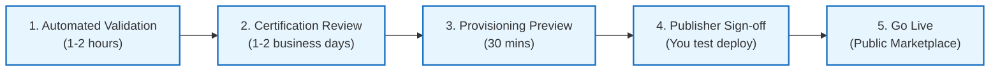

# Step-by-Step Guide: Publishing Enterprise HR Time & Leave Copilot on Microsoft Partner Center

This guide provides a screen-by-screen walkthrough for submitting the **Enterprise HR Time and Leave Copilot** as an **Azure Application – Managed Application** offer on the [Microsoft Partner Center Commercial Marketplace](https://partner.microsoft.com/dashboard/commercial-marketplace/overview).

---

## 0. Pre-Flight Asset & Identifier Checklist

All technical artifacts and media assets have been pre-generated, verified, and placed in your repository:

| Required Partner Center Field | Source File / Exact Value in Repository | Notes |
|---|---|---|
| **Package File (.zip)** | `packaging/managed_app/app.zip` | 6.6 KB, ARM-TTK verified, zero secrets, 8/8 parameters mapped |
| **Public Container Image** | `ghcr.io/zerosaber10-dev/hr-time-leave-agent:latest` | Public visibility on GitHub Container Registry |
| **Publisher Tenant ID** | `5cadfdc4-7111-47e8-9aa7-9f8090378691` | Retrieved via Azure CLI `az account show` |
| **Principal ID (Support Group / Admin)** | `97e5a173-9cad-4c04-b13f-dd2c4f7631f3` | Retrieved via Azure CLI `az ad signed-in-user show` |
| **Preview Subscription ID** | `540c00a6-8027-48c1-9982-b9cbe086ecd3` | Azure for Students test subscription |
| **Small Logo (48x48)** | `packaging/marketplace_assets/logo-small-48x48.png` | Formatted PNG |
| **Medium Logo (90x90)** | `packaging/marketplace_assets/logo-medium-90x90.png` | Formatted PNG |
| **Large Logo (216x216)** | `packaging/marketplace_assets/logo-large-216x216.png` | Formatted PNG |
| **Wide Logo (255x115)** | `packaging/marketplace_assets/logo-wide-255x115.png` | Formatted PNG with transparent padding |
| **Hero Banner (1090x500)** | `packaging/marketplace_assets/hero-banner-1090x500.png` | Formatted PNG |
| **Screenshot 1 (1280x720)** | `packaging/marketplace_assets/screenshot-1-architecture-1280x720.png` | Azure MRG & Container Topology |
| **Screenshot 2 (1280x720)** | `packaging/marketplace_assets/screenshot-2-leancanvas-1280x720.png` | Value Proposition & Business Canvas |

---

## 1. Initial Offer Creation

1. Open your browser and navigate to:
   **[Microsoft Partner Center – Commercial Marketplace Overview](https://partner.microsoft.com/dashboard/commercial-marketplace/overview)**
2. Sign in with your registered Microsoft Partner Network (MPN) publisher account.
3. In the left navigation, select **Commercial Marketplace** > **Overview**.
4. Click **+ New offer** (dropdown menu) and select **Azure Application**.
5. In the **New Azure Application** modal dialog, enter:
   * **Offer ID**: `hr-time-leave-copilot` *(Use lowercase alphanumeric, dashes allowed; cannot be changed after submission)*.
   * **Offer alias**: `Enterprise HR Time and Leave Copilot` *(Internal display name in your Partner Center dashboard)*.
6. Click **Create**.

---

## 2. Screen 1: Offer Setup

In the left menu, select **Offer setup**.

### 2.1 Customer Leads (Optional for Sandbox, Recommended for Production)
* **Lead destination**: Choose **None** if you don't have a CRM connected yet, or select **Azure Table** / **HTTPS Endpoint** to receive customer contact leads whenever someone deploys the app.

### 2.2 Offer Type Confirmation
* Confirm that this offer is created under the Azure Application schema.
* Click **Save draft** at the bottom of the page before proceeding.

---

## 3. Screen 2: Properties

In the left menu, select **Properties**.

### 3.1 Categories
* **Primary category**: `Human Resources` (or `Business Applications` > `Human Resources`).
* **Secondary category**: `Collaboration` or `AI + Machine Learning`.

### 3.2 Legal Contracts & Privacy Policy
* **Use Microsoft's Standard Contract**: Check **Yes** (Recommended. This uses Microsoft's standard commercial terms and eliminates legal review delays).
* **Terms of use**: Leave blank if Microsoft Standard Contract is checked, or provide a URL to your company's terms (e.g., `https://github.com/zerosaber10-dev/hve-innovation-fpt/blob/main/LICENSE`).
* **Privacy policy URL**: Enter a valid HTTPS link, e.g.:
  `https://github.com/zerosaber10-dev/hve-innovation-fpt/blob/main/docs/deployment/azure-managed-application.md#2-customer-data-sovereignty--managed-resource-group-mrg`
* Click **Save draft**.

---

## 4. Screen 3: Offer Listing

In the left menu, select **Offer listing**.

### 4.1 Marketplace Listing Text
* **Name**: `Enterprise HR Time & Leave Copilot for Teams`
* **Search results summary** *(Max 100 characters)*:
  > Enterprise HR Copilot for Teams: leave requests, balance queries, and grounded policy Q&A.
* **Short description** *(Max 256 characters)*:
  > Turnkey Azure Managed Application integrating Microsoft Teams and Azure OpenAI (gpt-6-luna). Automate leave requests, time adjustments, manager approvals, and SLA tracking directly within your Azure tenant with full data sovereignty.
* **Description** *(Formatted Markdown)*:
  ```markdown
  ### Enterprise HR Time and Leave Copilot

  Empower your workforce with an autonomous, privacy-preserving HR Copilot running natively in Microsoft Teams and backed by enterprise Azure cloud infrastructure.

  #### Key Capabilities
  * **Microsoft Teams Native Integration**: Employees interact naturally through Adaptive Cards and rich conversational prompts.
  * **Grounded Policy Intelligence**: Built on Azure OpenAI (`gpt-6-luna`) and Azure AI Search for zero-hallucination HR policy answers cited directly from your company handbooks.
  * **Automated Leave & Time Off Lifecycle**: Supports Annual Leave, Sick Leave, Overtime, and Attendance Adjustments with direct Entra ID manager hierarchy routing.
  * **SLA Timers & Escalations**: Asynchronous Service Bus workflows trigger automated manager reminders after 48 business hours and escalate to HR after 72 hours.
  * **Medical Privacy & PHI Isolation**: Sensitive medical notes and doctor details are strictly masked from manager views and excluded from database indexing.

  #### Customer Data Sovereignty (Azure Managed Application)
  All compute, storage, search indexes, and ticket databases deploy directly into your Azure subscription inside an isolated Managed Resource Group (MRG). Your sensitive employee records never leave your corporate cloud boundary.
  ```

### 4.2 Search Keywords (Tags)
Add up to 3 keywords:
1. `HR Copilot`
2. `Leave Management`
3. `Microsoft Teams`

### 4.3 Support & Contact Information
* **Help link**: `https://github.com/zerosaber10-dev/hve-innovation-fpt/issues`
* **Customer support contact**:
  * Name: `Hung Duy Ho` (or your company support lead)
  * Email: `hungduyhoqaz@gmail.com`
  * Phone: `+84-900-000-000` (or company phone)
* **Engineering contact**:
  * Name: `Technical Operations Team`
  * Email: `hungduyhoqaz@gmail.com`
  * Phone: `+84-900-000-000`

### 4.4 Marketplace Media & Logos
Upload the images generated in `packaging/marketplace_assets/`:
* **Small logo (48x48)**: Select `packaging/marketplace_assets/logo-small-48x48.png`
* **Medium logo (90x90)**: Select `packaging/marketplace_assets/logo-medium-90x90.png`
* **Large logo (216x216)**: Select `packaging/marketplace_assets/logo-large-216x216.png`
* **Wide logo (255x115)**: Select `packaging/marketplace_assets/logo-wide-255x115.png`
* **Hero logo (1090x500)**: Select `packaging/marketplace_assets/hero-banner-1090x500.png`
* **Screenshots (1280x720)**:
  * Screenshot 1: `packaging/marketplace_assets/screenshot-1-architecture-1280x720.png` (Caption: `Azure Managed Resource Group Architecture`)
  * Screenshot 2: `packaging/marketplace_assets/screenshot-2-leancanvas-1280x720.png` (Caption: `Enterprise Value Proposition and Lean Architecture`)

Click **Save draft**.

---

## 5. Screen 4: Preview Audience

In the left menu, select **Preview audience**.

This defines who can test-deploy the application before it is released to the public.
1. In the **Azure Subscription IDs** table, click **+ Add Azure Subscription ID**.
2. Enter:
   * **Subscription ID**: `540c00a6-8027-48c1-9982-b9cbe086ecd3`
   * **Description**: `Publisher Dev/Test Azure Subscription`
3. *(Optional)* Add any colleagues' subscription IDs if they need to test deployment.
4. Click **Save draft**.

---

## 6. Screen 5: Plan Overview & Configuration

In the left menu, select **Plan overview**.
Click **+ Create new plan**.

### 6.1 Plan Creation Dialog
* **Plan ID**: `standard` *(Lowercase alphanumeric)*.
* **Plan name**: `Standard Managed Application`.
* Click **Create**.

---

### 6.2 Plan Setup
1. In the Plan navigation, open **Plan setup**.
2. **Plan type**: Select **Managed application** *(Do NOT select Solution template. Solution templates do not support Deny Assignments or publisher operations)*.
3. Click **Save draft**.

---

### 6.3 Pricing and Availability
1. In the Plan navigation, open **Pricing and availability**.
2. **Markets**: Select **Select all** (or select United States and your target geographies).
3. **Pricing model**:
   * For initial certification or BYOL: Choose **Free** or set a monthly flat-rate price (e.g., `$0.00` / month or `$49.00` / month).
   * Note: The underlying Azure resources (compute, AI search, Cosmos DB) are billed directly to the customer's Azure subscription.
4. **Plan visibility**: Select **Public** (or **Private** if you want restricted distribution).
5. Click **Save draft**.

---

### 6.4 Technical Configuration (CRITICAL STEP)
In the Plan navigation, open **Technical configuration**.

#### A. Version Information
* **Version**: `1.0.0`

#### B. Package File Upload
* **Package file (.zip)**: Click browse and upload:
  `packaging/managed_app/app.zip`
  *(File size: ~6.6 KB. Partner Center will inspect the zip and display a green checkmark indicating valid `mainTemplate.json` and `createUiDefinition.json`)*.

#### C. Enable Just-In-Time (JIT) Access
* Check the box: **Enable Just-In-Time (JIT) access**.
* **JIT maximum duration**: Select **8 hours** (or 4 hours).
* **Require customer approval**: Select **Yes** (Provides highest security compliance for enterprise customers).

#### D. Customer Management & Deny Assignments
* Azure automatically enables a Deny Assignment on the customer's Managed Resource Group.
* Customer cannot delete or alter individual resources in the MRG.

#### E. Publisher Management Access (Authorizations Array)
Click **+ Add authorization**:
* **Azure Active Directory Tenant ID**: `5cadfdc4-7111-47e8-9aa7-9f8090378691`
* **Principal ID**: `97e5a173-9cad-4c04-b13f-dd2c4f7631f3` *(Your user/support group Entra ID Object ID)*
* **Role definition**: Select **Contributor** (or `Owner`)
* Click **Save draft**.

---

## 7. Screen 6: Co-sell with Microsoft (Optional for Day 1)

In the left menu, select **Co-sell with Microsoft**.
* You can configure this now or right after publishing.
* If completing now:
  * Select target customer segment: `Enterprise`, `Mid-market`.
  * Upload solution one-pager: You can export `docs/deployment/marketplace-managed-app-guide.md` as PDF.
  * Sales contact: Add your name and email.
* If deferring: Click **Save draft** and leave for post-certification.

---

## 8. Screen 7: Resell through CSPs

In the left menu, select **Resell through CSPs**.
* Select **Any partner in the Cloud Solution Provider (CSP) program** (or **Opt out**).
* Click **Save draft**.

---

## 9. Screen 8: Review and Publish

In the top-right corner of the Partner Center portal, click **Review and publish**.

### 9.1 Pre-Publish Validation Table
Partner Center displays a checklist of all sections:
* Offer setup: `Complete`
* Properties: `Complete`
* Offer listing: `Complete`
* Preview audience: `Complete`
* Plan overview (`standard`): `Complete`
* Resell through CSPs: `Complete`

### 9.2 Notes for Certification
In the **Notes for certification** text box, provide the reviewer with test instructions:
```text
The offer is an Enterprise HR Time and Leave Copilot deployed as an Azure Managed Application.
Runtime container: ghcr.io/zerosaber10-dev/hr-time-leave-agent:latest (Public GHCR image).
ARM template and createUiDefinition have passed local ARM-TTK (49/49) and Azure CLI preflight validation.
All services utilize Entra ID System-Assigned Managed Identity with zero secrets.
Endpoint health check post-deployment: GET /healthz and GET /readyz.
```

Click **Publish**.

---

## 10. Publication Pipeline & Lifecycle Stages

Once you click **Publish**, the offer moves through automated validation and certification:



1. **Automated Validation**: Azure parses `app.zip`, verifies JSON schemas, ensures parameter parity, and checks that container image `ghcr.io/zerosaber10-dev/hr-time-leave-agent:latest` is reachable.
2. **Certification Review**: Microsoft certification analysts verify security, policies, and listing details.
3. **Provisioning Preview**: Once approved, Partner Center generates a private preview link.
4. **Publisher Sign-Off**:
   * Click the preview link to open Azure Portal under your subscription `540c00a6-8027-48c1-9982-b9cbe086ecd3`.
   * Complete the wizard to verify the Managed Application deploys cleanly end-to-end.
   * Verify `/healthz` returns `{"status":"healthy"}`.
5. **Go Live**: In Partner Center, click **Go live** to make the offer publicly accessible worldwide!

